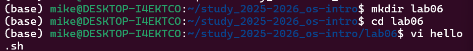
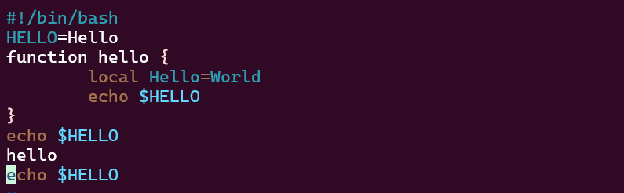
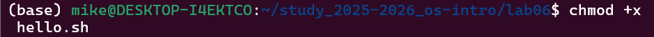
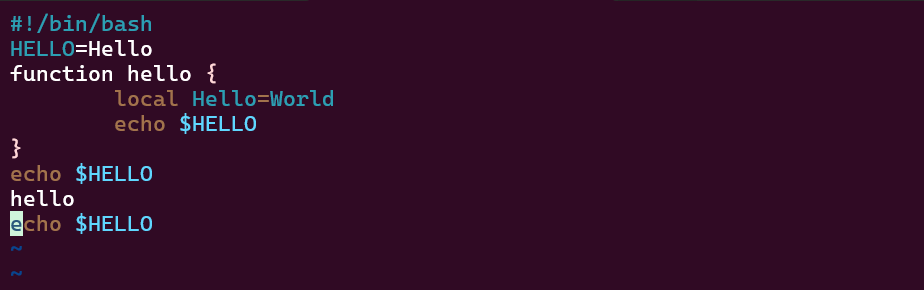

# **лаборатория 10**

**Давид Майкл Фрэнсис**
**1032249023**

## цель работы
Познакомиться с операционной системой Linux.Получитьпрактические навыки рабо
тысредактором vi,установленным по умолчанию практически во всехдистрибутивах.

### **Описание задачи**

1. Сначала Я Создал каталогс именем lab06 и перешел в недавно созданный каталог, затем я вызвал vi и создал файл hello.sh



2. Я нажал клавишу i и ввел следующий текст.



3. Я нажал клавишу Esc, чтобы войти в командный режим после завершения ввода текста, и нажал :wq, чтобы выйти из файла


4. Сделайте файл исполняемым, используя команду



### **Задание 2**
Файл был открыт командой vi hello.sh. В процессе редактирования были исправлены ошибки: HELL заменено на HELLO, LOCAL заменено на local. Затем в конец файла добавлена строка echo $HELLO, после чего она была удалена командой dd и восстановлена командой u. Все изменения сохранены командой :wq.



**Выход:** В этой лабораторной работе я познакомился с операционной системой Linux. Я получил практические навыки работы с редактором vi. 


#### **Контрольные вопросы**

1. Краткая характеристика режимов работы редактора vi:
Командный режим — для навигации и выполнения команд редактирования
Режим вставки — для ввода и редактирования текста
Режим последней строки — для сохранения, выхода и выполнения расширенных команд

2. Каквыйтиизредактора,не сохраняя произведённые изменения?
```
:q!
```
3. Команды позиционирования:
0 — переход в начало строки
$ — переход в конец строки
G — переход в конец файла
nG — переход на строку с номером n

4. Чтодляредактора vi является словом?
Для w/b — любая последовательность символов, разделённых пробелами, табуляцией или знаками пунктуации
Для W/B — любая последовательность символов, разделённых только пробелами, табуляцией или переносом строки

5.  Каким образом из любого места редактируемого файла перейти в начало (конец)
файла?
1G или gg — переход в начало файла
G — переход в конец файла

6. Основные группы команд редактирования:
Вставка — i, a, o, I, A, O
Удаление — x, dw, dd, ndd
Копирование — Y, nY, yw
Вставка из буфера — p, P
Замена — r, R, cw
Отмена — u
Поиск — /текст, ?текст

7. Необходимо заполнитьстроку символами $.Каковы вашидействия?
Установить курсор в начало строки
Нажать i для перехода в режим вставки
Ввести символ $ необходимое количество раз, затем нажать Esc

8. Как отменить некорректное действие:
```
u
```
9. Основные группы команд режима последней строки:
Сохранение — :w, :w имя_файла
Выход — :q, :q!
Сохранение и выход — :wq
Копирование/перемещение строк — :i,j t k, :i,j m k
Удаление строк — :n,m d
Опции — :set nu, :set all

10. Как определить позицию конца строки, не перемещая курсор:
Использовать команду:
```
:set nu
```
11. Анализ опций редактора vi:
Команда :set all выводит полный список доступных опций
Опций достаточно много — десятки
Основные опции: nu (номера строк), ic (игнорировать регистр при поиске), list (отображать невидимые символы)
Для отключения опции перед её именем ставится no, например :set nonu

12. Как определить текущий режим работы редактора vi:
Если можно свободно вводить текст — активен режим вставки
Если нажатия клавиш выполняют команды — активен командный режим
Если в нижней части экрана отображается : — активен режим последней строки
Нажатие Esc в любой момент возвращает в командный режим

13. Постройте граф взаимосвязи режимов работы редактора vi
```
+----------------+       i, a, o       +----------------+
|  Режим вставки | ------------------> | Командный режим|
+----------------+                     +----------------+
                        Esc                    |
                    <------------------        | :
                                               |
                                               v
                                    +--------------------+
                                    | Режим последней    |
                                    | строки (:wq, :q, w)|
                                    +--------------------+
                                               |
                                        Enter/Esc
                                               |
                                               v
                                    +----------------+
                                    | Командный режим|
                                    +----------------+
```

