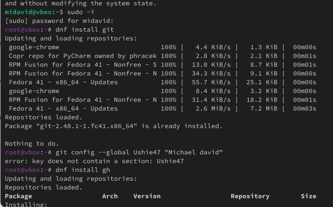
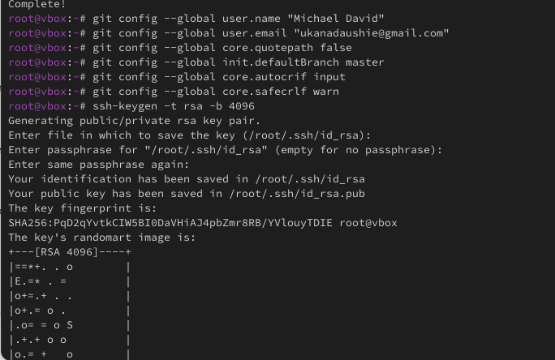
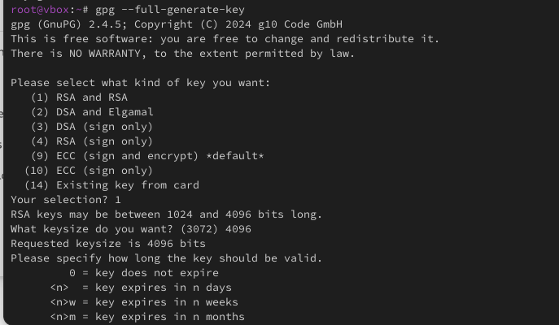
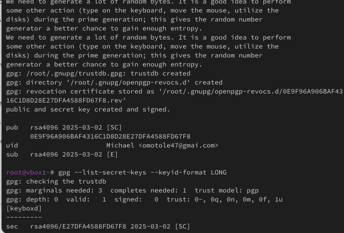
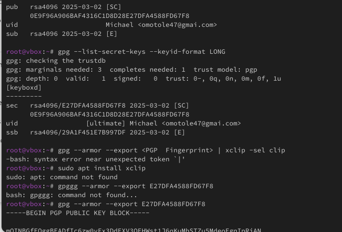
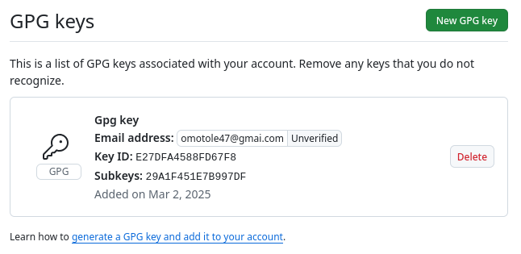
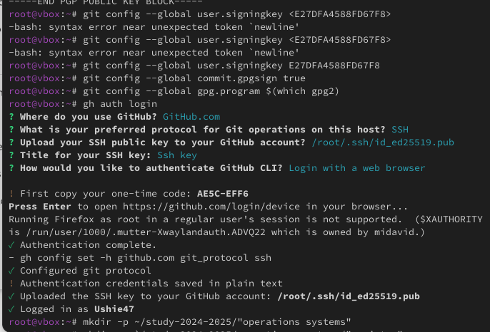
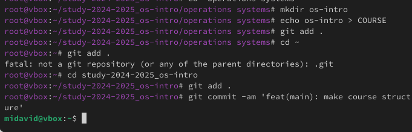

---
## Author
author:
  name: David Michael Francis
  affiliation:
    - name: Российский университет дружбы народов
      country: Российская Федерация
      postal-code: 117198
      city: Москва
      address: ул. Миклухо-Маклая, д. 6

## Title
title: "Лабораторная работа №2"
subtitle: "Системы контроля версий. Git"
license: "CC BY"
abstract: |
  В данном отчёте представлены результаты выполнения лабораторной работы по теме «Системы контроля версий. Git».

  Описаны установка и настройка Git и GitHub CLI, создание SSH- и PGP-ключей, настройка подписи коммитов и структуры рабочего каталога курса.

  Сделаны выводы о достижении поставленной цели.
keywords: [git, системы контроля версий, ssh, pgp, github]
---

# Введение

## Актуальность

Системы контроля версий являются неотъемлемым инструментом современной разработки программного обеспечения. Они позволяют отслеживать историю изменений, работать над проектом совместно с другими разработчиками и безопасно возвращаться к предыдущим версиям кода. Git, как наиболее распространённая распределённая система контроля версий, лежит в основе большинства современных рабочих процессов разработки, включая работу с платформой GitHub.

## Цель работы

Изучить идеологию и применение средств контроля версий, освоить умения по работе с Git.

## Задачи

- установить Git и GitHub CLI (gh);
- настроить пользовательские данные и кодировку вывода Git;
- создать SSH-ключ для аутентификации;
- создать PGP-ключ и настроить подпись коммитов;
- добавить PGP-ключ в учётную запись GitHub;
- настроить структуру рабочего каталога курса.

## Объект и предмет исследования

Объектом исследования является система контроля версий Git. Предметом исследования выступает процесс установки, настройки и подготовки Git к безопасной работе с удалённым репозиторием GitHub, включая аутентификацию по SSH и подпись коммитов PGP-ключом.

## Методы исследования

Работа выполнялась практическим методом — путём непосредственной установки и настройки программного обеспечения в среде Linux с использованием утилит командной строки (`dnf`, `git`, `gh`, `gpg`, `ssh-keygen`).

## Схема выполнения работы

На рис. -@fig-flowchart представлена общая последовательность действий при выполнении работы.

::: {#fig-flowchart}

```{mermaid}
%%| fig-width: 100%
graph TD
    A@{ shape: circle, label: "Начало" } --> B[Выполнить действие]
    B --> C[Описать, что конкретно сделано]
    C --> D[Подтвердить скриншотом]
    D --> E[Занести в отчёт]
    E --> F[Поместить в git-репозиторий]
    F --> G[Сделать релиз git]
    G --> J@{ shape: dbl-circ, label: "Конец" }
```

Блок-схема выполнения лабораторной работы

:::

# Теоретическая часть

Системы контроля версий (VCS, Version Control System) отслеживают изменения в файлах проекта во времени, позволяя нескольким людям совместно работать над ним, вести историю изменений и возвращаться к предыдущим версиям. Они решают такие задачи, как случайная потеря данных, конфликты при совместном редактировании кода и отслеживание того, кто и когда внёс те или иные изменения [@chacon_book_pro-git_en].

В рамках VCS используются следующие ключевые понятия:

- **хранилище (repository)** — центральное место, где хранятся все версии файлов проекта;
- **фиксация (commit)** — моментальный снимок изменений, сохранённый в репозитории;
- **история (history)** — последовательность коммитов, отражающая прошлые изменения проекта;
- **рабочая копия (working copy)** — локальная версия файлов, с которой непосредственно работает пользователь.

По способу хранения данных различают два вида систем контроля версий:

- **централизованные (CVCS)** — все изменения хранятся в едином центральном репозитории; примеры: Subversion (SVN), Perforce;
- **децентрализованные (DVCS)** — каждый пользователь располагает полной копией репозитория, что позволяет работать автономно, без постоянного подключения к серверу; примеры: Git, Mercurial.

Git, как децентрализованная система контроля версий, решает следующие основные задачи: отслеживание изменений в файлах, организация совместной работы и слияние изменений нескольких участников, ветвление для параллельной разработки независимых функций, а также откат к предыдущим версиям проекта при необходимости.

# Материалы и методы

Для выполнения работы использовались:

- операционная система семейства Linux (дистрибутив на основе `dnf`);
- система контроля версий **Git**;
- официальный клиент командной строки **GitHub CLI** (`gh`);
- утилита **GnuPG** (`gpg2`) для генерации PGP-ключа и подписи коммитов;
- утилита **ssh-keygen** для генерации SSH-ключа;
- платформа **GitHub** в качестве удалённого хостинга репозиториев.

# Выполнение лабораторной работы

Первым шагом были установлены Git и GitHub CLI с помощью менеджера пакетов `dnf` (рис. -@fig-001). Затем были указаны имя пользователя и адрес электронной почты для коммитов, настроен вывод сообщений Git в кодировке UTF-8, включена проверка и подпись коммитов, а также создан SSH-ключ для аутентификации (рис. -@fig-002).

Далее был сгенерирован PGP-ключ с помощью команды `gpg --full-generate-key` (рис. -@fig-003) и добавлен в учётную запись GitHub через настройки профиля (рис. -@fig-004, рис. -@fig-005, рис. -@fig-006).

После этого Git был настроен на автоматическую подпись коммитов сгенерированным PGP-ключом:

```bash
git config --global user.signingkey <PGP Fingerprint>
git config --global commit.gpgsign true
git config --global gpg.program $(which gpg2)
```

Результат настройки показан на рис. -@fig-007. Заключительным шагом стала настройка структуры рабочего каталога курса (рис. -@fig-008).

{#fig-001 width=70%}

{#fig-002 width=70%}

{#fig-003 width=70%}

{#fig-004 width=70%}

{#fig-005 width=70%}

{#fig-006 width=70%}

{#fig-007 width=70%}

{#fig-008 width=70%}

# Результаты

В результате выполнения работы:

- установлены и настроены Git и GitHub CLI;
- заданы пользовательские данные (имя, email) и кодировка вывода UTF-8;
- создан SSH-ключ для аутентификации на GitHub;
- сгенерирован PGP-ключ и добавлен в учётную запись GitHub;
- настроена автоматическая подпись коммитов PGP-ключом;
- подготовлена структура рабочего каталога курса.

# Обсуждение результатов

Настройка подписи коммитов PGP-ключом обеспечивает возможность проверки подлинности автора изменений — на GitHub такие коммиты отмечаются как «Verified», что повышает доверие к истории репозитория при совместной работе. Использование SSH-ключа вместо пароля для аутентификации соответствует современным требованиям безопасности, поскольку GitHub более не поддерживает аутентификацию по паролю для операций с Git. Выполненная настройка полностью соответствует стандартной практике подготовки рабочего окружения для децентрализованной разработки с использованием Git.

# Заключение

В ходе лабораторной работы были изучены идеология и применение средств контроля версий. Освоены основные умения по работе с Git:

- создание и клонирование репозиториев;
- создание SSH- и PGP-ключей;
- настройка подписи коммитов;
- получение изменений из удалённого репозитория и отправка изменений на GitHub.

Поставленная цель работы достигнута.

# Ответы на контрольные вопросы {.unnumbered}

**1. Что такое системы контроля версий (VCS) и для решения каких задач они предназначаются?**

Системы контроля версий (VCS) отслеживают изменения в файлах, позволяя нескольким людям совместно работать над проектом, вести историю и возвращаться к предыдущим версиям. Они решают такие проблемы, как случайная потеря данных, конфликты кода и отслеживание изменений.

**2. Объясните следующие понятия VCS и их отношения: хранилище, commit, история, рабочая копия.**

- Хранилище — центральное место, где хранятся все версии файлов.
- Коммит (фиксация) — моментальный снимок изменений, сохранённых в репозитории.
- История — запись коммитов, отражающая прошлые изменения.
- Рабочая копия — локальная версия файлов, изменяемых пользователем.

**3. Что представляют собой и чем отличаются централизованные и децентрализованные VCS? Приведите примеры VCS каждого вида.**

- Централизованная система контроля версий (CVCS): все изменения хранятся в едином центральном репозитории. Пример: Subversion (SVN), Perforce.
- Децентрализованная система контроля версий (DVCS): у каждого пользователя есть полная копия репозитория, что позволяет работать в автономном режиме. Пример: Git, Mercurial.

**4. Действия VCS при работе с хранилищем в одиночку**

- Инициализировать репозиторий.
- Вносить изменения и фиксировать их.
- Просматривать историю и при необходимости возвращаться к ней.

**5. Работа с VCS при совместном использовании хранилища**

- Клонировать репозиторий или получить последнюю версию.
- Вносить изменения и фиксировать их локально.
- Отправлять изменения в общий репозиторий.
- При необходимости разрешать конфликты.

**6. Основные задачи, решаемые Git**

- Отслеживание изменений.
- Совместная работа и слияние.
- Ветвление для параллельной разработки.
- Откат версии.

**7. Роли участников при работе с Git**

- Разработчики (developers) — пишут и фиксируют код.
- Сопровождающие (maintainers) — проверяют и объединяют изменения.
- Релиз-менеджеры (release managers) — управляют версиями и релизами.

**8. Использование локальных и удалённых репозиториев**

Локальный репозиторий:

```bash
git init
git add .
git commit -m "Initial commit"
```

Удалённый репозиторий:

```bash
git remote add origin <repo_url>
git push origin main
git pull origin main
```

**9. Ветви и их назначение**

Ветки позволяют вести параллельную разработку, не затрагивая основную кодовую базу:

```bash
git branch feature-branch
git checkout feature-branch
```

**10. Игнорирование файлов в Git**

```
node_modules/
*.log
```

Файл `.gitignore` с таким содержимым предотвращает попадание ненужных файлов в репозиторий.

# Список литературы {.unnumbered}

::: {#refs}
:::
