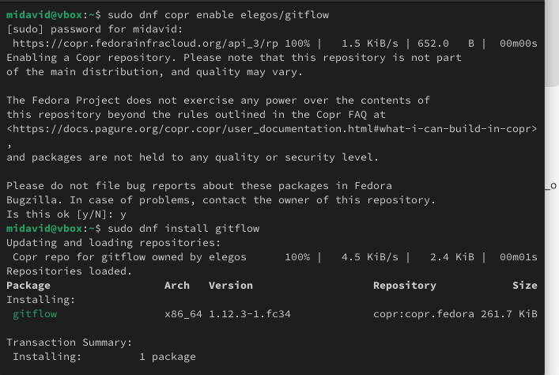
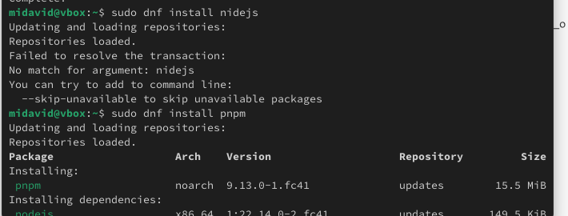
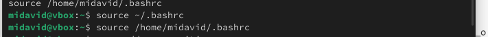
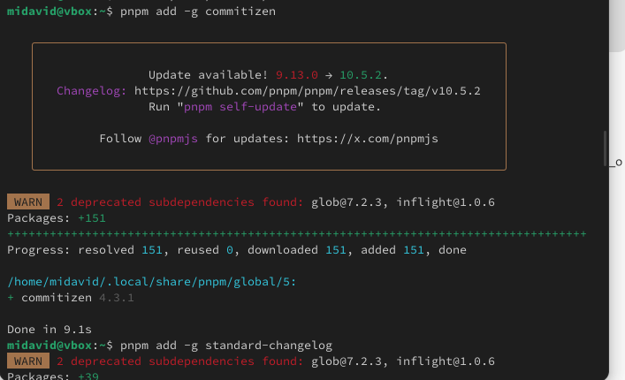
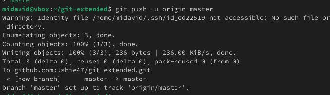
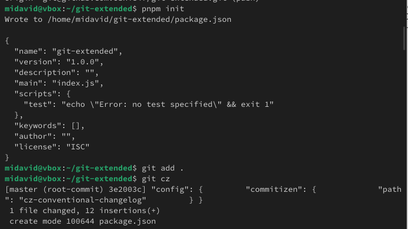
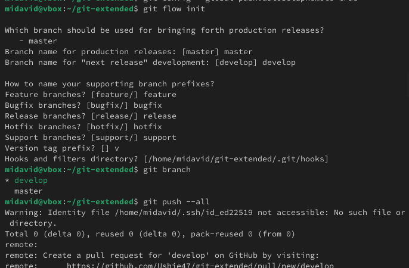
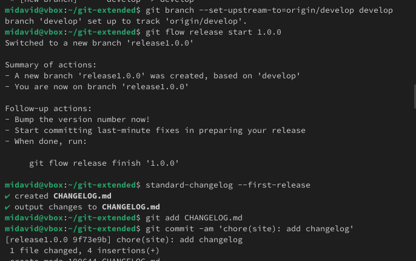

---
## Author
author:
  name: Давид Майкл Фрэнсис (10322249023)
  affiliation:
    - name: Российский университет дружбы народов
      country: Российская Федерация
      postal-code: 117198
      city: Москва
      address: ул. Миклухо-Маклая, д. 6

## Title
title: "Лабораторная работа №4"
subtitle: "Модель ветвления git-flow"
license: "CC BY"
abstract: |
  В данном отчёте представлены результаты выполнения лабораторной работы по теме «Модель ветвления git-flow».

  Описаны установка git-flow, Node.js и вспомогательных инструментов (commitizen, standard-changelog), подключение репозитория к GitHub, настройка и практическое применение модели git-flow для создания релизов и функциональных веток.

  Сделаны выводы о достижении поставленной цели.
keywords: [git, git-flow, semantic versioning, conventional commits, github]
---

# Введение

## Актуальность

При разработке программного обеспечения в команде важно придерживаться единого, предсказуемого процесса управления ветками и релизами. Модель git-flow, предложенная Винсентом Дриссеном, задаёт чёткую структуру веток (основная, разрабатываемая, функциональные, релизные) и остаётся широко применяемым подходом к организации совместной работы с Git, особенно в сочетании с автоматизированным версионированием и генерацией журнала изменений.

## Цель работы

Получение навыков правильной работы с репозиториями Git.

## Задачи

- установить git-flow из репозитория COPR;
- установить Node.js и настроить окружение для инструментов семантического версионирования;
- установить вспомогательные утилиты commitizen и standard-changelog;
- подключить локальный репозиторий к GitHub;
- инициализировать и настроить модель git-flow;
- создать релиз версии 1.0.0 с автоматически сформированным журналом изменений и опубликовать его на GitHub;
- отработать создание функциональной ветки и релиза версии 1.2.3 по модели git-flow.

## Объект и предмет исследования

Объектом исследования является рабочий процесс git-flow. Предметом исследования выступает процесс настройки и практического применения git-flow для управления функциональными ветками и релизами репозитория с использованием семантического версионирования и автоматизированной генерации журнала изменений.

## Методы исследования

Работа выполнялась практическим методом — путём установки и настройки программного обеспечения в среде Linux с использованием утилит командной строки (`git`, `git flow`, `node`, `pnpm`, `commitizen`, `standard-changelog`, `gh`).

## Схема выполнения работы

На рис. -@fig-flowchart представлена общая последовательность действий при выполнении работы.

::: {#fig-flowchart}

```{mermaid}
%%| fig-width: 100%
graph TD
    A@{ shape: circle, label: "Начало" } --> B[Выполнить действие]
    B --> C[Описать, что конкретно сделано]
    C --> D[Подтвердить скриншотом]
    D --> E[Занести в отчёт]
    E --> F[Поместить в git-репозиторий]
    F --> G[Сделать релиз git]
    G --> J@{ shape: dbl-circ, label: "Конец" }
```

Блок-схема выполнения лабораторной работы

:::

# Теоретическая часть

Git-flow — это модель ветвления для Git, предложенная Винсентом Дриссеном в 2010 году [@driessen_web_successful-git-branching-model_en]. Модель вводит набор строго определённых ветвей с заданным назначением:

- **main (master)** — содержит только стабильный, выпущенный код;
- **develop** — основная ветка разработки, объединяющая завершённые функции;
- **feature/\*** — ветки для разработки отдельных функций, создаются от `develop` и сливаются обратно в неё;
- **release/\*** — ветки подготовки релиза, создаются от `develop`, позволяют стабилизировать версию перед выпуском;
- **hotfix/\*** — ветки для срочных исправлений, создаются от `main`.

Такая структура чётко разделяет код в разработке и стабильно выпущенный код, что упрощает параллельную работу нескольких разработчиков и управление версиями.

Дополнительно модель git-flow в данной работе сочетается с практиками **семантического версионирования** (Semantic Versioning, формат `MAJOR.MINOR.PATCH`) и **конвенциональных коммитов** (Conventional Commits), которые задают единый формат сообщений коммитов. Утилита `commitizen` помогает формировать такие сообщения в интерактивном режиме, а `standard-changelog` автоматически формирует файл `CHANGELOG.md` на основе истории коммитов, что устраняет необходимость вести журнал изменений вручную [@chacon_book_pro-git_en].

# Материалы и методы

Для выполнения работы использовались:

- операционная система семейства Linux;
- система контроля версий **Git** и расширение **git-flow**, установленное из репозитория **COPR**;
- среда выполнения **Node.js** и пакетный менеджер **pnpm**;
- утилита **commitizen** для оформления коммитов;
- утилита **standard-changelog** для автоматической генерации журнала изменений;
- официальный клиент командной строки **GitHub CLI** (`gh`);
- платформа **GitHub** в качестве удалённого хостинга репозиториев.

# Выполнение лабораторной работы

Первым шагом git-flow был установлен из галереи хранилища COPR (рис. -@fig-001).

{#fig-001 width=70%}

Поскольку программное обеспечение для семантического версионирования и формирования журнала изменений основано на Node.js, был установлен Node.js (рис. -@fig-002).

{#fig-002 width=70%}

Для корректной работы с Node.js в переменную `PATH` была добавлена директория с исполняемыми файлами, установленными через yarn (рис. -@fig-003).

{#fig-003 width=70%}

Далее были установлены утилита `commitizen`, используемая для форматирования коммитов, и `standard-changelog`, используемая для автоматического формирования журнала изменений, с помощью пакетного менеджера `pnpm` (рис. -@fig-004).

{#fig-004 width=70%}

## Практический сценарий использования Git

На практике был выполнен следующий сценарий. Сначала репозиторий был подключён к GitHub: создан репозиторий `.git-extended`, сделан первый коммит и выполнена его отправка на GitHub (рис. -@fig-005).

{#fig-005 width=70%}

Затем была выполнена общая конфигурация коммитов для проекта на Node.js с инициализацией через PNPM (рис. -@fig-006).

{#fig-006 width=70%}

После этого была выполнена настройка и первый цикл git-flow:

```bash
# Инициализация git-flow (префикс ярлыков — "v")
git flow init

# Проверка текущей ветки (develop)
git branch

# Отправка всего репозитория в хранилище
git push --all

# Установка внешней ветки как вышестоящей для develop
git branch --set-upstream-to=origin/develop develop

# Создание релиза версии 1.0.0
git flow release start 1.0.0

# Формирование журнала изменений
standard-changelog --first-release

# Добавление журнала изменений в индекс
git add CHANGELOG.md
git commit -am 'chore(site): add changelog'

# Слияние релизной ветки в основную
git flow release finish 1.0.0

# Отправка данных на GitHub
git push --all
git push --tags

# Создание релиза на GitHub с описанием из журнала изменений
gh release create v1.0.0 -F CHANGELOG.md
```

Результат выполнения показан на рис. -@fig-007 и рис. -@fig-008.

{#fig-007 width=70%}

{#fig-008 width=70%}

## Работа с репозиторием Git

Далее была отработана разработка новой функциональности по модели git-flow:

```bash
# Создание ветки новой функциональности
git flow feature start feature_branch

# ... обычная работа с Git ...

# Слияние функциональной ветки с develop по завершении разработки
git flow feature finish feature_branch
```

Затем был создан второй релиз, версии 1.2.3:

```bash
# Создание релиза версии 1.2.3
git flow release start 1.2.3

# Обновление номера версии в package.json до 1.2.3
# (выполняется вручную в файле package.json)

# Формирование журнала изменений
standard-changelog

# Добавление журнала изменений в индекс
git add CHANGELOG.md
git commit -am 'chore(site): update changelog'

# Слияние релизной ветки в основную
git flow release finish 1.2.3

# Отправка данных на GitHub
git push --all
git push --tags

# Создание релиза на GitHub с комментарием из журнала изменений
gh release create v1.2.3 -F CHANGELOG.md
```

# Результаты

В результате выполнения работы:

- установлены git-flow, Node.js, pnpm, commitizen и standard-changelog;
- локальный репозиторий подключён к GitHub;
- инициализирована и настроена модель ветвления git-flow;
- создан и опубликован на GitHub релиз версии 1.0.0 с автоматически сформированным журналом изменений;
- отработано создание функциональной ветки и её слияние с веткой `develop`;
- создан и опубликован на GitHub релиз версии 1.2.3.

# Обсуждение результатов

Использование модели git-flow обеспечивает чёткое разделение кода в активной разработке (`develop`) и стабильно выпущенного кода (`main`), что снижает риск случайного попадания непротестированных изменений в релиз. Автоматическая генерация журнала изменений утилитой `standard-changelog` на основе истории коммитов устраняет необходимость вести журнал вручную и снижает вероятность расхождений между фактическими изменениями и их документированием. В сочетании с семантическим версионированием такой подход делает процесс выпуска релизов воспроизводимым и прослеживаемым.

# Заключение

В ходе лабораторной работы были получены навыки правильной работы с репозиториями Git по модели git-flow. Был изучен процесс выполнения работы для тестового репозитория и его преобразования в репозиторий, использующий git-flow и конвенциональные коммиты для автоматизированного управления релизами.

Поставленная цель работы достигнута.

# Список литературы {.unnumbered}

::: {#refs}
:::
