---
## Author
author:
  name: Давид Майкл Фрэнсис
  affiliation:
    - name: Российский университет дружбы народов
      country: Российская Федерация
      postal-code: 117198
      city: Москва
      address: ул. Миклухо-Маклая, д. 6

## Title
title: "Лабораторная работа №5"
subtitle: "Менеджеры паролей и управление конфигурационными файлами"
license: "CC BY"
abstract: |
  В данном отчёте представлены результаты выполнения лабораторной работы по теме «Менеджеры паролей и управление конфигурационными файлами».

  Описаны установка и настройка менеджера паролей pass (gopass), синхронизация хранилища паролей с git-репозиторием, настройка браузерного интерфейса BrowserPass, а также установка и настройка Chezmoi для управления конфигурационными файлами (dotfiles).

  Сделаны выводы о достижении поставленной цели.
keywords: [pass, gopass, менеджер паролей, chezmoi, dotfiles, gpg]
---

# Введение

## Актуальность

Безопасное хранение паролей и единообразное управление конфигурационными файлами (dotfiles) на нескольких машинах — распространённые практические задачи при настройке рабочего окружения разработчика. Менеджер паролей `pass`, основанный на шифровании GPG и версионировании через Git, и утилита `chezmoi` для управления dotfiles позволяют решать эти задачи безопасно и воспроизводимо, синхронизируя конфигурацию между устройствами через обычные git-репозитории.

## Цель работы

Научиться пользоваться менеджером паролей и Chezmoi.

## Задачи

- установить и настроить менеджер паролей `pass` (а также `gopass`);
- просмотреть список доступных GPG-ключей;
- инициализировать хранилище паролей и синхронизировать его с git-репозиторием;
- настроить ручную фиксацию изменений хранилища паролей при прямом редактировании файловой системы;
- настроить браузерный интерфейс BrowserPass для работы с паролями в браузере;
- сохранить и отобразить пароль с помощью `pass`;
- установить и настроить Chezmoi для управления конфигурационными файлами;
- создать собственный репозиторий dotfiles на основе шаблона и инициализировать Chezmoi;
- настроить автоматическую фиксацию и отправку изменений dotfiles в репозиторий.

## Объект и предмет исследования

Объектом исследования являются средства управления паролями и конфигурационными файлами в операционных системах семейства Linux. Предметом исследования выступает процесс установки, настройки и практического использования `pass`/`gopass` для хранения паролей и `chezmoi` для управления dotfiles с синхронизацией через git-репозитории.

## Методы исследования

Работа выполнялась практическим методом — путём установки и настройки программного обеспечения в среде Linux с использованием утилит командной строки (`pass`, `gopass`, `gpg`, `git`, `chezmoi`, `gh`) и браузерного расширения BrowserPass.

## Схема выполнения работы

На рис. -@fig-flowchart представлена общая последовательность действий при выполнении работы.

::: {#fig-flowchart}

```{mermaid}
%%| fig-width: 100%
graph TD
    A@{ shape: circle, label: "Начало" } --> B[Выполнить действие]
    B --> C[Описать, что конкретно сделано]
    C --> D[Подтвердить скриншотом]
    D --> E[Занести в отчёт]
    E --> F[Поместить в git-репозиторий]
    F --> G[Сделать релиз git]
    G --> J@{ shape: dbl-circ, label: "Конец" }
```

Блок-схема выполнения лабораторной работы

:::

# Теоретическая часть

`pass` — стандартный менеджер паролей для Unix-подобных систем [@donenfeld_web_pass_en]. Его принцип основан на сочетании двух уже существующих и проверенных инструментов: каждый пароль шифруется с помощью **GPG** и хранится в виде отдельного файла, а всё хранилище паролей версионируется и синхронизируется как обычный **git-репозиторий**. Такой подход соответствует философии Unix — комбинированию простых, специализированных утилит вместо создания монолитного решения. `gopass` представляет собой переработанную реализацию того же подхода на языке Go, совместимую по формату хранения с `pass`.

Для интеграции с браузером используется расширение **BrowserPass**, которое через нативный хост-процесс обращается к локальному хранилищу `pass` и позволяет подставлять сохранённые пароли непосредственно на веб-страницах.

**Chezmoi** — это утилита для управления конфигурационными файлами (dotfiles) на нескольких машинах [@chezmoi_web_docs_en]. В отличие от простого хранения dotfiles в git-репозитории, Chezmoi применяет файлы из репозитория-источника к домашнему каталогу через шаблонизацию, что позволяет использовать единый репозиторий конфигурации на разных машинах с разными настройками (например, разными адресами электронной почты или путями), подставляя нужные значения при применении. Поддержка автоматической фиксации и отправки изменений (`autoCommit`, `autoPush`) позволяет поддерживать репозиторий конфигурации в актуальном состоянии без дополнительных ручных действий.

# Материалы и методы

Для выполнения работы использовались:

- операционная система семейства Linux (менеджер пакетов `dnf`);
- менеджер паролей **pass** (с расширением `pass-otp`) и его альтернативная реализация **gopass**;
- утилита **GnuPG** (`gpg`) для шифрования хранилища паролей;
- расширение браузера **BrowserPass** и соответствующий системный пакет;
- система контроля версий **Git** и официальный клиент **GitHub CLI** (`gh`);
- утилита **Chezmoi** для управления конфигурационными файлами;
- платформа **GitHub** в качестве удалённого хостинга репозиториев паролей и dotfiles.

# Выполнение лабораторной работы

Первым шагом были установлены `pass`, `pass-otp` и `gopass` с помощью менеджера пакетов `dnf` (рис. -@fig-001, рис. -@fig-002).

```bash
dnf install pass pass-otp
dnf install gopass
```

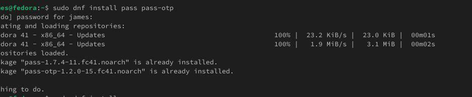{#fig-001 width=70%}

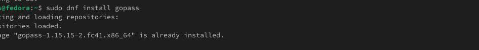{#fig-002 width=70%}

Далее был просмотрен список имеющихся GPG-ключей командой `gpg --list-secret-keys` (рис. -@fig-003).

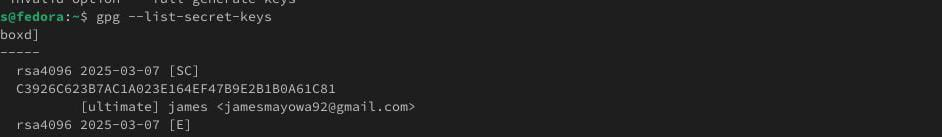{#fig-003 width=70%}

После этого хранилище паролей было инициализировано с привязкой к GPG-ключу, синхронизировано с git и был указан адрес удалённого хранилища (рис. -@fig-004):

```bash
pass init omotole47@gmail.com
pass git init
pass git remote add origin git@github.com:Ushie47/study_2024-2025_os-intro.git
```

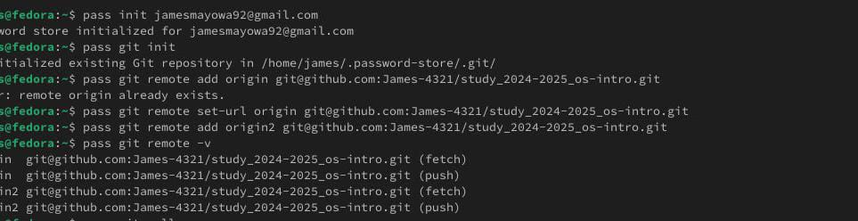{#fig-004 width=70%}

Для синхронизации хранилища используются команды `pass git pull` и `pass git push` (рис. -@fig-005).

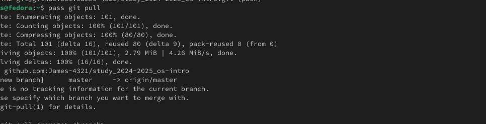{#fig-005 width=70%}

Если изменения вносятся непосредственно в файловую систему хранилища, их необходимо зафиксировать и отправить вручную (рис. -@fig-006):

```bash
cd ~/.password-store/
git add .
git commit -am 'edit manually'
git push
```

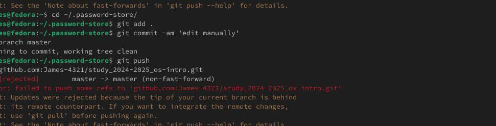{#fig-006 width=70%}

## Настройка интерфейса с помощью браузера

Для работы с паролями непосредственно в браузере был установлен плагин BrowserPass, а также интерфейс для его взаимодействия с терминалом (рис. -@fig-007):

```bash
dnf copr enable maximbaz/browserpass
dnf install browserpass
```

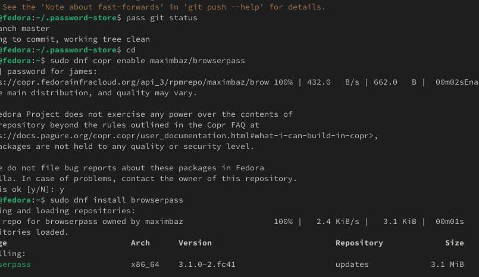{#fig-007 width=70%}

## Сохранение пароля

Был создан пароль и выполнено его отображение для конкретной записи в терминале (рис. -@fig-008):

```bash
pass insert [study]/[github]
pass [study]/[github]
```

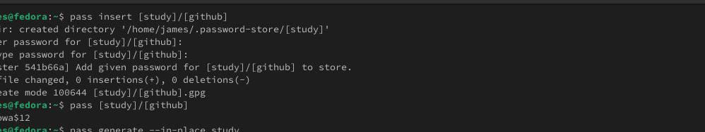{#fig-008 width=70%}

## Управление конфигурационными файлами

Для работы с Chezmoi было установлено необходимое дополнительное программное обеспечение (рис. -@fig-009).

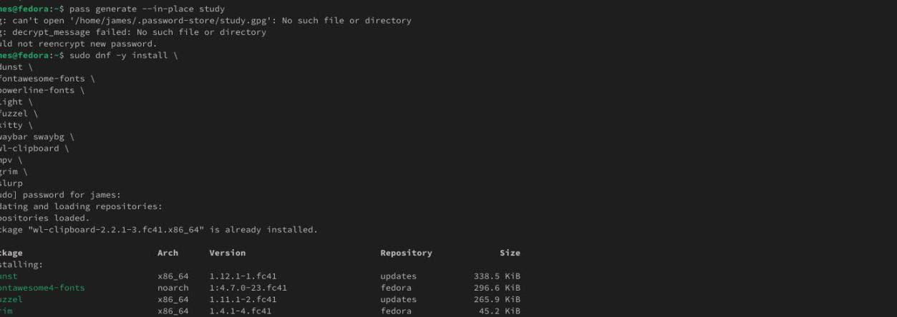{#fig-009 width=70%}

Бинарный файл Chezmoi был установлен с помощью установочного скрипта, который сам определяет архитектуру процессора и операционную систему:

```bash
sh -c "$(wget -qO- chezmoi.io/get)"
```

Далее был создан собственный репозиторий для конфигурационных файлов на основе шаблона и выполнена инициализация Chezmoi с указанием этого репозитория (рис. -@fig-010):

```bash
gh repo create dotfiles --template="yamadharma/dotfiles-template" --private
chezmoi init git@github.com:Ushie47/dotfiles.git
```

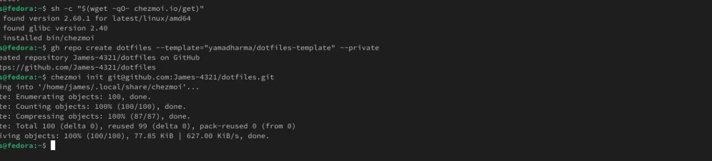{#fig-010 width=70%}

Для получения и применения изменений из репозитория используется команда `chezmoi update`. Чтобы получить последние изменения и предварительно посмотреть, что изменится при применении, используется связка:

```bash
chezmoi git pull -- --autostash --rebase && chezmoi diff
```

Для применения изменений используется команда:

```bash
chezmoi apply
```

По умолчанию автоматическая фиксация и отправка изменений исходного каталога отключены. Чтобы включить эту функцию, в файл `~/.config/chezmoi/chezmoi.toml` было добавлено (рис. -@fig-011, рис. -@fig-012):

```toml
[git]
    autoCommit = true
    autoPush = true
```

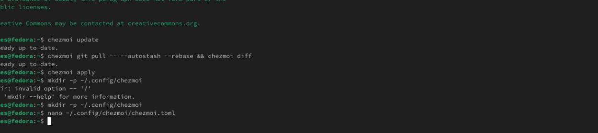{#fig-011 width=70%}

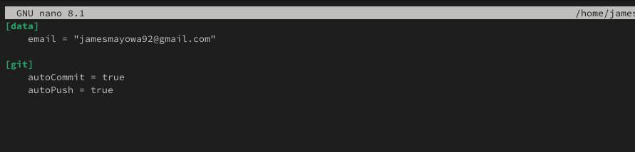{#fig-012 width=70%}

# Результаты

В результате выполнения работы:

- установлены и настроены менеджеры паролей `pass` и `gopass`;
- хранилище паролей инициализировано, привязано к GPG-ключу и синхронизировано с удалённым git-репозиторием;
- настроена ручная фиксация изменений хранилища при прямом редактировании файлов;
- установлен и настроен браузерный интерфейс BrowserPass;
- сохранён и успешно отображён пароль через `pass`;
- установлен Chezmoi, создан личный репозиторий dotfiles на основе шаблона и выполнена его инициализация;
- настроена автоматическая фиксация и отправка изменений конфигурационных файлов.

# Обсуждение результатов

Сочетание GPG-шифрования и git-версионирования в `pass` обеспечивает одновременно конфиденциальность и прослеживаемость истории изменений хранилища паролей, что соответствует принципу «несколько простых инструментов лучше одного монолитного». Аналогично, Chezmoi решает задачу синхронизации конфигурационных файлов между машинами через git-репозиторий, но в отличие от прямого хранения dotfiles в репозитории использует шаблонизацию, позволяя применять одну и ту же конфигурацию на разных машинах с разными параметрами. Включение автоматической фиксации и отправки изменений в обоих инструментах снижает риск забыть синхронизировать локальные изменения с удалённым репозиторием.

# Заключение

В ходе лабораторной работы было изучено использование Chezmoi для управления конфигурационными файлами, а также использование менеджера паролей `pass` совместно с `gopass` для безопасного хранения и синхронизации паролей.

Поставленная цель работы достигнута.

# Список литературы {.unnumbered}

::: {#refs}
:::
