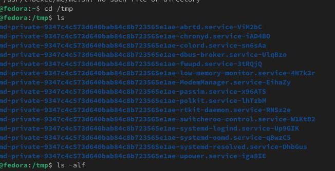
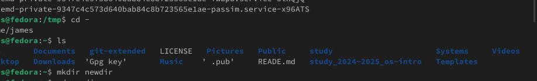
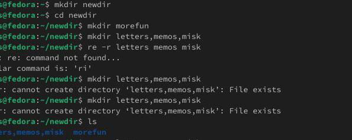
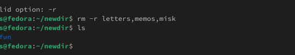
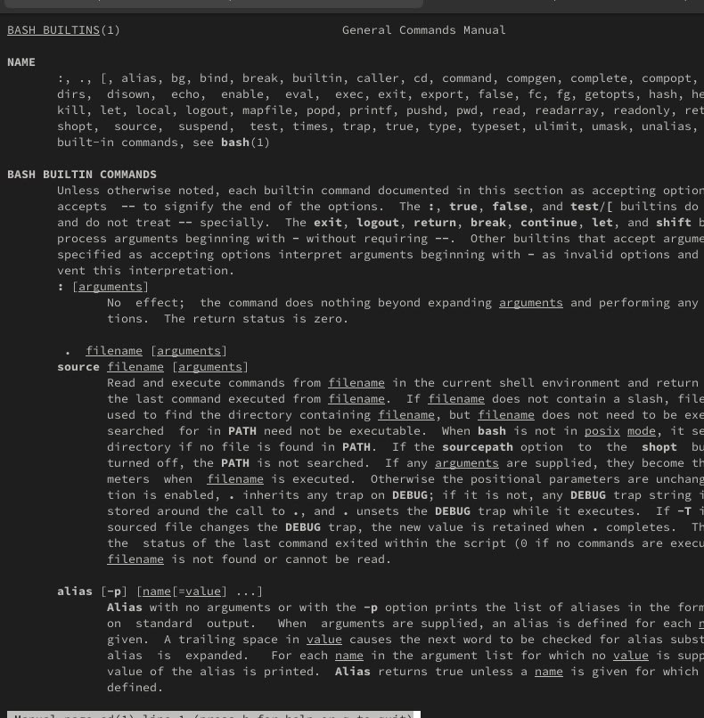
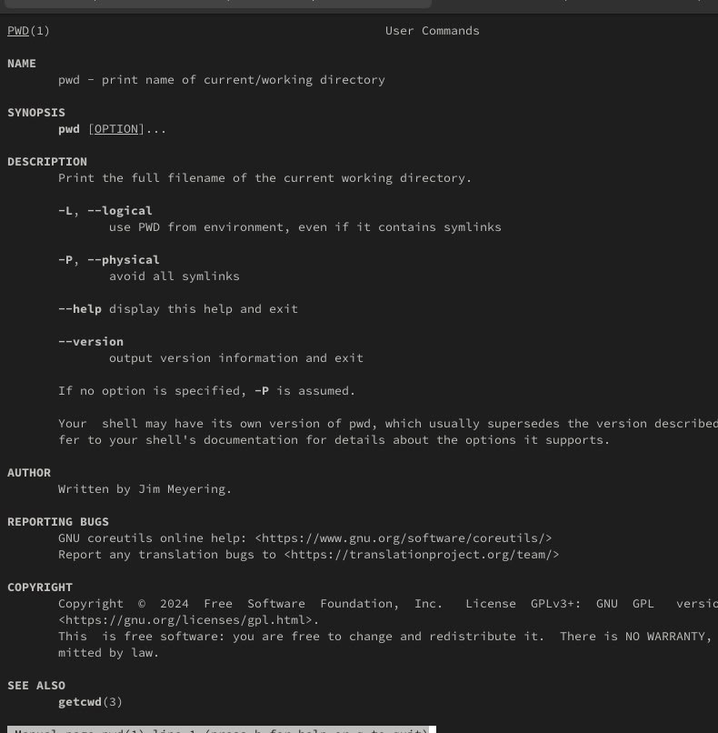
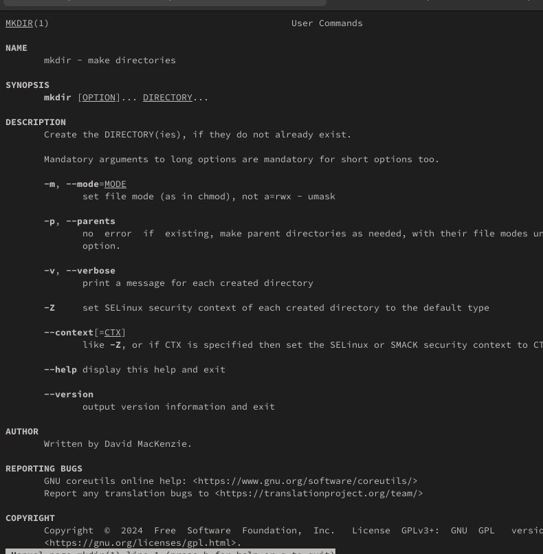
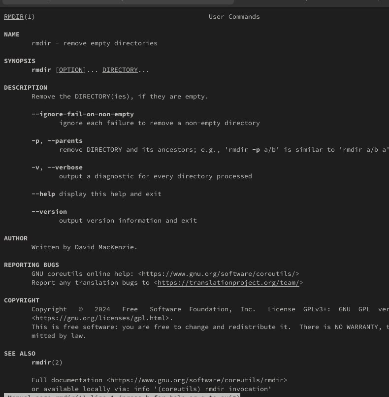
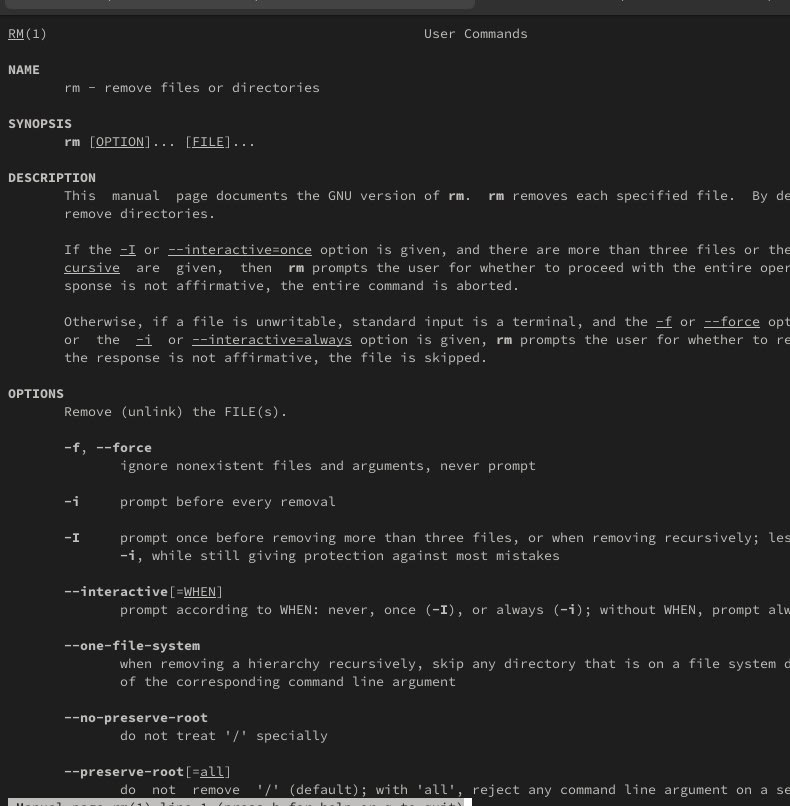
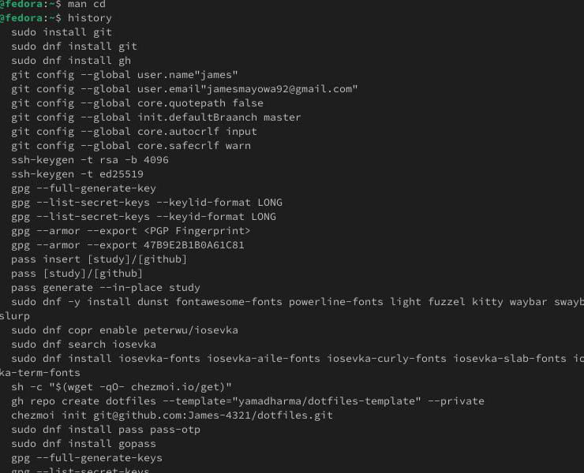

---
## Author
author:
  name: Давид Майкл Фрэнсис
  affiliation:
    - name: Российский университет дружбы народов
      country: Российская Федерация
      postal-code: 117198
      city: Москва
      address: ул. Миклухо-Маклая, д. 6

## Title
title: "Лабораторная работа №6"
subtitle: "Взаимодействие пользователя с системой посредством командной строки"
license: "CC BY"
abstract: |
  В данном отчёте представлены результаты выполнения лабораторной работы по теме «Взаимодействие пользователя с системой посредством командной строки».

  Рассмотрены навигация по файловой системе, создание и удаление каталогов, использование команды `man` для изучения опций команд, а также работа с историей команд.

  Сделаны выводы о достижении поставленной цели.
keywords: [командная строка, shell, bash, man, history, файловая система]
---

# Введение

## Актуальность

Уверенное владение командной строкой является базовым навыком при работе с операционными системами семейства Linux. Значительная часть администрирования, разработки и автоматизации задач выполняется именно через интерпретатор команд, поэтому понимание навигации по файловой системе, управления каталогами и способов получения справочной информации о командах необходимо для дальнейшей работы в системе.

## Цель работы

Приобретение практических навыков взаимодействия пользователя с системой посредством командной строки.

## Задачи

- определить полный путь домашнего каталога пользователя;
- выполнить навигацию в каталог `/tmp` и просмотреть его содержимое с различными опциями команды `ls`;
- вернуться в домашний каталог и просмотреть его содержимое;
- создать и удалить каталоги, в том числе несколько каталогов одной командой;
- с помощью `man` определить опцию `ls` для рекурсивного просмотра подкаталогов;
- с помощью `man` определить опции `ls` для сортировки по времени изменения с развёрнутым описанием файлов;
- изучить описания команд `cd`, `pwd`, `mkdir`, `rmdir`, `rm` с помощью `man`;
- используя историю команд, выполнить модификацию и повторное исполнение команды из буфера.

## Объект и предмет исследования

Объектом исследования является командная строка (shell) операционной системы Linux. Предметом исследования выступает процесс навигации по файловой системе и управления каталогами с использованием базовых команд командной строки (`cd`, `pwd`, `ls`, `mkdir`, `rmdir`, `rm`), а также способы получения справочной информации о командах и работы с историей команд.

## Методы исследования

Работа выполнялась практическим методом — путём непосредственного взаимодействия с интерпретатором команд (shell) операционной системы Linux.

## Схема выполнения работы

На рис. -@fig-flowchart представлена общая последовательность действий при выполнении работы.

::: {#fig-flowchart}

```{mermaid}
%%| fig-width: 100%
graph TD
    A@{ shape: circle, label: "Начало" } --> B[Выполнить действие]
    B --> C[Описать, что конкретно сделано]
    C --> D[Подтвердить скриншотом]
    D --> E[Занести в отчёт]
    E --> F[Поместить в git-репозиторий]
    F --> G[Сделать релиз git]
    G --> J@{ shape: dbl-circ, label: "Конец" }
```

Блок-схема выполнения лабораторной работы

:::

# Теоретическая часть

Командная строка (shell) — это текстовый интерфейс, через который пользователь вводит команды для управления операционной системой: навигации по файловой системе, запуска программ, управления файлами и каталогами [@shotts_book_linux-command-line_en]. В Linux файловая система организована в виде единого дерева каталогов с корнем `/`; путь к файлу или каталогу может быть **абсолютным** — указанным от корня (например, `/home/user/file.txt`), или **относительным** — указанным относительно текущего рабочего каталога (например, `file.txt` или `../file.txt`).

Базовые команды навигации и управления каталогами включают `pwd` (вывод полного пути текущего каталога), `cd` (переход в указанный каталог), `ls` (просмотр содержимого каталога), `mkdir` (создание каталога) и `rmdir`/`rm` (удаление пустого каталога и удаление файлов/каталогов соответственно). Подробное описание возможностей и опций любой команды можно получить с помощью системы встроенной документации `man` («manual»), которая для каждой команды содержит полное руководство с перечислением всех доступных опций.

Отдельным полезным механизмом командной строки является **история команд** (`history`), хранящая список ранее введённых команд. Для повторного исполнения команд из истории используются специальные обозначения событий: `!!` повторяет последнюю выполненную команду, `!n` — команду с номером `n` из истории, а `!строка` — последнюю команду, начинающуюся с указанной строки.

# Материалы и методы

Для выполнения работы использовались:

- операционная система семейства Linux;
- интерпретатор командной строки (shell);
- команды навигации и управления файловой системой: `cd`, `pwd`, `ls`, `mkdir`, `rmdir`, `rm`;
- система встроенной документации `man`;
- механизм истории команд `history`.

# Выполнение лабораторной работы

Первым шагом был определён полный путь домашнего каталога пользователя, относительно которого выполнялись последующие упражнения.

Далее был выполнен переход в каталог `/tmp`, и его содержимое было выведено на экран с использованием команды `ls` с различными опциями (рис. -@fig-001).

{#fig-001 width=70%}

После этого был выполнен переход обратно в домашний каталог, и его содержимое также было выведено на экран (рис. -@fig-002).

{#fig-002 width=70%}

В домашнем каталоге был создан новый каталог `newdir`, а внутри него — каталог `morefun`. Также одной командой было создано три новых каталога: `letters`, `memos`, `misk`, которые затем были удалены также одной командой (рис. -@fig-003, рис. -@fig-004).

{#fig-003 width=70%}

{#fig-004 width=70%}

Каталог `~/newdir/morefun` был удалён, после чего было проверено, что удаление действительно выполнено.

С помощью команды `man ls` была определена опция, позволяющая просматривать содержимое не только указанного каталога, но и всех вложенных в него подкаталогов (рис. -@fig-005).

{#fig-005 width=70%}

Аналогичным образом с помощью `man ls` был определён набор опций, позволяющий отсортировать содержимое каталога по времени последнего изменения с выводом развёрнутого описания файлов.

Далее с помощью `man` были изучены описания команд `cd`, `pwd`, `mkdir`, `rmdir` и `rm` (рис. -@fig-006).

{#fig-006 width=70%}

**pwd** — показывает полный путь текущего каталога (рис. -@fig-007).

{#fig-007 width=70%}

**mkdir** — создаёт новый каталог (рис. -@fig-008).

{#fig-008 width=70%}

**rmdir** — удаляет пустой каталог (рис. -@fig-009).

{#fig-009 width=70%}

**rm** — удаляет файлы и каталоги.

Заключительным шагом, используя информацию, полученную с помощью команды `history`, была выполнена модификация и повторное исполнение нескольких команд из буфера истории (рис. -@fig-010).

{#fig-010 width=70%}

# Результаты

В результате выполнения работы:

- определён полный путь домашнего каталога;
- отработана навигация по файловой системе и просмотр содержимого каталогов с различными опциями `ls`;
- созданы и удалены каталоги, в том числе несколько каталогов одной командой;
- с помощью `man` определены опции `ls` для рекурсивного и отсортированного по времени просмотра содержимого каталогов;
- изучены описания команд `cd`, `pwd`, `mkdir`, `rmdir`, `rm`;
- отработано использование истории команд для модификации и повторного исполнения команд.

# Обсуждение результатов

Систематическое использование `man` для поиска нужных опций команд (например, `-R` для рекурсивного просмотра или комбинации опций для сортировки по времени изменения) оказывается более надёжным подходом, чем запоминание всех возможных ключей команд наизусть. Использование истории команд и обозначений событий (`!!`, `!n`, `!строка`) заметно ускоряет работу в командной строке при повторении или незначительном изменении ранее введённых команд.

# Заключение

В ходе лабораторной работы были изучены основные команды терминала Linux для навигации по файловой системе и управления каталогами, а также приёмы получения справочной информации о командах и работы с историей команд.

Поставленная цель работы достигнута.

# Ответы на контрольные вопросы {.unnumbered}

**1. Что такое командная строка?**

Командная строка — это интерфейс, в котором пользователи вводят команды для управления операционной системой.

**2. При помощи какой команды можно определить абсолютный путь текущего каталога?**

```bash
pwd
```

**3. При помощи какой команды и каких опций можно определить только тип файлов и их имена в текущем каталоге?**

```bash
ls -F
```

**4. Каким образом отобразить информацию о скрытых файлах?**

```bash
ls -a
```

**5. При помощи каких команд можно удалить файл и каталог? Можно ли это сделать одной и той же командой?**

- Файл: `rm файл.txt`
- Каталог: `rm -r папка/`

Да, командой `rm` с флагом `-r` можно удалить и файлы, и каталоги.

**6. Каким образом можно вывести информацию о последних выполненных пользователем командах?**

```bash
history
```

**7. Как воспользоваться историей команд для их модифицированного выполнения?**

- `!!` — повторить последнюю команду;
- `!номер` — выполнить команду из истории под указанным номером;
- `!ls` — выполнить последнюю команду, начинающуюся с `ls`.

**8. Пример запуска нескольких команд в одной строке**

```bash
mkdir test; cd test; touch file.txt
```

**9. Определение и примеры символов экранирования**

Экранирование используется для защиты специальных символов от интерпретации оболочкой. Символ `\` позволяет избежать интерпретации следующего за ним специального символа.

**10. Вывод информации на экран после выполнения `ls -l`**

Команда `ls -l` показывает подробную информацию о файлах и каталогах: права доступа, владельца, группу, размер и дату последнего изменения.

**11. Что такое относительный путь к файлу? Примеры использования относительного и абсолютного пути**

Относительный путь — путь к файлу относительно текущего каталога. Абсолютный путь — полный путь от корня `/`.

Пример использования:

```bash
cat файл.txt             # относительный путь
cat /home/user/файл.txt  # абсолютный путь
```

**12. Как получить информацию об интересующей вас команде?**

- `man команда` — подробное руководство;
- `команда --help` — краткая справка.

**13. Какая клавиша или комбинация клавиш служит для автоматического дополнения вводимых команд?**

`Tab` — дополняет команды и имена файлов.

# Список литературы {.unnumbered}

::: {#refs}
:::
