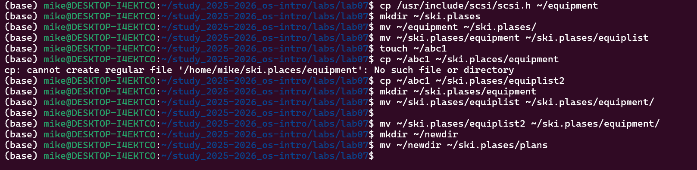
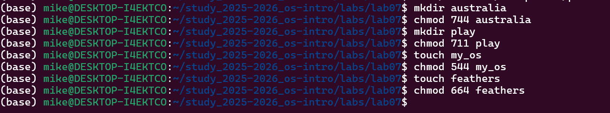

Лабораторная работа № 5.

**ДАВИД МАЙКЛ ФРАНСИС**

## 1. Цель работы

Ознакомление с файловой системой Linux, ее структурой, именами и содержанием
каталогов. Приобретение практических навыков по применению команд для работы
с файлами и каталогами, по управлению правами доступа, а также по проверке
использования диска и обслуживанию файловой системы.

---

## 2. Теоретическая часть

### Файловая система Linux

Файловая система Linux представляет собой единое дерево каталогов, начинающееся
с корневого каталога `/`. Все файлы, каталоги, устройства и подключенные
файловые системы отображаются внутри этого дерева.

Основные каталоги первого уровня:

- `/bin` — основные пользовательские команды
- `/boot` — файлы загрузчика и ядра системы
- `/dev` — файлы устройств
- `/etc` — системные конфигурационные файлы
- `/home` — домашние каталоги пользователей
- `/lib`, `/lib64` — системные библиотеки
- `/media`, `/mnt` — точки монтирования
- `/opt` — дополнительное программное обеспечение
- `/proc` — виртуальная файловая система процессов и ядра
- `/root` — домашний каталог администратора
- `/run` — временные данные работающей системы
- `/sbin` — системные административные команды
- `/srv` — данные сервисов
- `/sys` — информация о ядре и устройствах
- `/tmp` — временные файлы
- `/usr` — пользовательские программы, библиотеки и документация
- `/var` — изменяемые данные, журналы и кэши

---

### Команды для работы с файлами и каталогами

Команда `touch` используется для создания пустого файла:

```bash
touch имя_файла
```

Команда `cat` используется для просмотра содержимого небольших файлов:

```bash
cat имя_файла
```

Команда `less` используется для постраничного просмотра файлов:

```bash
less имя_файла
```

Команды `head` и `tail` используются для вывода первых и последних строк файла:

```bash
head имя_файла
tail имя_файла
```

Команда `cp` используется для копирования файлов и каталогов:

```bash
cp исходный_файл целевой_файл
cp -r исходный_каталог целевой_каталог
```

Команда `mv` используется для перемещения и переименования файлов и каталогов:

```bash
mv старое_имя новое_имя
mv файл каталог/
```

---

### Права доступа

В Linux каждый файл и каталог имеет права доступа для трех категорий пользователей:

- `u` — владелец файла
- `g` — группа
- `o` — остальные пользователи

Основные права:

| Право | Обозначение | Для файла | Для каталога |
|---|---|---|---|
| Чтение | `r` | Просмотр содержимого | Просмотр списка файлов |
| Запись | `w` | Изменение файла | Создание и удаление файлов |
| Выполнение | `x` | Запуск файла | Переход в каталог |

Права изменяются командой `chmod`:

```bash
chmod режим имя_файла
```

Примеры:

```bash
chmod u+x file
chmod g-w file
chmod 755 directory
```

---

### Анализ файловой системы

Команда `mount` показывает смонтированные файловые системы:

```bash
mount
```

Команда `df` показывает использование дискового пространства:

```bash
df -h
```

Команда `fsck` используется для проверки и восстановления файловой системы:

```bash
fsck имя_устройства
```

---

## 3. Выполнение работы

### Шаг 1. Выполнение примеров из первой части лабораторной работы

```bash
cd ~
touch abc1
cat abc1
less abc1
head abc1
tail abc1
```

```bash
mkdir monthly
cp abc1 april
cp abc1 may
cp april may monthly
cp monthly/may monthly/june
ls monthly
```

```bash
mkdir monthly.00
cp -r monthly monthly.00
mv april july
mv july monthly.00
mkdir reports
mv monthly.00 reports/monthly
ls -l
```

---

### Шаг 2. Копирование файла из `/usr/include/sys/`

Скопировать файл `/usr/include/sys/io.h` в домашний каталог и назвать его
`equipment`:

```bash
cp /usr/include/scis/sci.h ~/equipment
```

Если файла `io.h` нет, можно выбрать любой другой файл из каталога:

```bash
ls /usr/include/sys
cp /usr/include/sys/<имя_файла> ~/equipment
```

---

### Шаг 3. Создание каталога `ski.plases`

```bash
mkdir ~/ski.plases
```

---

### Шаг 4. Перемещение файла `equipment`

```bash
mv ~/equipment ~/ski.plases/
```

---

### Шаг 5. Переименование файла `equipment` в `equiplist`

```bash
mv ~/ski.plases/equipment ~/ski.plases/equiplist
```

---

### Шаг 6. Создание файла `abc1` и копирование его как `equiplist2`

```bash
touch ~/abc1
cp ~/abc1 ~/ski.plases/equiplist2
```

---

### Шаг 7. Создание каталога `equipment`

```bash
mkdir ~/ski.plases/equipment
```

---

### Шаг 8. Перемещение файлов `equiplist` и `equiplist2`

```bash
mv ~/ski.plases/equiplist ~/ski.plases/equiplist2 ~/ski.plases/equipment/
```

---

### Шаг 9. Создание каталога `newdir` и перемещение его как `plans`

```bash
mkdir ~/newdir
mv ~/newdir ~/ski.plases/plans
```

Проверка результата:

```bash
ls -lR ~/ski.plases
```



---

### Шаг 10. Создание объектов для изменения прав доступа

```bash
mkdir ~/australia ~/play
touch ~/my_os ~/feathers
chmod 000 ~/australia ~/play ~/my_os ~/feathers
```

---

### Шаг 11. Назначение прав доступа

```bash
chmod 744 ~/australia
chmod 711 ~/play
chmod 544 ~/my_os
chmod 664 ~/feathers
```

Проверка:

```bash
ls -ld ~/australia ~/play
ls -l ~/my_os ~/feathers
```



Полученные права:

| Объект | Требуемые права | Команда |
|---|---|---|
| `australia` | `drwxr--r--` | `chmod 744 ~/australia` |
| `play` | `drwx--x--x` | `chmod 711 ~/play` |
| `my_os` | `-r-xr--r--` | `chmod 544 ~/my_os` |
| `feathers` | `-rw-rw-r--` | `chmod 664 ~/feathers` |


---

### Шаг 12. Просмотр файла `/etc/passwd`

В задании указан файл `/etc/password`, однако в Linux обычно используется файл
`/etc/passwd`.

```bash
cat /etc/passwd
```

---

### Шаг 13. Копирование файла `feathers`

```bash
cp ~/feathers ~/file.old
```

---

### Шаг 14. Перемещение файла `file.old` в каталог `play`

```bash
mv ~/file.old ~/play/
```

---

### Шаг 15. Копирование каталога `play` в каталог `fun`

```bash
cp -r ~/play ~/fun
```

---

### Шаг 16. Перемещение каталога `fun` в каталог `play` под именем `games`

```bash
mv ~/fun ~/play/games
```

---

### Шаг 17. Лишение владельца файла `feathers` права на чтение

```bash
chmod u-r ~/feathers
```

---

### Шаг 18. Попытка просмотра файла `feathers`

```bash
cat ~/feathers
```

Результат: появляется ошибка `Permission denied`, так как у владельца нет права
на чтение файла.

---

### Шаг 19. Попытка копирования файла `feathers`

```bash
cp ~/feathers ~/feathers.copy
```

Результат: появляется ошибка `Permission denied`, так как для копирования
необходимо право чтения исходного файла.

---

### Шаг 20. Возврат права чтения владельцу файла `feathers`

```bash
chmod u+r ~/feathers
```

---

### Шаг 21. Лишение владельца каталога `play` права на выполнение

```bash
chmod u-x ~/play
```

---

### Шаг 22. Попытка перехода в каталог `play`

```bash
cd ~/play
```

Результат: появляется ошибка `Permission denied`, так как без права выполнения
нельзя перейти в каталог.

---

### Шаг 23. Возврат права выполнения владельцу каталога `play`

```bash
chmod u+x ~/play
cd ~/play
```


---

### Шаг 24. Изучение команд `mount`, `fsck`, `mkfs`, `kill`

```bash
man mount
man fsck
man mkfs
man kill
```

Краткая характеристика команд:

- `mount` — подключает файловую систему к точке монтирования
- `fsck` — проверяет и восстанавливает файловую систему
- `mkfs` — создает файловую систему на разделе или устройстве
- `kill` — отправляет сигнал процессу, чаще всего используется для завершения процесса

Примеры:

```bash
mount /dev/sdb1 /mnt
fsck /dev/sdb1
mkfs.ext4 /dev/sdb1
kill 1234
```


---

### Шаг 25. Проверка использования диска

```bash
df -h
df -T
lsblk -f
```


---


---

## 4. Выводы

В ходе выполнения лабораторной работы была изучена структура файловой системы
Linux и основные команды для работы с файлами и каталогами. Были получены
практические навыки создания, копирования, перемещения, переименования и
просмотра файлов.

Также были изучены права доступа к файлам и каталогам, способы их изменения
с помощью команды `chmod`, а также особенности прав чтения, записи и выполнения.
Дополнительно были рассмотрены команды `mount`, `fsck`, `mkfs`, `kill`, `df`
и `lsblk`, применяемые для анализа и обслуживания файловой системы.

---

## 5. Ответы на контрольные вопросы

**1. Дайте характеристику каждой файловой системе, существующей на жестком диске компьютера, на котором выполнялась лабораторная работа.**

Файловые системы можно определить командами:

```bash
df -T
lsblk -f
mount
```

На современных Linux-системах часто встречаются:

- `ext4` — распространенная журналируемая файловая система Linux
- `xfs` — файловая система для больших файлов и разделов
- `btrfs` — файловая система с поддержкой снимков и контроля целостности
- `vfat` — файловая система, часто используемая на EFI-разделах
- `ntfs` — файловая система Windows, поддерживаемая в Linux
- `swap` — область подкачки, не предназначенная для обычного хранения файлов

**2. Приведите общую структуру файловой системы и дайте характеристику каждой директории первого уровня этой структуры.**

Файловая система Linux имеет древовидную структуру, начинающуюся с корневого
каталога `/`. Основные каталоги:

- `/bin` — основные команды
- `/boot` — загрузочные файлы
- `/dev` — файлы устройств
- `/etc` — конфигурационные файлы
- `/home` — домашние каталоги пользователей
- `/lib` — системные библиотеки
- `/media` и `/mnt` — точки монтирования
- `/opt` — дополнительное программное обеспечение
- `/proc` — информация о процессах и ядре
- `/root` — домашний каталог администратора
- `/run` — временные данные системы
- `/sbin` — системные команды администратора
- `/sys` — информация об устройствах
- `/tmp` — временные файлы
- `/usr` — пользовательские программы и библиотеки
- `/var` — журналы, кэши и изменяемые данные

**3. Какая операция должна быть выполнена, чтобы содержимое некоторой файловой системы было доступно операционной системе?**

Необходимо выполнить монтирование файловой системы. Монтирование связывает
устройство или раздел с каталогом, который называется точкой монтирования.
После этого содержимое файловой системы становится доступно через дерево
каталогов Linux.

**4. Назовите основные причины нарушения целостности файловой системы. Как устранить повреждения файловой системы?**

Основные причины нарушения целостности файловой системы:

- аварийное отключение питания
- некорректное выключение компьютера
- сбой оборудования
- повреждение носителя
- ошибки драйверов или ядра
- некорректное размонтирование устройства

Для проверки и восстановления файловой системы используется команда:

```bash
fsck имя_устройства
```

**5. Как создается файловая система?**

Файловая система создается на разделе или устройстве с помощью команды `mkfs`.

Пример:

```bash
mkfs.ext4 /dev/sdb1
```

Перед выполнением этой команды необходимо убедиться, что выбран правильный
раздел, так как прежние данные будут удалены.

**6. Дайте характеристику командам для просмотра текстовых файлов.**

- `cat` — выводит весь файл на экран
- `less` — позволяет просматривать файл постранично
- `head` — выводит первые 10 строк файла
- `tail` — выводит последние 10 строк файла
- `tail -f` — позволяет наблюдать за изменением файла в реальном времени

**7. Приведите основные возможности команды `cp` в Linux.**

Команда `cp` используется для копирования файлов и каталогов.

Примеры:

```bash
cp file1 file2
cp file1 directory/
cp file1 file2 directory/
cp -r dir1 dir2
cp -i file1 file2
```

Основные возможности:

- копирование одного файла в другой
- копирование нескольких файлов в каталог
- рекурсивное копирование каталогов
- подтверждение перезаписи файлов
- сохранение атрибутов файлов

**8. Приведите основные возможности команды `mv` в Linux.**

Команда `mv` используется для перемещения и переименования файлов и каталогов.

Примеры:

```bash
mv oldname newname
mv file directory/
mv dir1 dir2
mv -i file1 file2
```

Основные возможности:

- переименование файлов
- переименование каталогов
- перемещение файлов в другой каталог
- перемещение каталогов
- подтверждение перезаписи при использовании параметра `-i`

**9. Что такое права доступа? Как они могут быть изменены?**

Права доступа определяют, какие действия могут выполнять пользователи с файлом
или каталогом. Они задаются для владельца, группы и остальных пользователей.

Основные права:

- `r` — чтение
- `w` — запись
- `x` — выполнение

Права доступа изменяются командой `chmod`.

Примеры:

```bash
chmod u+x file
chmod g-w file
chmod o+r file
chmod 755 directory
chmod 644 file
```

[Ссылка на репозиторий](https://github.com/Ushie47/study_2025-2026_os-intro)
