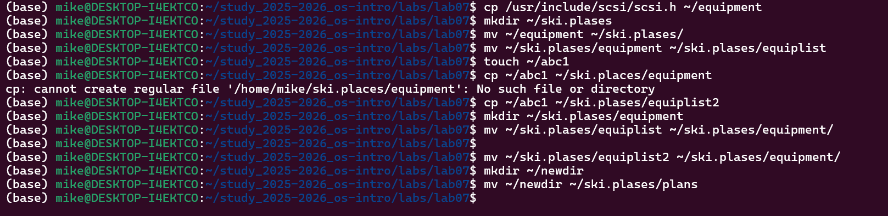
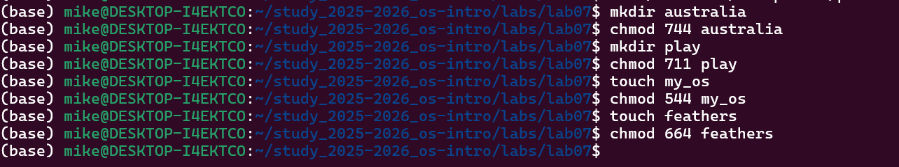

---
## Author
author:
  name:  Давид Майкл Фрэнсис
  affiliation:
    - name: Российский университет дружбы народов
      country: Российская Федерация
      postal-code: 117198
      city: Москва
      address: ул. Миклухо-Маклая, д. 6

## Title
title: "Лабораторная работа №7"
subtitle: "Файловая система Linux, работа с файлами и права доступа"
license: "CC BY"
abstract: |
  В данном отчёте представлены результаты выполнения лабораторной работы по теме «Файловая система Linux, работа с файлами и права доступа».

  Рассмотрены структура файловой системы Linux, команды работы с файлами и каталогами, управление правами доступа с помощью `chmod`, а также команды анализа и обслуживания файловой системы.

  Сделаны выводы о достижении поставленной цели.
keywords: [файловая система, linux, права доступа, chmod, fsck, mount]
---

# Введение

## Актуальность

Понимание структуры файловой системы Linux и уверенное владение командами работы с файлами, каталогами и правами доступа — необходимая основа для дальнейшей работы в системе, будь то администрирование, разработка или повседневное использование. Модель прав доступа Linux, основанная на владельце, группе и остальных пользователях, лежит в основе безопасности многопользовательской системы, а команды анализа и обслуживания файловой системы позволяют контролировать состояние дисков и устранять возможные неисправности.

## Цель работы

Ознакомление с файловой системой Linux, её структурой, именами и содержанием каталогов. Приобретение практических навыков по применению команд для работы с файлами и каталогами, по управлению правами доступа, а также по проверке использования диска и обслуживанию файловой системы.

## Задачи

- изучить структуру файловой системы Linux и назначение основных каталогов первого уровня;
- освоить команды работы с файлами и каталогами (`touch`, `cat`, `less`, `head`, `tail`, `cp`, `mv`);
- освоить управление правами доступа с помощью команды `chmod`;
- на практике проверить влияние прав доступа на выполнение операций с файлами и каталогами;
- изучить команды анализа и обслуживания файловой системы (`mount`, `df`, `fsck`, `mkfs`, `lsblk`).

## Объект и предмет исследования

Объектом исследования является файловая система операционной системы Linux. Предметом исследования выступает процесс управления файлами, каталогами и правами доступа с использованием команд командной строки, а также анализа и обслуживания файловой системы.

## Методы исследования

Работа выполнялась практическим методом — путём непосредственного взаимодействия с файловой системой и правами доступа в среде Linux с использованием утилит командной строки.

## Схема выполнения работы

На рис. -@fig-flowchart представлена общая последовательность действий при выполнении работы.

::: {#fig-flowchart}

```{mermaid}
%%| fig-width: 100%
graph TD
    A@{ shape: circle, label: "Начало" } --> B[Выполнить действие]
    B --> C[Описать, что конкретно сделано]
    C --> D[Подтвердить скриншотом]
    D --> E[Занести в отчёт]
    E --> F[Поместить в git-репозиторий]
    F --> G[Сделать релиз git]
    G --> J@{ shape: dbl-circ, label: "Конец" }
```

Блок-схема выполнения лабораторной работы

:::

# Теоретическая часть

## Файловая система Linux

Файловая система Linux представляет собой единое дерево каталогов, начинающееся с корневого каталога `/`. Все файлы, каталоги, устройства и подключённые файловые системы отображаются внутри этого дерева, структура которого регламентируется стандартом Filesystem Hierarchy Standard [@fhs_web_filesystem-hierarchy-standard_en]. Основные каталоги первого уровня:

- `/bin` — основные пользовательские команды;
- `/boot` — файлы загрузчика и ядра системы;
- `/dev` — файлы устройств;
- `/etc` — системные конфигурационные файлы;
- `/home` — домашние каталоги пользователей;
- `/lib`, `/lib64` — системные библиотеки;
- `/media`, `/mnt` — точки монтирования;
- `/opt` — дополнительное программное обеспечение;
- `/proc` — виртуальная файловая система процессов и ядра;
- `/root` — домашний каталог администратора;
- `/run` — временные данные работающей системы;
- `/sbin` — системные административные команды;
- `/srv` — данные сервисов;
- `/sys` — информация о ядре и устройствах;
- `/tmp` — временные файлы;
- `/usr` — пользовательские программы, библиотеки и документация;
- `/var` — изменяемые данные, журналы и кэши.

## Команды для работы с файлами и каталогами

Команда `touch` создаёт пустой файл, `cat` выводит содержимое небольшого файла целиком, `less` позволяет просматривать файл постранично, а `head` и `tail` выводят, соответственно, первые и последние строки файла [@shotts_book_linux-command-line_en]. Команда `cp` используется для копирования файлов и каталогов (с ключом `-r` — рекурсивно, для каталогов), а `mv` — для перемещения и переименования файлов и каталогов.

## Права доступа

В Linux каждый файл и каталог имеет права доступа, заданные отдельно для трёх категорий пользователей: `u` (владелец файла), `g` (группа) и `o` (остальные пользователи). Основные права — чтение (`r`), запись (`w`) и выполнение (`x`) — имеют разный смысл для файлов и каталогов: так, право на выполнение для каталога означает возможность перехода в него, а не запуск самого каталога как программы.

| Право | Обозначение | Для файла | Для каталога |
|---|---|---|---|
| Чтение | `r` | Просмотр содержимого | Просмотр списка файлов |
| Запись | `w` | Изменение файла | Создание и удаление файлов |
| Выполнение | `x` | Запуск файла | Переход в каталог |

Права изменяются командой `chmod`, принимающей как символьную форму (например, `chmod u+x file`), так и числовую, восьмеричную форму (например, `chmod 755 directory`).

## Анализ файловой системы

Команда `mount` без аргументов показывает список смонтированных файловых систем, `df -h` показывает использование дискового пространства в удобочитаемом формате, а `fsck` используется для проверки и восстановления файловой системы на указанном устройстве.

# Материалы и методы

Для выполнения работы использовались операционная система семейства Linux и команды `touch`, `cat`, `less`, `head`, `tail`, `cp`, `mv`, `mkdir`, `chmod`, `mount`, `df`, `fsck`, `mkfs`, `lsblk`, `kill` и `man`.

# Выполнение лабораторной работы

## Примеры работы с файлами и каталогами

В домашнем каталоге был создан файл `abc1`, после чего были опробованы команды просмотра его содержимого:

```bash
cd ~
touch abc1
cat abc1
less abc1
head abc1
tail abc1
```

Далее был создан каталог `monthly`, в который с помощью `cp` были скопированы и переименованы несколько копий файла `abc1`:

```bash
mkdir monthly
cp abc1 april
cp abc1 may
cp april may monthly
cp monthly/may monthly/june
ls monthly
```

После этого была создана резервная копия каталога `monthly`, выполнено перемещение и переименование файлов, а итоговый каталог перемещён во вложенную структуру `reports`:

```bash
mkdir monthly.00
cp -r monthly monthly.00
mv april july
mv july monthly.00
mkdir reports
mv monthly.00 reports/monthly
ls -l
```

## Подготовка файла equipment

Файл `io.h` из каталога `/usr/include/sys/` был скопирован в домашний каталог под именем `equipment`:

```bash
cp /usr/include/sys/io.h ~/equipment
```

Если файл `io.h` в системе отсутствует, можно выбрать любой другой файл из того же каталога:

```bash
ls /usr/include/sys
cp /usr/include/sys/<имя_файла> ~/equipment
```

Далее был создан каталог `~/ski.plases`, в который файл `equipment` был перемещён, а затем переименован в `equiplist`:

```bash
mkdir ~/ski.plases
mv ~/equipment ~/ski.plases/
mv ~/ski.plases/equipment ~/ski.plases/equiplist
```

Был создан новый файл `abc1` и скопирован в `ski.plases` под именем `equiplist2`, после чего внутри `ski.plases` был создан каталог `equipment`, и оба файла (`equiplist`, `equiplist2`) перемещены в него:

```bash
touch ~/abc1
cp ~/abc1 ~/ski.plases/equiplist2
mkdir ~/ski.plases/equipment
mv ~/ski.plases/equiplist ~/ski.plases/equiplist2 ~/ski.plases/equipment/
```

Наконец, был создан каталог `~/newdir` и перемещён внутрь `ski.plases` под именем `plans`, после чего структура каталога была проверена (рис. -@fig-001):

```bash
mkdir ~/newdir
mv ~/newdir ~/ski.plases/plans
ls -lR ~/ski.plases
```

{#fig-001 width=70%}

## Изменение и проверка прав доступа

Для экспериментов с правами доступа были созданы два каталога и два файла, у которых все права были сначала полностью убраны:

```bash
mkdir ~/australia ~/play
touch ~/my_os ~/feathers
chmod 000 ~/australia ~/play ~/my_os ~/feathers
```

Затем каждому объекту были назначены требуемые права, и результат был проверен командой `ls` (рис. -@fig-002):

```bash
chmod 744 ~/australia
chmod 711 ~/play
chmod 544 ~/my_os
chmod 664 ~/feathers

ls -ld ~/australia ~/play
ls -l ~/my_os ~/feathers
```

{#fig-002 width=70%}

Полученные права соответствовали ожидаемым:

| Объект | Требуемые права | Команда |
|---|---|---|
| `australia` | `drwxr--r--` | `chmod 744 ~/australia` |
| `play` | `drwx--x--x` | `chmod 711 ~/play` |
| `my_os` | `-r-xr--r--` | `chmod 544 ~/my_os` |
| `feathers` | `-rw-rw-r--` | `chmod 664 ~/feathers` |

По заданию требовалось просмотреть файл `/etc/password`, однако в Linux учётные записи пользователей хранятся в файле `/etc/passwd` (без последней буквы «w» в конце отсутствует — опечатка в формулировке задания), поэтому был просмотрен именно он:

```bash
cat /etc/passwd
```

Далее была смоделирована практическая работа с правами доступа: файл `feathers` был скопирован в `file.old`, который переместили в каталог `play`; каталог `play` был скопирован в `fun`, а затем перемещён обратно в `play` под именем `games`:

```bash
cp ~/feathers ~/file.old
mv ~/file.old ~/play/
cp -r ~/play ~/fun
mv ~/fun ~/play/games
```

Чтобы проверить влияние права чтения на практике, у владельца файла `feathers` было отозвано право чтения, после чего были предприняты попытки просмотреть и скопировать файл:

```bash
chmod u-r ~/feathers
cat ~/feathers
cp ~/feathers ~/feathers.copy
```

Обе операции завершились ошибкой `Permission denied`: `cat` — поскольку у владельца нет права чтения файла, а `cp` — поскольку копирование также требует права чтения исходного файла. Право чтения было возвращено:

```bash
chmod u+r ~/feathers
```

Аналогичная проверка была выполнена для права выполнения на каталоге: у владельца каталога `play` было отозвано право выполнения, после чего попытка перехода в каталог завершилась ошибкой `Permission denied`, поскольку без права выполнения невозможно войти в каталог:

```bash
chmod u-x ~/play
cd ~/play
```

Право выполнения было возвращено, после чего переход в каталог выполнился успешно:

```bash
chmod u+x ~/play
cd ~/play
```

## Изучение команд обслуживания файловой системы

С помощью `man` были изучены команды `mount`, `fsck`, `mkfs` и `kill`:

```bash
man mount
man fsck
man mkfs
man kill
```

Кратко их назначение можно описать так: `mount` подключает файловую систему к точке монтирования, `fsck` проверяет и восстанавливает файловую систему, `mkfs` создаёт файловую систему на разделе или устройстве, а `kill` отправляет сигнал процессу — чаще всего для его завершения:

```bash
mount /dev/sdb1 /mnt
fsck /dev/sdb1
mkfs.ext4 /dev/sdb1
kill 1234
```

Завершающим шагом было проверено использование дискового пространства:

```bash
df -h
df -T
lsblk -f
```

# Результаты

В результате выполнения работы:

- изучена структура файловой системы Linux и назначение основных каталогов первого уровня;
- отработаны команды создания, просмотра, копирования, перемещения и переименования файлов и каталогов;
- изучена и проверена на практике модель прав доступа (владелец, группа, остальные; чтение, запись, выполнение);
- на конкретных примерах подтверждено влияние отсутствия прав чтения и выполнения на доступность файлов и каталогов;
- изучены команды анализа и обслуживания файловой системы (`mount`, `df`, `fsck`, `mkfs`, `lsblk`, `kill`).

# Обсуждение результатов

Практическая демонстрация ошибок `Permission denied` при попытке прочитать файл без права чтения и перейти в каталог без права выполнения наглядно подтверждает теоретическую модель прав доступа: право `x` для каталога управляет возможностью входа в него, а не запуска, что часто вызывает затруднения на начальном этапе изучения Linux. Отдельно стоит отметить расхождение между формулировкой задания (`/etc/password`) и фактическим именем системного файла (`/etc/passwd`) — такие несоответствия нередко встречаются на практике, и их обнаружение путём проверки реального состояния системы, а не слепого следования инструкции, является важным практическим навыком.

# Заключение

В ходе выполнения лабораторной работы была изучена структура файловой системы Linux и основные команды для работы с файлами и каталогами. Были получены практические навыки создания, копирования, перемещения, переименования и просмотра файлов.

Также были изучены права доступа к файлам и каталогам, способы их изменения с помощью команды `chmod`, а также особенности прав чтения, записи и выполнения. Дополнительно были рассмотрены команды `mount`, `fsck`, `mkfs`, `kill`, `df` и `lsblk`, применяемые для анализа и обслуживания файловой системы.

Поставленная цель работы достигнута.

# Ответы на контрольные вопросы {.unnumbered}

**1. Дайте характеристику каждой файловой системе, существующей на жёстком диске компьютера, на котором выполнялась лабораторная работа.**

Файловые системы можно определить командами:

```bash
df -T
lsblk -f
mount
```

На современных Linux-системах часто встречаются:

- `ext4` — распространённая журналируемая файловая система Linux;
- `xfs` — файловая система для больших файлов и разделов;
- `btrfs` — файловая система с поддержкой снимков и контроля целостности;
- `vfat` — файловая система, часто используемая на EFI-разделах;
- `ntfs` — файловая система Windows, поддерживаемая в Linux;
- `swap` — область подкачки, не предназначенная для обычного хранения файлов.

**2. Приведите общую структуру файловой системы и дайте характеристику каждой директории первого уровня этой структуры.**

Файловая система Linux имеет древовидную структуру, начинающуюся с корневого каталога `/`. Основные каталоги: `/bin` — основные команды; `/boot` — загрузочные файлы; `/dev` — файлы устройств; `/etc` — конфигурационные файлы; `/home` — домашние каталоги пользователей; `/lib` — системные библиотеки; `/media` и `/mnt` — точки монтирования; `/opt` — дополнительное программное обеспечение; `/proc` — информация о процессах и ядре; `/root` — домашний каталог администратора; `/run` — временные данные системы; `/sbin` — системные команды администратора; `/sys` — информация об устройствах; `/tmp` — временные файлы; `/usr` — пользовательские программы и библиотеки; `/var` — журналы, кэши и изменяемые данные.

**3. Какая операция должна быть выполнена, чтобы содержимое некоторой файловой системы было доступно операционной системе?**

Необходимо выполнить монтирование файловой системы. Монтирование связывает устройство или раздел с каталогом, который называется точкой монтирования. После этого содержимое файловой системы становится доступно через дерево каталогов Linux.

**4. Назовите основные причины нарушения целостности файловой системы. Как устранить повреждения файловой системы?**

Основные причины нарушения целостности файловой системы:

- аварийное отключение питания;
- некорректное выключение компьютера;
- сбой оборудования;
- повреждение носителя;
- ошибки драйверов или ядра;
- некорректное размонтирование устройства.

Для проверки и восстановления файловой системы используется команда:

```bash
fsck имя_устройства
```

**5. Как создаётся файловая система?**

Файловая система создаётся на разделе или устройстве с помощью команды `mkfs`, например:

```bash
mkfs.ext4 /dev/sdb1
```

Перед выполнением этой команды необходимо убедиться, что выбран правильный раздел, так как прежние данные на нём будут удалены.

**6. Дайте характеристику командам для просмотра текстовых файлов.**

- `cat` — выводит весь файл на экран;
- `less` — позволяет просматривать файл постранично;
- `head` — выводит первые 10 строк файла;
- `tail` — выводит последние 10 строк файла;
- `tail -f` — позволяет наблюдать за изменением файла в реальном времени.

**7. Приведите основные возможности команды cp в Linux.**

Команда `cp` используется для копирования файлов и каталогов, например:

```bash
cp file1 file2
cp file1 directory/
cp file1 file2 directory/
cp -r dir1 dir2
cp -i file1 file2
```

Основные возможности: копирование одного файла в другой, копирование нескольких файлов в каталог, рекурсивное копирование каталогов, подтверждение перезаписи файлов, сохранение атрибутов файлов.

**8. Приведите основные возможности команды mv в Linux.**

Команда `mv` используется для перемещения и переименования файлов и каталогов, например:

```bash
mv oldname newname
mv file directory/
mv dir1 dir2
mv -i file1 file2
```

Основные возможности: переименование файлов и каталогов, перемещение файлов и каталогов в другой каталог, подтверждение перезаписи при использовании параметра `-i`.

**9. Что такое права доступа? Как они могут быть изменены?**

Права доступа определяют, какие действия могут выполнять пользователи с файлом или каталогом. Они задаются отдельно для владельца, группы и остальных пользователей:

- `r` — чтение;
- `w` — запись;
- `x` — выполнение.

Права доступа изменяются командой `chmod`, например:

```bash
chmod u+x file
chmod g-w file
chmod o+r file
chmod 755 directory
chmod 644 file
```

# Список литературы {.unnumbered}

::: {#refs}
:::
