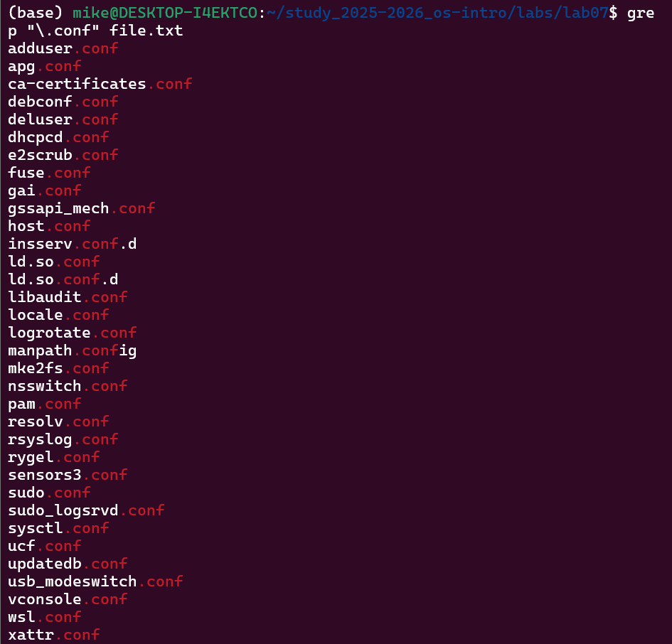
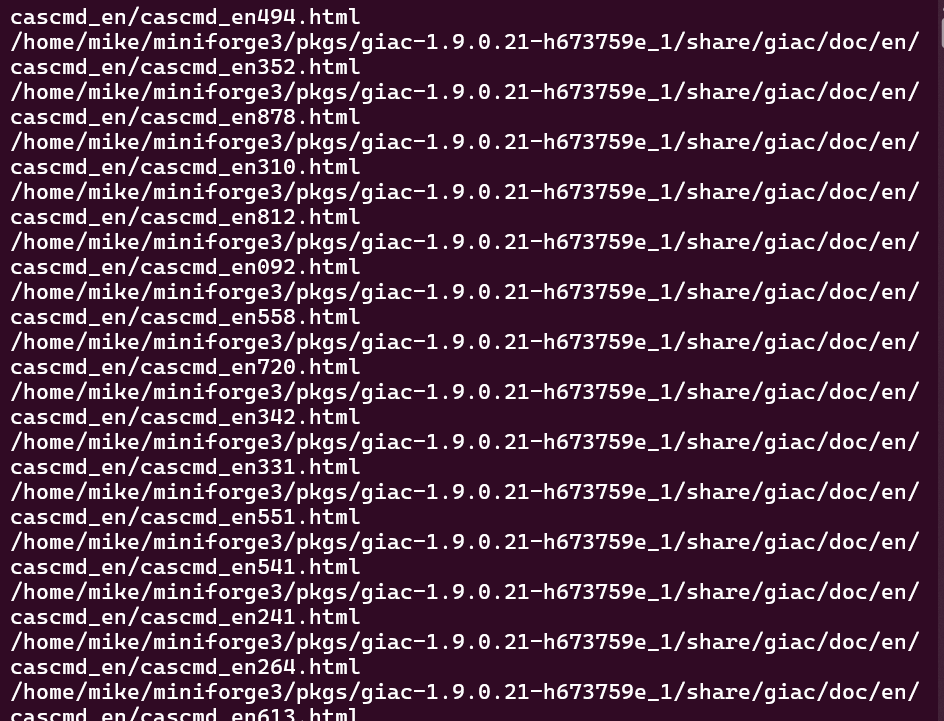
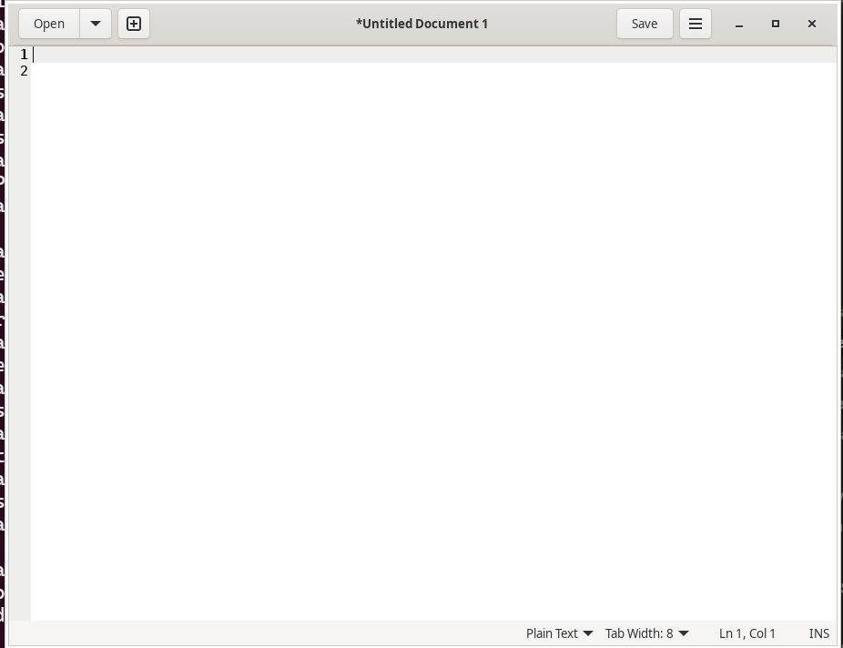
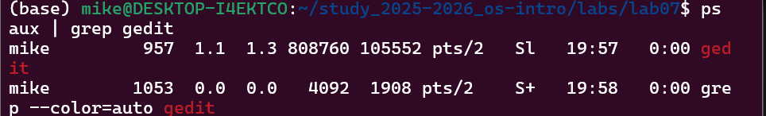
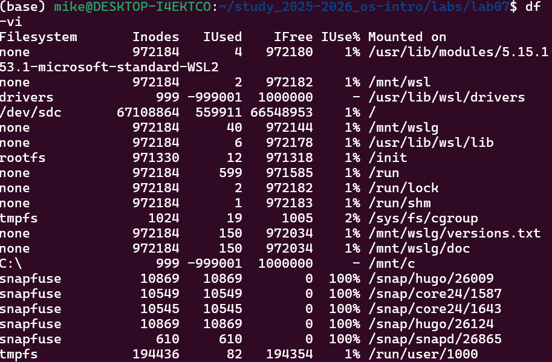

# Лабораторная работа № 8.

**ДАВИД МАЙКЛ ФРАНСИС**

## 1. Цель работы
Ознакомление с инструментами поиска файлов и фильтрации текстовых данных.
Приобретение практических навыков по управлению процессами (и заданиями),
по проверке использования диска и обслуживанию файловых систем.

---

## 2. Теоретическая часть

### Перенаправление ввода-вывода

В системе по умолчанию открыто три специальных потока:
- **stdin** — стандартный поток ввода (по умолчанию: клавиатура), дескриптор 0
- **stdout** — стандартный поток вывода (по умолчанию: консоль), дескриптор 1
- **stderr** — стандартный поток вывода ошибок (по умолчанию: консоль), дескриптор 2

Основные операторы перенаправления:

| Оператор | Описание |
|---|---|
| `>` | Перенаправление вывода в файл (перезапись) |
| `>>` | Перенаправление вывода в файл (добавление) |
| `<` | Перенаправление ввода из файла |
| `2>` | Перенаправление stderr в файл |
| `&>` | Перенаправление stdout и stderr в файл |

---

### Конвейер

Конвейер (pipe) служит для объединения команд в цепочки, где результат работы
предыдущей команды передаётся последующей:
```bash
команда1 | команда2
```

---

### Поиск файлов

Команда `find` используется для поиска файлов:
```bash
find путь [-опции]
```

Команда `grep` используется для фильтрации текста:
```bash
grep строка имя_файла
```

---

### Управление процессами и задачами

- `ps aux` — получение информации о процессах
- `kill PID` — завершение процесса по идентификатору
- `jobs` — список фоновых задач
- `df` — проверка использования диска
- `du` — размер файлов и каталогов

---

## 3. Выполнение работы

### Шаг 1. Вход в систему
```bash
whoami
```

### Шаг 2. Запись файлов из /etc и домашнего каталога в file.txt
```bash
ls /etc > file.txt
ls ~ >> file.txt
```

### Шаг 3. Вывод файлов с расширением .conf и запись в conf.txt
```bash
grep "\.conf" file.txt
grep "\.conf" file.txt > conf.txt
```



### Шаг 4. Определение файлов, начинающихся с символа 'c'
```bash
# Вариант 1 — с помощью find
find ~ -name "c*"
# Вариант 2 — с помощью ls
ls ~/c*
# Вариант 3 — с помощью echo
echo ~/c*
```



### Шаг 5. Вывод файлов из /etc, начинающихся с символа 'h', постранично
```bash
ls /etc | grep "^h" | less
```


### Шаг 6. Запуск фонового процесса записи log-файлов в ~/logfile
```bash
find / -name "log*" > ~/logfile &
```

### Шаг 7. Удаление файла ~/logfile
```bash
rm ~/logfile
```

### Шаг 8. Запуск редактора gedit в фоновом режиме
```bash
gedit &
```


### Шаг 9. Определение идентификатора процесса gedit
```bash
# С помощью ps и grep
ps aux | grep gedit
# С помощью pgrep
pgrep gedit
```


### Шаг 10. Завершение процесса gedit с помощью kill
```bash
# Прочитать справку
man kill
# Завершить процесс по PID
kill PID
# Или завершить по имени
killall gedit
```

### Шаг 11. Выполнение команд df и du
```bash
# Просмотр справки
man df
man du
# Проверка использования диска
df -vi
# Проверка размера домашнего каталога
du -a ~/
```


### Шаг 12. Вывод всех директорий в домашнем каталоге
```bash
find ~ -type d
```

---

## Выводы
В ходе выполнения лабораторной работы были изучены инструменты поиска файлов
и фильтрации текстовых данных в ОС Linux. Были получены практические навыки
работы с командами `find`, `grep`, `ps`, `kill`, `df` и `du`. Изучены механизмы
перенаправления ввода-вывода и работы с конвейерами. Получены навыки управления
процессами и фоновыми задачами.

---

## 5. Ответы на контрольные вопросы

**1. Потоки ввода-вывода:**
- **stdin** — стандартный поток ввода (по умолчанию: клавиатура), файловый дескриптор 0
- **stdout** — стандартный поток вывода (по умолчанию: консоль), файловый дескриптор 1
- **stderr** — стандартный поток вывода ошибок (по умолчанию: консоль), файловый дескриптор 2

**2. Разница между > и >>:**
- `>` — перенаправляет вывод в файл, **перезаписывая** его если он уже существует
- `>>` — перенаправляет вывод в файл в режиме **добавления**, не перезаписывая существующее содержимое

**3. Что такое конвейер:**
Конвейер (pipe) — механизм объединения команд в цепочки, где вывод одной команды
передаётся на ввод следующей с помощью символа `|`. Например `ls -la | sort`
передаёт вывод команды `ls` команде `sort`.

**4. Что такое процесс и чем отличается от программы:**
Программа — это статический набор инструкций, хранящихся на диске. Процесс —
это запущенный экземпляр программы в памяти с собственными выделенными
ресурсами, адресным пространством и идентификатором процесса. Из одной программы
одновременно может быть запущено несколько процессов.

**5. Что такое PID и GID:**
- **PID (Process ID)** — уникальный числовой идентификатор, присваиваемый каждому
запущенному процессу в системе
- **GID (Group ID)** — числовой идентификатор группы, к которой принадлежит процесс
или пользователь

**6. Что такое задачи и какая команда управляет ими:**
Задачи — это программы или команды, выполняющиеся в фоновом режиме терминала.
Ими управляют с помощью команды `jobs`, которая выводит список всех текущих
фоновых задач. Задачу можно завершить командой `kill %номер_задачи`.

**7. Утилиты top и htop:**
- **top** — встроенная утилита Linux, отображающая в реальном времени информацию
о запущенных процессах, использовании CPU, памяти и нагрузке на систему
- **htop** — улучшенная интерактивная версия top с более удобным интерфейсом,
цветным отображением и поддержкой мыши. Позволяет легче управлять процессами

**8. Команда поиска файлов и примеры:**
Команда `find` используется для поиска файлов. Примеры:
```bash
# Найти файлы начинающиеся с f в домашнем каталоге
find ~ -name "f*"
# Найти файлы в /etc начинающиеся с p
find /etc -name "p*"
# Найти и удалить файлы заканчивающиеся на ~
find ~ -name "*~" -exec rm "{}" \;
# Найти все директории в домашнем каталоге
find ~ -type d
```

**9. Можно ли найти файл по содержимому:**
Да, с помощью команды `grep`:
```bash
# Найти файлы содержащие слово "hello"
grep -r "hello" ~
# Найти файлы содержащие шаблон
grep -rl "шаблон" /путь/к/поиску
```

**10. Как определить объём свободной памяти на жёстком диске:**
```bash
df -h
```
Флаг `-h` отображает размеры в удобочитаемом формате (КБ, МБ, ГБ).

**11. Как определить объём домашнего каталога:**
```bash
du -sh ~
```
Флаг `-s` показывает общий размер, а `-h` отображает его в удобочитаемом формате.

**12. Как удалить зависший процесс:**
```bash
# Найти идентификатор процесса
ps aux | grep имя_процесса
# Завершить по PID
kill PID
# Принудительно завершить если обычный kill не помогает
kill -9 PID
# Завершить по имени
killall имя_процесса
```

[Ссылка на репозиторий](https://github.com/Ushie47/study_2025-2026_os-intro)
