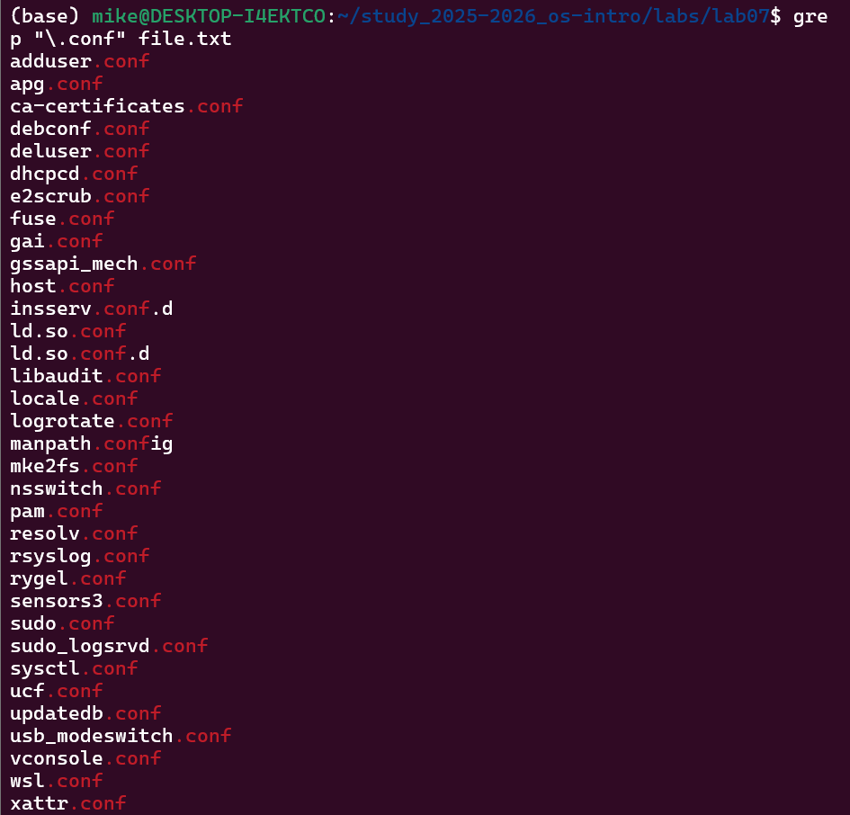
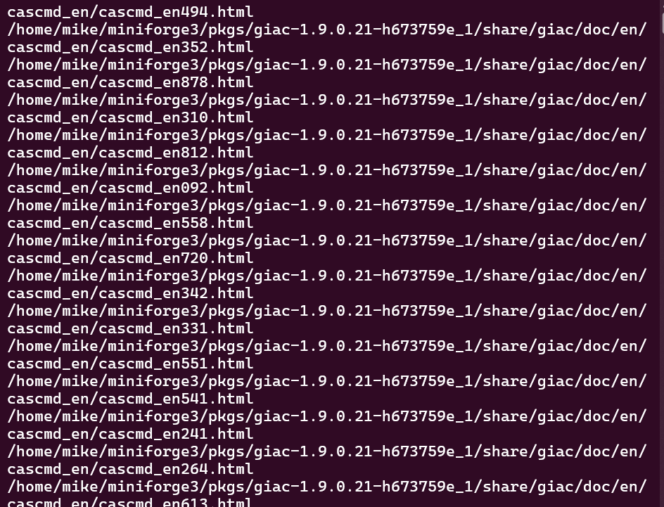
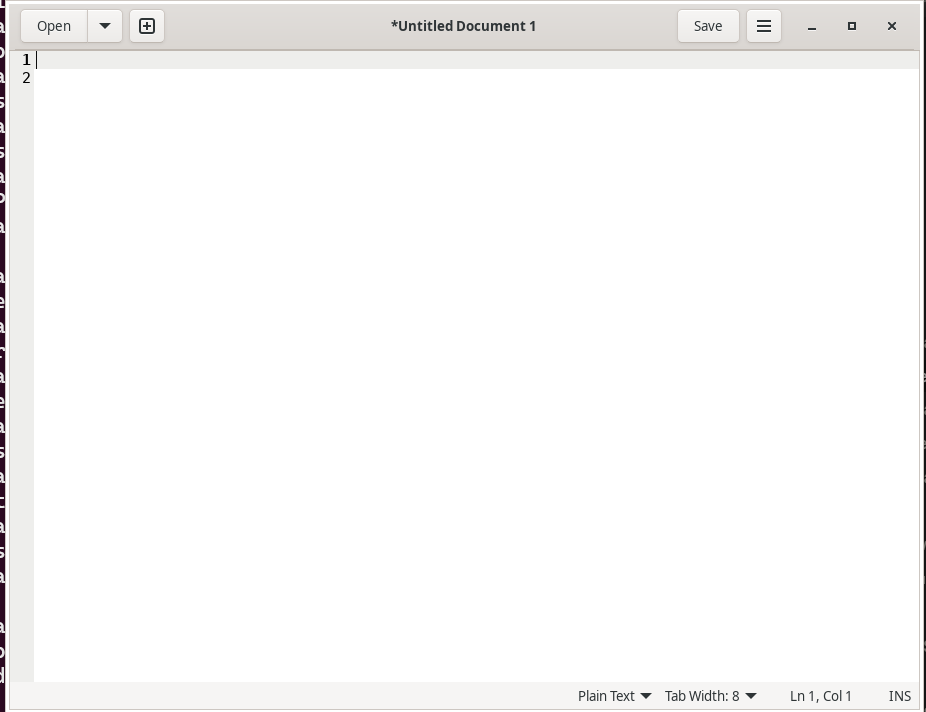
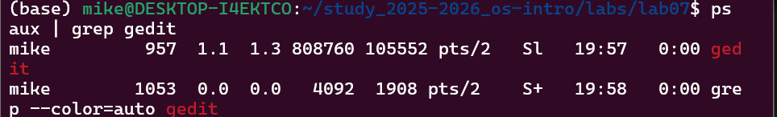
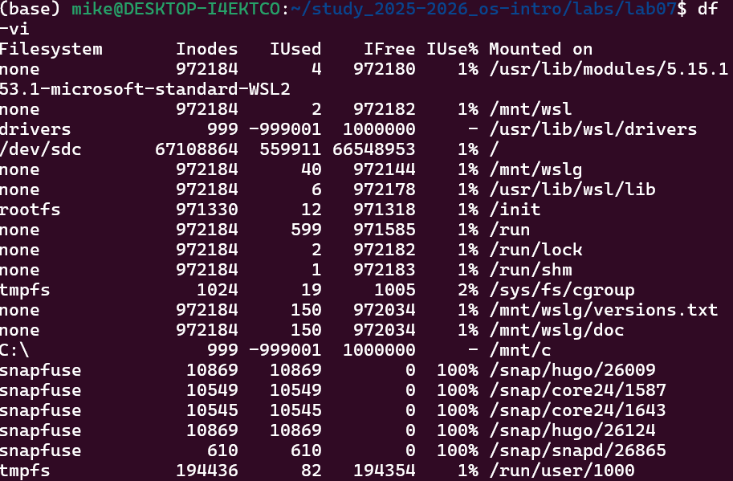

---
## Author
author:
  name: Давид Майкл Фрэнсис
  affiliation:
    - name: Российский университет дружбы народов
      country: Российская Федерация
      postal-code: 117198
      city: Москва
      address: ул. Миклухо-Маклая, д. 6

## Title
title: "Лабораторная работа №8"
subtitle: "Перенаправление ввода-вывода, поиск файлов и управление процессами"
license: "CC BY"
abstract: |
  В данном отчёте представлены результаты выполнения лабораторной работы по теме «Перенаправление ввода-вывода, поиск файлов и управление процессами».

  Рассмотрены потоки ввода-вывода и операторы их перенаправления, конвейеры, поиск и фильтрация файлов с помощью `find` и `grep`, управление процессами и фоновыми задачами, а также проверка использования дискового пространства.

  Сделаны выводы о достижении поставленной цели.
keywords: [перенаправление ввода-вывода, конвейер, find, grep, процессы, df, du]
---

# Введение

## Актуальность

Перенаправление ввода-вывода, конвейеры и инструменты поиска файлов составляют основу эффективной работы в командной строке Linux, позволяя объединять простые утилиты в гибкие цепочки обработки данных. Управление процессами и фоновыми задачами, а также контроль использования дискового пространства — повседневные практические задачи администрирования системы, без которых невозможна полноценная работа в многозадачной среде.

## Цель работы

Ознакомление с инструментами поиска файлов и фильтрации текстовых данных. Приобретение практических навыков по управлению процессами (и заданиями), по проверке использования диска и обслуживанию файловых систем.

## Задачи

- изучить потоки ввода-вывода и операторы их перенаправления;
- освоить использование конвейеров для объединения команд;
- освоить поиск файлов с помощью `find` и фильтрацию текста с помощью `grep`;
- освоить управление процессами и фоновыми задачами (`ps`, `kill`, `jobs`, `pgrep`, `killall`);
- освоить проверку использования диска командами `df` и `du`.

## Объект и предмет исследования

Объектом исследования являются средства перенаправления ввода-вывода, поиска файлов и управления процессами командной строки Linux. Предметом исследования выступает процесс поиска и фильтрации файлов, управления процессами и фоновыми задачами, а также анализа использования дискового пространства.

## Методы исследования

Работа выполнялась практическим методом — путём непосредственного взаимодействия с интерпретатором команд операционной системы Linux.

## Схема выполнения работы

На рис. -@fig-flowchart представлена общая последовательность действий при выполнении работы.

::: {#fig-flowchart}

```{mermaid}
%%| fig-width: 100%
graph TD
    A@{ shape: circle, label: "Начало" } --> B[Выполнить действие]
    B --> C[Описать, что конкретно сделано]
    C --> D[Подтвердить скриншотом]
    D --> E[Занести в отчёт]
    E --> F[Поместить в git-репозиторий]
    F --> G[Сделать релиз git]
    G --> J@{ shape: dbl-circ, label: "Конец" }
```

Блок-схема выполнения лабораторной работы

:::

# Теоретическая часть

## Перенаправление ввода-вывода

В системе по умолчанию открыто три специальных потока: **stdin** — стандартный поток ввода (по умолчанию клавиатура, дескриптор 0), **stdout** — стандартный поток вывода (по умолчанию консоль, дескриптор 1) и **stderr** — стандартный поток вывода ошибок (по умолчанию консоль, дескриптор 2) [@shotts_book_linux-command-line_en]. Основные операторы перенаправления:

| Оператор | Описание |
|---|---|
| `>` | Перенаправление вывода в файл (перезапись) |
| `>>` | Перенаправление вывода в файл (добавление) |
| `<` | Перенаправление ввода из файла |
| `2>` | Перенаправление stderr в файл |
| `&>` | Перенаправление stdout и stderr в файл |

## Конвейер

Конвейер (pipe) служит для объединения команд в цепочки, в которых результат работы предыдущей команды передаётся на вход последующей: `команда1 | команда2`. Это позволяет комбинировать простые, узкоспециализированные утилиты для решения более сложных задач обработки данных.

## Поиск файлов

Команда `find путь [-опции]` используется для поиска файлов по заданным критериям (имени, типу, времени изменения и др.) с рекурсивным обходом каталогов. Команда `grep строка имя_файла` используется для фильтрации текста — поиска строк, соответствующих заданному шаблону, в содержимом файлов.

## Управление процессами и задачами

Команда `ps aux` выводит информацию о запущенных в системе процессах, `kill PID` завершает процесс по его идентификатору, а `jobs` выводит список фоновых задач текущей сессии терминала. Для анализа использования дискового пространства применяются команды `df` (свободное место на файловых системах) и `du` (размер файлов и каталогов).

# Материалы и методы

Для выполнения работы использовались операционная система семейства Linux и команды `find`, `grep`, `ps`, `pgrep`, `kill`, `killall`, `jobs`, `df`, `du`, а также операторы перенаправления ввода-вывода (`>`, `>>`, `|`).

# Выполнение лабораторной работы

## Перенаправление вывода и поиск по содержимому файлов

Вход в систему был подтверждён командой `whoami`. Далее содержимое каталога `/etc` было записано в файл `file.txt` с перезаписью, а содержимое домашнего каталога — дописано в тот же файл:

```bash
whoami
ls /etc > file.txt
ls ~ >> file.txt
```

Из полученного файла с помощью `grep` были отфильтрованы строки, содержащие файлы с расширением `.conf`, и результат сохранён в `conf.txt` (рис. -@fig-001):

```bash
grep "\.conf" file.txt
grep "\.conf" file.txt > conf.txt
```

{#fig-001 width=70%}

Файлы домашнего каталога, начинающиеся с символа `c`, были найдены тремя разными способами — с помощью `find`, подстановки имён файлов в `ls` и в `echo` (рис. -@fig-002):

```bash
# Вариант 1 — с помощью find
find ~ -name "c*"
# Вариант 2 — с помощью ls
ls ~/c*
# Вариант 3 — с помощью echo
echo ~/c*
```

{#fig-002 width=70%}

Файлы каталога `/etc`, начинающиеся с символа `h`, были выведены постранично с помощью конвейера из `ls`, `grep` и `less` (рис. -@fig-003):

```bash
ls /etc | grep "^h" | less
```

{#fig-003 width=70%}

## Управление фоновыми процессами

Был запущен фоновый процесс поиска файлов `log*` по всей файловой системе с записью результата в `~/logfile`, после чего созданный файл был удалён:

```bash
find / -name "log*" > ~/logfile &
rm ~/logfile
```

Далее в фоновом режиме был запущен текстовый редактор `gedit` (рис. -@fig-004):

```bash
gedit &
```

{#fig-004 width=70%}

Идентификатор процесса `gedit` был определён двумя способами — через конвейер `ps aux | grep` и напрямую через `pgrep` (рис. -@fig-005):

```bash
# С помощью ps и grep
ps aux | grep gedit
# С помощью pgrep
pgrep gedit
```

{#fig-005 width=70%}

Процесс `gedit` был завершён с помощью `kill` по идентификатору процесса либо с помощью `killall` по имени процесса, после предварительного изучения справки:

```bash
man kill
kill PID
killall gedit
```

## Проверка использования диска

С помощью `man` были изучены команды `df` и `du`, после чего было проверено использование дискового пространства и размер домашнего каталога (рис. -@fig-006):

```bash
man df
man du
df -vi
du -a ~/
```

{#fig-006 width=70%}

Завершающим шагом были выведены все вложенные каталоги домашнего каталога:

```bash
find ~ -type d
```

# Результаты

В результате выполнения работы:

- отработаны операторы перенаправления вывода (`>`, `>>`) и использование конвейеров;
- освоена фильтрация текста с помощью `grep` и поиск файлов с помощью `find`, а также альтернативные способы поиска через подстановку имён файлов;
- запущены и исследованы фоновые процессы, определены их идентификаторы (PID) и выполнено их завершение;
- проверено использование дискового пространства и размер домашнего каталога с помощью `df` и `du`.

# Обсуждение результатов

Сравнение трёх способов поиска файлов, начинающихся с `c` (`find`, подстановка имён файлов в `ls`, подстановка в `echo`), наглядно показывает различие между специализированным инструментом рекурсивного поиска (`find`) и механизмом подстановки имён файлов самой оболочки (glob), который ограничен текущим каталогом и синтаксисом шаблонов оболочки. Запуск `gedit` и поиска лог-файлов в фоновом режиме с последующим определением их PID через `ps`/`pgrep` и завершением через `kill`/`killall` демонстрирует полный практический цикл управления процессом — от запуска до завершения.

# Заключение

В ходе выполнения лабораторной работы были изучены инструменты поиска файлов и фильтрации текстовых данных в ОС Linux. Были получены практические навыки работы с командами `find`, `grep`, `ps`, `kill`, `df` и `du`. Изучены механизмы перенаправления ввода-вывода и работы с конвейерами. Получены навыки управления процессами и фоновыми задачами.

Поставленная цель работы достигнута.

# Ответы на контрольные вопросы {.unnumbered}

**1. Потоки ввода-вывода**

- **stdin** — стандартный поток ввода (по умолчанию клавиатура), файловый дескриптор 0;
- **stdout** — стандартный поток вывода (по умолчанию консоль), файловый дескриптор 1;
- **stderr** — стандартный поток вывода ошибок (по умолчанию консоль), файловый дескриптор 2.

**2. Разница между > и >>**

- `>` — перенаправляет вывод в файл, **перезаписывая** его, если он уже существует;
- `>>` — перенаправляет вывод в файл в режиме **добавления**, не перезаписывая существующее содержимое.

**3. Что такое конвейер**

Конвейер (pipe) — механизм объединения команд в цепочки, где вывод одной команды передаётся на ввод следующей с помощью символа `|`. Например, `ls -la | sort` передаёт вывод команды `ls` команде `sort`.

**4. Что такое процесс и чем он отличается от программы**

Программа — это статический набор инструкций, хранящихся на диске. Процесс — это запущенный экземпляр программы в памяти с собственными выделенными ресурсами, адресным пространством и идентификатором. Из одной программы одновременно может быть запущено несколько процессов.

**5. Что такое PID и GID**

- **PID (Process ID)** — уникальный числовой идентификатор, присваиваемый каждому запущенному процессу в системе;
- **GID (Group ID)** — числовой идентификатор группы, к которой принадлежит процесс или пользователь.

**6. Что такое задачи и какая команда управляет ими**

Задачи — это программы или команды, выполняющиеся в фоновом режиме терминала. Ими управляют с помощью команды `jobs`, которая выводит список всех текущих фоновых задач. Задачу можно завершить командой `kill %номер_задачи`.

**7. Утилиты top и htop**

- **top** — встроенная утилита Linux, отображающая в реальном времени информацию о запущенных процессах, использовании CPU, памяти и нагрузке на систему;
- **htop** — улучшенная интерактивная версия `top` с более удобным интерфейсом, цветным отображением и поддержкой мыши, позволяющая легче управлять процессами.

**8. Команда поиска файлов и примеры**

Команда `find` используется для поиска файлов:

```bash
# Найти файлы, начинающиеся с f, в домашнем каталоге
find ~ -name "f*"
# Найти файлы в /etc, начинающиеся с p
find /etc -name "p*"
# Найти и удалить файлы, заканчивающиеся на ~
find ~ -name "*~" -exec rm "{}" \;
# Найти все директории в домашнем каталоге
find ~ -type d
```

**9. Можно ли найти файл по содержимому**

Да, с помощью команды `grep`:

```bash
# Найти файлы, содержащие слово "hello"
grep -r "hello" ~
# Найти файлы, содержащие шаблон
grep -rl "шаблон" /путь/к/поиску
```

**10. Как определить объём свободной памяти на жёстком диске**

```bash
df -h
```

Флаг `-h` отображает размеры в удобочитаемом формате (КБ, МБ, ГБ).

**11. Как определить объём домашнего каталога**

```bash
du -sh ~
```

Флаг `-s` показывает общий размер, а `-h` отображает его в удобочитаемом формате.

**12. Как удалить зависший процесс**

```bash
# Найти идентификатор процесса
ps aux | grep имя_процесса
# Завершить по PID
kill PID
# Принудительно завершить, если обычный kill не помогает
kill -9 PID
# Завершить по имени
killall имя_процесса
```

# Список литературы {.unnumbered}

::: {#refs}
:::
