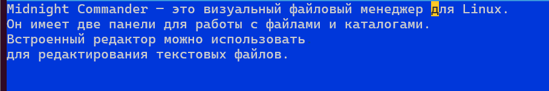
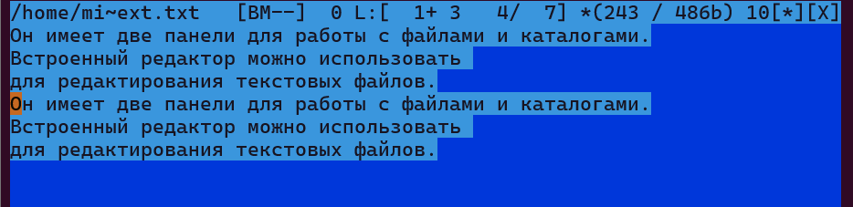
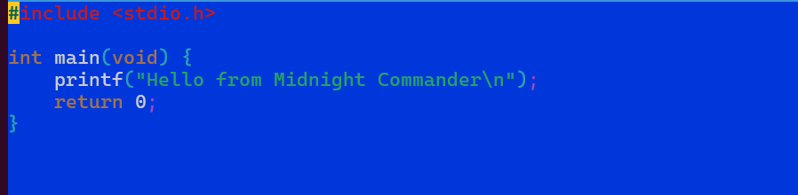

Лабораторная работа № 9.

**ДАВИД МАЙКЛ ФРАНСИС**

## 1. Цель работы

Освоение основных возможностей командной оболочки Midnight Commander.
Приобретение навыков практической работы по просмотру каталогов и файлов,
а также выполнению операций с файлами и каталогами.

---

## 2. Теоретическая часть

### Командная оболочка Midnight Commander

Midnight Commander, или `mc`, - это псевдографическая командная оболочка для
UNIX/Linux-систем. Она позволяет выполнять основные операции с файлами и
каталогами в удобном двухпанельном интерфейсе.

Для запуска Midnight Commander используется команда:

```bash
mc
```

Рабочее пространство `mc` состоит из двух панелей, в которых отображаются
списки файлов и каталогов. Над панелями находится меню, вызываемое клавишей
`F9`, а внизу расположены подсказки для функциональных клавиш `F1` - `F10`.

---

### Основные функциональные клавиши mc

| Клавиша | Назначение |
|---|---|
| `F1` | Вызов справки |
| `F2` | Вызов пользовательского меню |
| `F3` | Просмотр содержимого файла |
| `F4` | Редактирование файла |
| `F5` | Копирование файла или каталога |
| `F6` | Перемещение или переименование файла или каталога |
| `F7` | Создание каталога |
| `F8` | Удаление файла или каталога |
| `F9` | Вызов меню mc |
| `F10` | Выход из mc |

---

### Управление панелями

В Midnight Commander можно управлять отображением панелей и режимами их работы.

Основные комбинации:

- `Ctrl-u` - поменять панели местами
- `Ctrl-o` - скрыть или показать панели
- `Ctrl-x d` - сравнить каталоги на двух панелях
- `Tab` - перейти с одной панели на другую

Панели могут отображаться в разных режимах:

- стандартный список;
- ускоренный список;
- расширенный список;
- пользовательский формат списка;
- режим информации;
- режим дерева каталогов.

---

### Меню Midnight Commander

Меню `mc` вызывается клавишей `F9`. Оно содержит следующие основные разделы:

- **Левая панель** - настройка режима отображения левой панели
- **Файл** - операции над файлами и каталогами
- **Команда** - общие команды Midnight Commander
- **Настройки** - настройка внешнего вида и поведения программы
- **Правая панель** - настройка режима отображения правой панели

---

### Встроенный редактор mc

Встроенный редактор Midnight Commander вызывается клавишей `F4`. Он позволяет
редактировать текстовые файлы прямо внутри `mc`.

Основные клавиши редактора:

| Клавиша | Назначение |
|---|---|
| `Ctrl-y` | Удалить строку |
| `Ctrl-u` | Отменить последнее действие |
| `Ins` | Режим вставки или замены |
| `F7` | Поиск |
| `Shift-F7` | Повтор последнего поиска |
| `F4` | Замена |
| `F3` | Начало и конец выделения |
| `F5` | Копировать выделенный фрагмент |
| `F6` | Переместить выделенный фрагмент |
| `F8` | Удалить выделенный фрагмент |
| `F2` | Сохранить изменения |
| `F10` | Выйти из редактора |

---

## 3. Выполнение работы

### Шаг 1. Изучение справки по Midnight Commander

```bash
man mc
```

В результате была изучена справочная информация о командной оболочке
Midnight Commander, ее назначении, структуре интерфейса и основных параметрах
запуска.

---

### Шаг 2. Запуск Midnight Commander

```bash
mc
```

После запуска была изучена структура окна Midnight Commander: левая и правая
панели, строка меню, командная строка и нижняя строка функциональных клавиш.

---

### Шаг 3. Изучение структуры и меню mc

Для перехода в меню была использована клавиша:

```text
F9
```

Были просмотрены основные разделы меню:

- Левая панель
- Файл
- Команда
- Настройки
- Правая панель

---

### Шаг 4. Выполнение операций с панелями

Были выполнены операции управления панелями:

```text
Tab
Ctrl-u
Ctrl-o
Ctrl-x d
```

Результат:

- с помощью `Tab` выполнялось переключение между панелями;
- с помощью `Ctrl-u` панели менялись местами;
- с помощью `Ctrl-o` панели временно скрывались;
- с помощью `Ctrl-x d` выполнялось сравнение каталогов.

---

### Шаг 5. Выделение и отмена выделения файлов

В активной панели были выбраны файлы и каталоги. Для выделения использовалась
клавиша `Insert`.

```text
Insert
```

Повторное нажатие `Insert` отменяет выделение выбранного файла.

---

### Шаг 6. Создание каталога в mc

Для создания каталога была использована клавиша:

```text
F7
```

После нажатия `F7` было введено имя нового каталога:

```text
test_mc
```

В результате был создан каталог `test_mc`.

---

### Шаг 7. Копирование файла в созданный каталог

Для копирования файла в созданный каталог использовалась клавиша:

```text
F5
```

Файл был выбран в одной панели, а каталог назначения был открыт во второй
панели. После подтверждения операции файл был скопирован.

Аналогичная операция в shell может быть выполнена командой:

```bash
cp имя_файла ~/test_mc/
```

---

### Шаг 8. Перемещение или переименование файла

Для перемещения или переименования файла использовалась клавиша:

```text
F6
```

Аналогичная операция в shell:

```bash
mv старое_имя новое_имя
mv имя_файла каталог/
```

---

### Шаг 9. Просмотр содержимого текстового файла

Для просмотра файла без редактирования была использована клавиша:

```text
F3
```

Аналогичная операция в shell:

```bash
less имя_файла
cat имя_файла
```

---

### Шаг 10. Редактирование текстового файла без сохранения

Для открытия файла во встроенном редакторе была использована клавиша:

```text
F4
```

После внесения изменений выход был выполнен без сохранения результатов.

---

### Шаг 11. Получение информации о файлах и правах доступа

Через меню `Файл` были просмотрены свойства файла и права доступа.

Использовались пункты:

- `Права доступа`
- `Права (расширенные)`
- `Владелец/группа`

Аналогичные команды shell:

```bash
ls -l имя_файла
stat имя_файла
chmod режим имя_файла
```

---

### Шаг 12. Выполнение команд меню левой или правой панели

Через меню левой или правой панели были изучены режимы отображения списка
файлов:

- стандартный;
- ускоренный;
- расширенный;
- пользовательский.

Вывод: наиболее подробным является расширенный режим, так как он показывает
права доступа, владельца, группу, размер файла и время изменения.

---

### Шаг 13. Поиск файла через меню Команда

Через меню `Команда` был выбран пункт `Поиск файла`. Выполнялся поиск файла
с расширением `.c` или `.cpp`, содержащего строку `main`.

Аналогичная команда shell:

```bash
find ~ -name "*.c" -exec grep -l "main" {} \;
find ~ -name "*.cpp" -exec grep -l "main" {} \;
```

---

### Шаг 14. Выбор и повторение предыдущей команды

В меню `Команда` был открыт пункт `История командной строки`. С его помощью
была выбрана и повторно выполнена одна из ранее использованных команд.

Аналогичная возможность в shell:

```bash
history
```

---

### Шаг 15. Переход в домашний каталог

Переход в домашний каталог был выполнен через интерфейс Midnight Commander.

Аналогичная команда shell:

```bash
cd ~
```

---

### Шаг 16. Анализ файла меню и файла расширений

Через меню `Команда` были просмотрены пункты:

- `Редактировать файл меню`
- `Редактировать файл расширений`

Файл меню позволяет создавать пользовательские команды, вызываемые через `F2`.
Файл расширений позволяет задавать действия для файлов разных типов.

---

### Шаг 17. Изучение меню Настройки

Было открыто меню `Настройки`. В нем были изучены параметры:

- `Конфигурация`
- `Внешний вид`
- `Настройки панелей`
- `Подтверждение`
- `Распознание клавиш`
- `Виртуальные ФС`

Также были изучены параметры отображения:

- `Full screen`
- `Double Width`
- `Show Hidden Files`

---

## 4. Задание по встроенному редактору mc

### Шаг 1. Создание файла `text.txt`

```bash
touch text.txt
```

---

### Шаг 2. Открытие файла во встроенном редакторе

Файл был открыт в Midnight Commander клавишей:

```text
F4
```

Аналогично редактор можно запустить из командной строки:

```bash
mcedit text.txt
```

---

### Шаг 3. Вставка фрагмента текста

В файл был вставлен небольшой фрагмент текста:

```text
Midnight Commander is a visual file manager for Unix-like systems.
It provides a two-panel interface for working with files and directories.
The built-in editor can be used to edit text and source code files.
```

---

### Шаг 4. Удаление строки текста

Для удаления строки была использована комбинация:

```text
Ctrl-y
```

---

### Шаг 5. Копирование выделенного фрагмента на новую строку

Для выделения фрагмента использовалась клавиша:

```text
F3
```

Для копирования выделенного фрагмента:

```text
F5
```

---

### Шаг 6. Перемещение выделенного фрагмента на новую строку

Для выделения фрагмента использовалась клавиша `F3`, после чего для перемещения
фрагмента была использована клавиша:

```text
F6
```

---

### Шаг 7. Сохранение файла

```text
F2
```

---

### Шаг 8. Отмена последнего действия

```text
Ctrl-u
```

---

### Шаг 9. Переход в конец файла и добавление текста

Для перехода в конец файла использовалась клавиша:

```text
End
```

Если нужно перейти в конец всего файла, используется:

```text
Ctrl-End
```

В конец файла был добавлен текст:

```text
This line was added at the end of the file.
```

---

### Шаг 10. Переход в начало файла и добавление текста

Для перехода в начало файла использовалась клавиша:

```text
Home
```

Если нужно перейти в начало всего файла, используется:

```text
Ctrl-Home
```

В начало файла был добавлен текст:

```text
This line was added at the beginning of the file.
```

---

### Шаг 11. Сохранение и закрытие файла

Для сохранения файла:

```text
F2
```

Для выхода из редактора:

```text
F10
```

---

### Шаг 12. Открытие файла с исходным кодом

Был создан файл с исходным кодом на языке C:

```bash
cat > main.c << 'EOF'
#include <stdio.h>

int main(void) {
    printf("Hello from Midnight Commander editor\n");
    return 0;
}
EOF
```

Файл был открыт во встроенном редакторе:

```bash
mcedit main.c
```

---

### Шаг 13. Включение или выключение подсветки синтаксиса

В редакторе Midnight Commander через меню была включена или выключена подсветка
синтаксиса для файла `main.c`.

---







## 5. Выводы

В ходе выполнения лабораторной работы была изучена командная оболочка Midnight
Commander. Были рассмотрены структура интерфейса, назначение левой и правой
панели, строка меню, командная строка и функциональные клавиши.

Были получены практические навыки выполнения файловых операций в `mc`: просмотр,
создание, копирование, перемещение, переименование и удаление файлов и каталогов.
Также были изучены режимы отображения панелей, меню `Файл`, `Команда` и
`Настройки`.

Дополнительно была освоена работа со встроенным редактором Midnight Commander:
создание и редактирование текстового файла, копирование и перемещение фрагментов,
отмена действий, сохранение файла и работа с подсветкой синтаксиса.

---

## 6. Ответы на контрольные вопросы

**1. Какие режимы работы есть в mc. Охарактеризуйте их.**

В Midnight Commander есть несколько режимов работы панелей:

- стандартный режим - показывает имена файлов, размеры и время изменения;
- ускоренный режим - выводит только имена файлов в несколько столбцов;
- расширенный режим - показывает права доступа, владельца, группу, размер и время изменения;
- пользовательский режим - позволяет самостоятельно выбрать отображаемые поля;
- режим информации - показывает сведения о выбранном файле или каталоге;
- режим дерева - отображает дерево каталогов.

**2. Какие операции с файлами можно выполнить как с помощью команд shell, так и с помощью меню или комбинаций клавиш mc? Приведите примеры.**

Многие операции можно выполнить как через shell, так и через Midnight Commander:

| Операция | Shell | Midnight Commander |
|---|---|---|
| Просмотр файла | `cat file`, `less file` | `F3` |
| Редактирование файла | `nano file`, `mcedit file` | `F4` |
| Копирование | `cp file dir/` | `F5` |
| Перемещение | `mv file dir/` | `F6` |
| Переименование | `mv old new` | `F6` |
| Создание каталога | `mkdir dir` | `F7` |
| Удаление | `rm file` | `F8` |
| Изменение прав | `chmod 755 file` | `Ctrl-x c` |

**3. Опишите структуру меню левой или правой панели mc, дайте характеристику командам.**

Меню левой и правой панели предназначены для настройки отображения содержимого
панелей. В них можно выбрать режим отображения списка, порядок сортировки,
быстрый просмотр, режим информации или дерево каталогов.

Основные команды:

- `Формат списка` - выбор стандартного, ускоренного, расширенного или пользовательского вида;
- `Порядок сортировки` - сортировка по имени, размеру, времени изменения и другим признакам;
- `Быстрый просмотр` - отображение содержимого выбранного файла;
- `Информация` - вывод сведений о файле, каталоге и файловой системе;
- `Дерево` - отображение структуры каталогов.

**4. Опишите структуру меню Файл mc, дайте характеристику командам.**

Меню `Файл` содержит команды для работы с файлами и каталогами.

Основные команды:

- `Просмотр` (`F3`) - просмотр содержимого файла;
- `Правка` (`F4`) - редактирование файла;
- `Копирование` (`F5`) - копирование файлов и каталогов;
- `Права доступа` (`Ctrl-x c`) - изменение прав доступа;
- `Жесткая ссылка` (`Ctrl-x l`) - создание жесткой ссылки;
- `Символическая ссылка` (`Ctrl-x s`) - создание символической ссылки;
- `Владелец/группа` (`Ctrl-x o`) - изменение владельца и группы;
- `Переименование` (`F6`) - переименование или перемещение;
- `Создание каталога` (`F7`) - создание нового каталога;
- `Удалить` (`F8`) - удаление файлов и каталогов;
- `Выход` (`F10`) - выход из Midnight Commander.

**5. Опишите структуру меню Команда mc, дайте характеристику командам.**

Меню `Команда` содержит общие средства работы с Midnight Commander.

Основные команды:

- `Дерево каталогов` - отображает структуру каталогов;
- `Поиск файла` - выполняет поиск файлов по заданным условиям;
- `Переставить панели` - меняет левую и правую панели местами;
- `Сравнить каталоги` - сравнивает содержимое двух каталогов;
- `Размеры каталогов` - показывает размеры каталогов;
- `История командной строки` - показывает ранее введенные команды;
- `Каталоги быстрого доступа` - обеспечивает быстрый переход в выбранные каталоги;
- `Редактировать файл расширений` - задает действия для файлов разных типов;
- `Редактировать файл меню` - позволяет изменить пользовательское меню;
- `Редактировать файл расцветки имен` - настраивает цветовое выделение файлов.

**6. Опишите структуру меню Настройки mc, дайте характеристику командам.**

Меню `Настройки` используется для изменения внешнего вида и поведения Midnight
Commander.

Основные пункты:

- `Конфигурация` - настройка поведения программы;
- `Внешний вид` - настройка элементов интерфейса;
- `Настройки панелей` - настройка отображения панелей;
- `Биты символов` - настройка обработки символов терминалом;
- `Подтверждение` - настройка запросов подтверждения при удалении, перезаписи и выходе;
- `Распознание клавиш` - проверка работы клавиш;
- `Виртуальные ФС` - настройка виртуальных файловых систем.

**7. Назовите и дайте характеристику встроенным командам mc.**

К встроенным командам Midnight Commander относятся:

- `F1` - справка;
- `F2` - пользовательское меню;
- `F3` - просмотр файла;
- `F4` - редактирование файла;
- `F5` - копирование;
- `F6` - перемещение или переименование;
- `F7` - создание каталога;
- `F8` - удаление;
- `F9` - открытие меню;
- `F10` - выход;
- `Ctrl-o` - скрытие или показ панелей;
- `Ctrl-u` - перестановка панелей;
- `Ctrl-x d` - сравнение каталогов;
- `Ctrl-x c` - изменение прав доступа;
- `Ctrl-x s` - создание символической ссылки;
- `Ctrl-x l` - создание жесткой ссылки.

**8. Назовите и дайте характеристику командам встроенного редактора mc.**

Команды встроенного редактора:

- `Ctrl-y` - удалить строку;
- `Ctrl-u` - отменить последнее действие;
- `Ins` - переключить режим вставки и замены;
- `F7` - поиск;
- `Shift-F7` - повтор поиска;
- `F4` - замена;
- `F3` - начало и конец выделения;
- `F5` - копирование выделенного фрагмента;
- `F6` - перемещение выделенного фрагмента;
- `F8` - удаление выделенного фрагмента;
- `F2` - сохранение файла;
- `F10` - выход из редактора.

**9. Дайте характеристику средствам mc, которые позволяют создавать меню, определяемые пользователем.**

Пользовательское меню Midnight Commander вызывается клавишей `F2`. Его можно
изменять через пункт `Команда` - `Редактировать файл меню`. В этом файле
пользователь может описать собственные команды и действия, которые будут
доступны из меню `F2`.

Такое меню удобно для часто выполняемых операций, например компиляции программы,
запуска скрипта, упаковки файлов в архив или обработки выбранного файла.

**10. Дайте характеристику средствам mc, которые позволяют выполнять действия, определяемые пользователем, над текущим файлом.**

Для выполнения пользовательских действий над текущим файлом в Midnight Commander
используются пользовательское меню и файл расширений.

Файл пользовательского меню позволяет создавать команды, которые применяются к
текущему или выделенному файлу. Файл расширений позволяет назначать действия
для файлов определенного типа, например открытие, просмотр, редактирование или
запуск внешней программы для файлов с заданным расширением.

Эти средства делают `mc` гибкой оболочкой, которую можно настроить под
конкретные задачи пользователя.

[Ссылка на репозиторий](https://github.com/Ushie47/study_2025-2026_os-intro)
