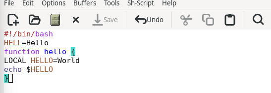
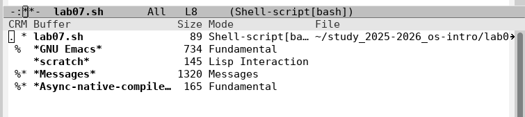
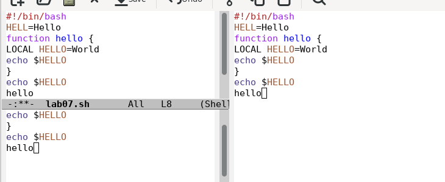
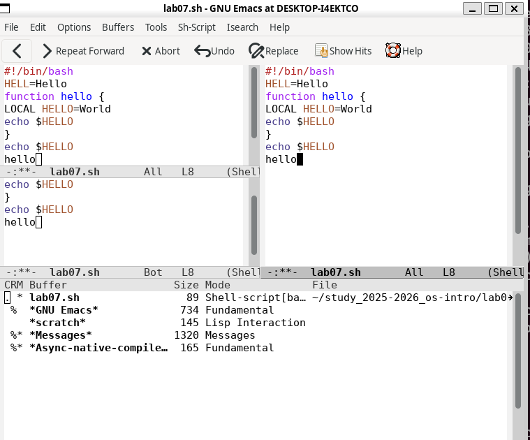

#  **Лаборатору Отчет No11**

**ДАВИД МАЙКЛ ФРЭНСИС**

## Цель работы

Познакомиться с операционной системой Linux.Получитьпрактические навыки рабо
тысредактором Emacs.

### **Описание задачи**
Файл lab07.sh был создан с помощью команды C-x C-f. Текст скрипта был набран и сохранён с помощью команды C-x C-s. 
Затем были выполнены стандартные процедуры редактирования: строка была вырезана командой C-k и вставлена в конец файла с помощью C-y. 
Область текста была выделена с помощью C-space, скопирована командой M-w, вставлена в конец файла, после чего вырезана командой C-w. 
Последнее действие было отменено с помощью C-/. Были отработаны команды перемещения курсора: C-a (начало строки), C-e (конец строки), 
M-< (начало буфера) и M-> (конец буфера). Было изучено управление буферами: список буферов выведен командой C-x C-b, переключение между 
буферами выполнено с помощью C-x b, окно закрыто командой C-x 0. Затем фрейм был разделён на 4 части с помощью C-x 3, после чего каждое окно 
разделено командой C-x 2, и в каждом окне был открыт новый буфер. В завершение был протестирован режим поиска с помощью C-s для нахождения 
слов в тексте, выполнен поиск с заменой командой M-%, а также изучен режим поиска M-s o (occur), который отличается от обычного поиска тем, 
что отображает все совпадающие строки в отдельном буфере.

#### **Контрольные вопросы**

**1. Краткая характеристика редактора Emacs:**
Emacs — мощный многофункциональный текстовый редактор, написанный на языке Elisp. Поддерживает множество режимов редактирования, расширений и настроек. Используется не только для редактирования текста, но и для программирования и управления файлами.

**2. Что делает Emacs сложным для новичка:**
Большое количество комбинаций клавиш, непривычные термины (буфер, фрейм, минибуфер), отсутствие привычного интерфейса и необходимость запоминать множество горячих клавиш.

**3. Буфер и окно в терминологии Emacs:**
Буфер — область памяти, содержащая текст файла или другую информацию, не обязательно привязанную к файлу. Окно — прямоугольная область экрана, отображающая содержимое буфера.

**4. Можно ли открыть больше 10 буферов:**
Да, количество открытых буферов не ограничено. Переключаться между ними можно с помощью `C-x b`.

**5. Буферы по умолчанию при запуске Emacs:**
- `*scratch*` — буфер для временных заметок
- `*Messages*` — буфер с системными сообщениями

**6. Как ввести комбинации C-c | и C-c C-|:**
- `C-c |` — нажать `Ctrl+C`, отпустить, затем нажать `|`
- `C-c C-|` — нажать `Ctrl+C`, отпустить, затем нажать `Ctrl+|`

**7. Как разделить текущее окно на две части:**
- По горизонтали: `C-x 2`
- По вертикали: `C-x 3`

**8. В каком файле хранятся настройки Emacs:**
`~/.emacs` или `~/.emacs.d/init.el`

**9. Функция клавиши и можно ли её переназначить:**
В Emacs каждая клавиша выполняет определённую функцию. Да, любую клавишу можно переназначить с помощью команды `global-set-key` в файле настроек `~/.emacs`.

**10. Какой редактор удобнее — vi или Emacs:**
Для новичка vi может показаться проще из-за меньшего количества команд и более чёткого разделения режимов. Emacs более мощный и гибкий, но требует больше времени для освоения.
