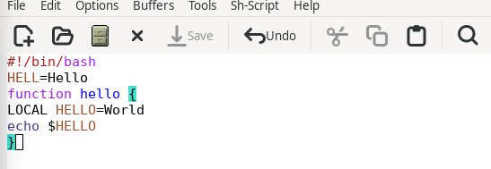
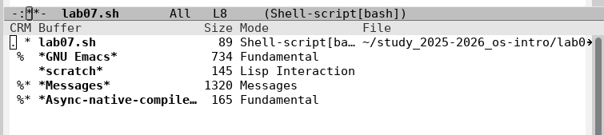
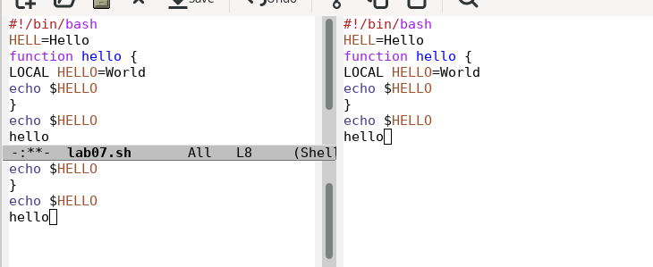
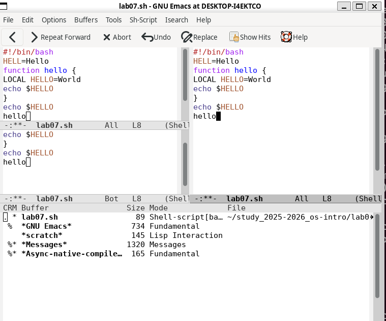

---
## Author
author:
  name: Давид Майкл Фрэнсис
  affiliation:
    - name: Российский университет дружбы народов
      country: Российская Федерация
      postal-code: 117198
      city: Москва
      address: ул. Миклухо-Маклая, д. 6

## Title
title: "Лабораторная работа №11"
subtitle: "Текстовый редактор Emacs"
license: "CC BY"
abstract: |
  В данном отчёте представлены результаты выполнения лабораторной работы по теме «Текстовый редактор Emacs».

  Рассмотрены создание и редактирование файла, базовые операции редактирования текста, управление буферами и окнами, а также режимы поиска в редакторе Emacs.

  Сделаны выводы о достижении поставленной цели.
keywords: [emacs, текстовый редактор, буфер, kill-ring, поиск]
---

# Введение

## Актуальность

Emacs — один из старейших и наиболее функциональных текстовых редакторов, широко применяемый как для редактирования текста, так и для программирования и администрирования систем в среде Linux. Несмотря на нетипичную для новичка модель взаимодействия (собственная терминология, обилие комбинаций клавиш), владение базовыми приёмами работы в Emacs остаётся востребованным навыком, особенно при работе в окружениях без графического интерфейса.

## Цель работы

Познакомиться с операционной системой Linux. Получить практические навыки работы с редактором Emacs.

## Задачи

- создать и сохранить файл скрипта с помощью Emacs;
- освоить базовые операции редактирования текста (вырезание, вставка, копирование, отмена действия);
- освоить выделение текстовой области и операции с ней;
- освоить команды перемещения курсора;
- освоить управление буферами Emacs;
- освоить разделение фрейма на несколько окон;
- освоить режимы поиска текста, поиска с заменой и режим `occur`.

## Объект и предмет исследования

Объектом исследования является текстовый редактор Emacs. Предметом исследования выступает процесс редактирования текстовых файлов, управления буферами и окнами, а также поиска текста средствами Emacs.

## Методы исследования

Работа выполнялась практическим методом — путём непосредственного взаимодействия с редактором Emacs в среде Linux.

## Схема выполнения работы

На рис. -@fig-flowchart представлена общая последовательность действий при выполнении работы.

::: {#fig-flowchart}

```{mermaid}
%%| fig-width: 100%
graph TD
    A@{ shape: circle, label: "Начало" } --> B[Выполнить действие]
    B --> C[Описать, что конкретно сделано]
    C --> D[Подтвердить скриншотом]
    D --> E[Занести в отчёт]
    E --> F[Поместить в git-репозиторий]
    F --> G[Сделать релиз git]
    G --> J@{ shape: dbl-circ, label: "Конец" }
```

Блок-схема выполнения лабораторной работы

:::

# Теоретическая часть

Emacs — расширяемый текстовый редактор, значительная часть функциональности которого реализована на встроенном языке Emacs Lisp [@gnu_web_emacs-manual_en]. В терминологии Emacs открытый текст (файла или нет) хранится в **буфере** — области памяти, независимой от экранного представления; **окно** — это прямоугольная область экрана, в которой отображается содержимое буфера; а **фрейм** объединяет одно или несколько окон в пределах одного графического окна или терминальной сессии. Один и тот же буфер может одновременно отображаться в нескольких окнах.

Для вырезания и вставки текста Emacs использует механизм **kill-ring** — кольцевой буфер обмена, в который помещается вырезанный или скопированный текст и из которого он впоследствии вставляется; это отличает Emacs от редакторов с единственным системным буфером обмена. Выделение области текста выполняется через установку **точки** (текущей позиции курсора) и **метки** (второй границы выделения), между которыми определяется активная область.

Команды Emacs традиционно обозначаются сочетаниями с префиксами `C-` (Control) и `M-` (Meta, обычно клавиша Alt). Например, `C-x C-f` открывает файл, а `M-w` копирует выделенную область в kill-ring. Такая система обозначений позволяет компактно записывать даже сложные многоклавишные команды.

# Материалы и методы

Для выполнения работы использовались операционная система семейства Linux и текстовый редактор **Emacs**.

# Выполнение лабораторной работы

## Создание и редактирование файла

Файл `lab07.sh` был создан командой `C-x C-f`. Текст скрипта был набран и сохранён командой `C-x C-s`.

Были отработаны базовые операции редактирования: строка была вырезана командой `C-k` и вставлена в конец файла командой `C-y`. Область текста была выделена командой `C-space`, скопирована в kill-ring командой `M-w`, вставлена в конец файла, после чего вырезана командой `C-w`. Последнее действие было отменено командой `C-/`.

## Перемещение курсора

Были отработаны команды перемещения курсора: `C-a` — переход в начало строки, `C-e` — переход в конец строки, `M-<` — переход в начало буфера, `M->` — переход в конец буфера.

## Управление буферами и окнами

Список открытых буферов был выведен командой `C-x C-b`, переключение между буферами выполнено командой `C-x b`, окно закрыто командой `C-x 0`.

Далее фрейм был разделён на 4 части: сначала командой `C-x 3` (разделение по вертикали), затем каждое из полученных окон было дополнительно разделено командой `C-x 2` (разделение по горизонтали), и в каждом из четырёх окон был открыт отдельный буфер.

## Поиск текста

В завершение были протестированы режимы поиска: инкрементальный поиск слов в тексте командой `C-s`, поиск с заменой командой `M-%`, а также режим `occur`, вызываемый командой `M-s o`. В отличие от обычного поиска, режим `occur` отображает все найденные совпадающие строки сразу в отдельном буфере, что удобно для быстрого просмотра всех вхождений искомого текста по файлу.

Выполненные действия зафиксированы на рис. -@fig-001 – рис. -@fig-004.

{#fig-001 width=70%}

{#fig-002 width=70%}

{#fig-003 width=70%}

{#fig-004 width=70%}

# Результаты

В результате выполнения работы:

- создан и отредактирован файл скрипта в Emacs;
- отработаны операции вырезания, вставки, копирования и отмены действия;
- освоены команды перемещения курсора в пределах строки и буфера;
- изучено управление буферами и переключение между ними;
- выполнено разделение фрейма на несколько окон с отдельными буферами в каждом;
- опробованы режимы поиска, поиска с заменой и режим `occur`.

# Обсуждение результатов

Модель буферов и kill-ring в Emacs отличается от более привычной модели «один файл — одно окно — один системный буфер обмена», используемой в большинстве простых текстовых редакторов. Такая организация позволяет одновременно держать открытыми множество файлов и фрагментов текста, свободно перемещая содержимое между ними без обращения к системному буферу обмена. Режим `occur`, показывающий все совпадения поиска в отдельном буфере, демонстрирует характерный для Emacs подход — представлять результаты операции как ещё один редактируемый буфер, а не как отдельное модальное окно.

# Заключение

В ходе лабораторной работы были получены практические навыки работы с текстовым редактором Emacs: создание и редактирование файлов, базовые операции редактирования текста, перемещение курсора, управление буферами и окнами, а также использование различных режимов поиска.

Поставленная цель работы достигнута.

# Ответы на контрольные вопросы {.unnumbered}

**1. Краткая характеристика редактора Emacs**

Emacs — мощный многофункциональный текстовый редактор, написанный на языке Elisp. Поддерживает множество режимов редактирования, расширений и настроек. Используется не только для редактирования текста, но и для программирования и управления файлами.

**2. Что делает Emacs сложным для новичка**

Большое количество комбинаций клавиш, непривычные термины (буфер, фрейм, минибуфер), отсутствие привычного интерфейса и необходимость запоминать множество горячих клавиш.

**3. Буфер и окно в терминологии Emacs**

Буфер — область памяти, содержащая текст файла или другую информацию, не обязательно привязанную к файлу. Окно — прямоугольная область экрана, отображающая содержимое буфера.

**4. Можно ли открыть больше 10 буферов**

Да, количество открытых буферов не ограничено. Переключаться между ними можно с помощью `C-x b`.

**5. Буферы по умолчанию при запуске Emacs**

- `*scratch*` — буфер для временных заметок;
- `*Messages*` — буфер с системными сообщениями.

**6. Как ввести комбинации C-c | и C-c C-|**

- `C-c |` — нажать `Ctrl+C`, отпустить, затем нажать `|`;
- `C-c C-|` — нажать `Ctrl+C`, отпустить, затем нажать `Ctrl+|`.

**7. Как разделить текущее окно на две части**

- По горизонтали: `C-x 2`;
- По вертикали: `C-x 3`.

**8. В каком файле хранятся настройки Emacs**

`~/.emacs` или `~/.emacs.d/init.el`.

**9. Функция клавиши и можно ли её переназначить**

В Emacs каждая клавиша выполняет определённую функцию. Да, любую клавишу можно переназначить с помощью команды `global-set-key` в файле настроек `~/.emacs`.

**10. Какой редактор удобнее — vi или Emacs**

Для новичка vi может показаться проще из-за меньшего количества команд и более чёткого разделения режимов. Emacs более мощный и гибкий, но требует больше времени для освоения.

# Список литературы {.unnumbered}

::: {#refs}
:::
