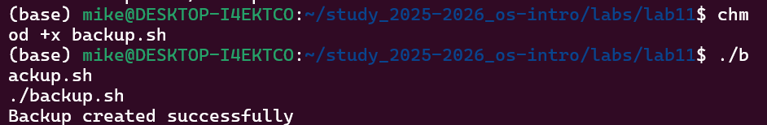
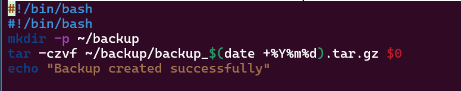
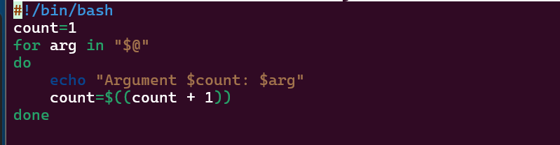
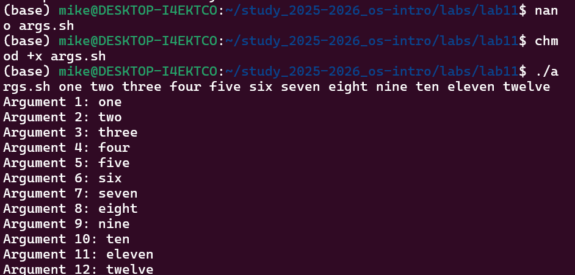
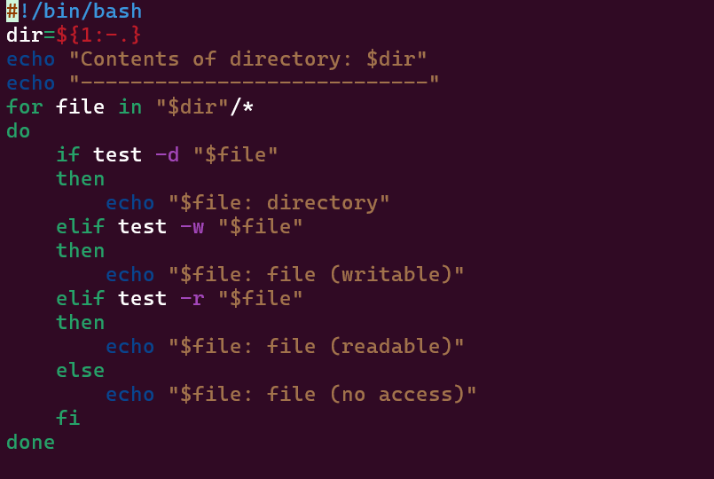
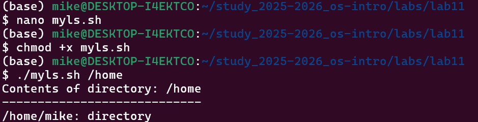
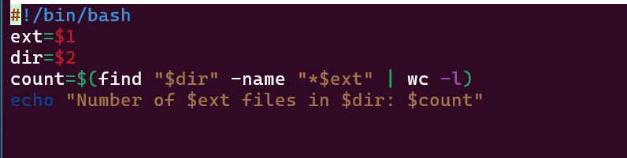
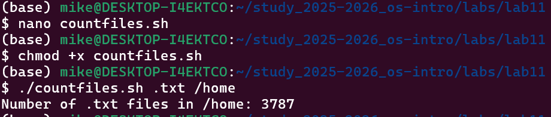

# **Лаборатория 12**

**Давид Майкл Фрэнсис**
**1032249023**

## цель работы
Изучить основы программирования в оболочке ОС UNIX/Linux. Научиться
писать небольшие командные файлы.

### Выполнение работы
**Задание 1. Скрипт резервного копирования**

Был создан командный файл `backup.sh`, который создаёт резервную копию самого себя
в директории `~/backup`, архивируя файл с помощью команды `tar`. При каждом запуске
создаётся архив с датой в имени файла.
```
bash
#!/bin/bash
mkdir -p ~/backup
tar -czvf ~/backup/backup_$(date +%Y%m%d).tar.gz $0
echo "Backup created successfully"
```





**Задание 2. Скрипт обработки произвольного числа аргументов**

Был создан командный файл `args.sh`, который последовательно выводит все переданные
аргументы командной строки, включая более десяти. Для обработки аргументов
использовался цикл `for` с переменной `$@`.
```
bash
#!/bin/bash
count=1
for arg in "$@"
do
    echo "Argument $count: $arg"
    count=$((count + 1))
done
```




**Задание 3. Аналог команды ls**

Был создан командный файл `myls.sh`, который выводит содержимое указанного каталога
и информацию о правах доступа к каждому файлу без использования команд `ls` и `dir`.

```
bash
#!/bin/bash
dir=${1:-.}
echo "Contents of directory: $dir"
echo "----------------------------"
for file in "$dir"/*
do
    if test -d "$file"
    then
        echo "$file: directory"
    elif test -w "$file"
    then
        echo "$file: file (writable)"
    elif test -r "$file"
    then
        echo "$file: file (readable)"
    else
        echo "$file: file (no access)"
    fi
done
```




**Задание 4. Подсчёт файлов по расширению**

Был создан командный файл `countfiles.sh`, который принимает в качестве аргументов
расширение файла и путь к директории, после чего подсчитывает количество файлов
с указанным расширением в данной директории.

```
bash
#!/bin/bash
ext=$1
dir=$2
count=$(find "$dir" -name "*$ext" | wc -l)
echo "Number of $ext files in $dir: $count"
```





####  Выводы
В ходе выполнения лабораторной работы были изучены основы программирования
в командной оболочке bash. Были написаны командные файлы, реализующие резервное
копирование, обработку аргументов командной строки, аналог команды ls и подсчёт
файлов по расширению. Получены практические навыки работы с переменными,
циклами, условными операторами и специальными переменными bash.


##### Ответы на контрольные вопросы

**1. Понятие командной оболочки. Примеры и отличия:**
Командная оболочка — программа, позволяющая пользователю взаимодействовать
с операционной системой. Примеры: sh (базовая оболочка UNIX), csh (С-подобный
синтаксис), ksh (совмещает sh и csh), bash (наиболее распространённая в Linux).
Отличаются синтаксисом команд, набором функций и совместимостью со стандартами.

**2. Что такое POSIX:**
POSIX (Portable Operating System Interface) — набор стандартов, разработанных
комитетом IEEE для обеспечения совместимости различных UNIX/Linux-подобных
операционных систем и переносимости прикладных программ на уровне исходного кода.

**3. Как определяются переменные и массивы в bash:**
Переменные: `variable_name=value`
Массивы: `set -A array_name value1 value2 value3` или `array_name[0]=value`

**4. Назначение операторов let и read:**
`let` — выполняет арифметические операции над переменными.
`read` — считывает значения переменных со стандартного ввода.

**5. Арифметические операции в bash:**
Сложение `+`, вычитание `-`, умножение `*`, деление `/`, остаток `%`, побитовые
операции `&`, `|`, `^`, сдвиги `<<`, `>>`, логические операции `&&`, `||`.

**6. Что означает операция (( )):**
Двойные скобки позволяют записывать арифметические и условные выражения
в упрощённой форме без использования ключевого слова `let`. Например `(( x+=1 ))`.

**7. Стандартные имена переменных:**
`PATH`, `HOME`, `PS1`, `PS2`, `MAIL`, `TERM`, `LOGNAME`, `IFS`.

**8. Что такое метасимволы:**
Метасимволы — специальные символы, имеющие особый смысл для командного
процессора: `' < > * ? | \ " &`. Используются для шаблонов имён файлов,
перенаправления ввода/вывода и других операций.

**9. Как экранировать метасимволы:**
С помощью символа `\` перед метасимволом, одинарных кавычек для группы символов
или двойных кавычек, которые экранируют все метасимволы кроме `$`, `'`, `\`, `"`.

**10. Как создавать и запускать командные файлы:**
Создать файл, добавить `#!/bin/bash` в первую строку, сделать исполняемым
командой `chmod +x имя_файла` и запустить командой `./имя_файла`.

**11. Как определяются функции в bash:**
```bash
function function_name {
    commands
}
```
Удалить функцию можно командой `unset -f function_name`.

**12. Как проверить, является файл каталогом или обычным файлом:**
```bash
if test -d filename
then echo "это каталог"
else echo "это обычный файл"
fi
```

**13. Назначение команд set, typeset и unset:**
`set` — отображает все текущие переменные и их значения.
`typeset` — объявляет типы переменных, например `typeset -i x` объявляет x целым.
`unset` — удаляет переменную или функцию из программы.

**14. Как передаются параметры в командные файлы:**
Параметры передаются после имени скрипта при его вызове: `./script.sh param1 param2`.
Внутри скрипта они доступны как `$1`, `$2`, `$3` и т.д. `$0` — имя самого скрипта.

**15. Специальные переменные bash и их назначение:**
- `$*` — все параметры командной строки
- `$?` — код завершения последней выполненной команды
- `$$` — идентификатор процесса текущей оболочки
- `$!` — номер последнего фонового процесса
- `$#` — количество параметров, переданных скрипту
- `$-` — текущие флаги командного процессора
- `$0` — имя командного файла
