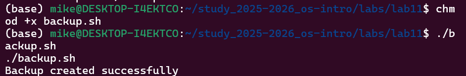
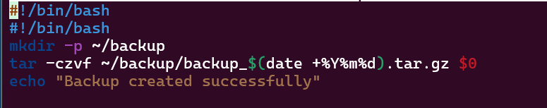
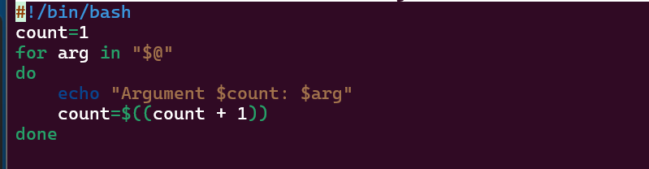
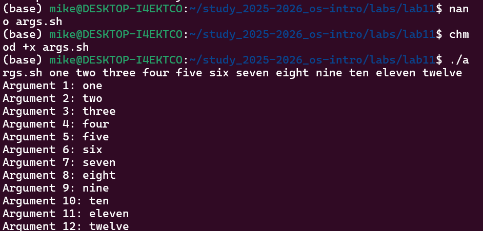
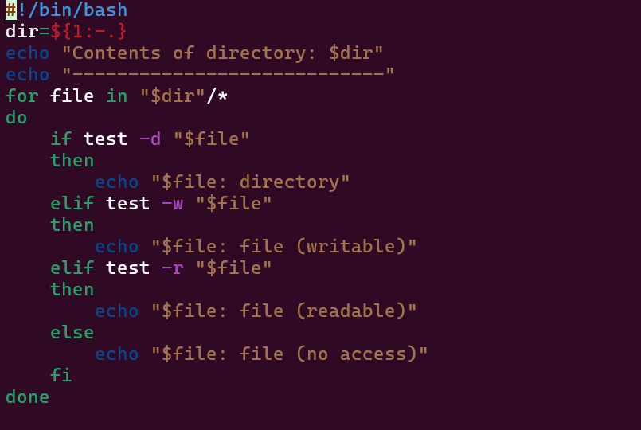
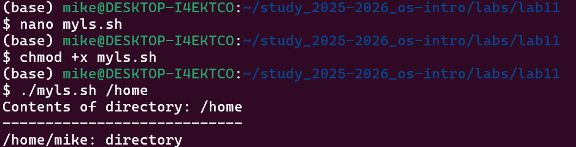
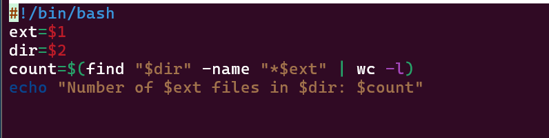
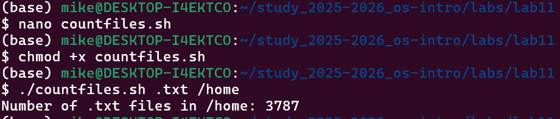

---
## Author
author:
  name: Давид Майкл Фрэнсис (1032249023)
  affiliation:
    - name: Российский университет дружбы народов
      country: Российская Федерация
      postal-code: 117198
      city: Москва
      address: ул. Миклухо-Маклая, д. 6

## Title
title: "Лабораторная работа №12"
subtitle: "Основы программирования в командной оболочке bash"
license: "CC BY"
abstract: |
  В данном отчёте представлены результаты выполнения лабораторной работы по теме «Основы программирования в командной оболочке bash».

  Описана разработка командных файлов (скриптов) bash: резервного копирования, обработки произвольного числа аргументов, аналога команды `ls` и подсчёта файлов по расширению.

  Сделаны выводы о достижении поставленной цели.
keywords: [bash, shell, скрипт, переменные, циклы]
---

# Введение

## Актуальность

Написание командных файлов (скриптов) является одним из базовых практических навыков работы в операционных системах семейства Linux. Скрипты bash позволяют автоматизировать повторяющиеся задачи — от резервного копирования до анализа файловой системы, — используя при этом те же команды, которые применяются в интерактивном режиме командной строки.

## Цель работы

Изучить основы программирования в оболочке ОС UNIX/Linux. Научиться писать небольшие командные файлы.

## Задачи

- изучить основы написания командных файлов (скриптов) bash;
- написать скрипт резервного копирования с использованием `tar` и подстановки текущей даты;
- написать скрипт обработки произвольного числа аргументов командной строки;
- написать скрипт — аналог команды `ls`, определяющий тип и права доступа файлов;
- написать скрипт подсчёта файлов с заданным расширением в каталоге.

## Объект и предмет исследования

Объектом исследования является командная оболочка bash операционной системы Linux. Предметом исследования выступает процесс разработки командных файлов (скриптов) bash с использованием переменных, циклов, условных операторов и специальных переменных оболочки.

## Методы исследования

Работа выполнялась практическим методом — путём написания и выполнения bash-скриптов в среде Linux.

## Схема выполнения работы

На рис. -@fig-flowchart представлена общая последовательность действий при выполнении работы.

::: {#fig-flowchart}

```{mermaid}
%%| fig-width: 100%
graph TD
    A@{ shape: circle, label: "Начало" } --> B[Выполнить действие]
    B --> C[Описать, что конкретно сделано]
    C --> D[Подтвердить скриншотом]
    D --> E[Занести в отчёт]
    E --> F[Поместить в git-репозиторий]
    F --> G[Сделать релиз git]
    G --> J@{ shape: dbl-circ, label: "Конец" }
```

Блок-схема выполнения лабораторной работы

:::

# Теоретическая часть

Командный файл (скрипт) bash — это текстовый файл, содержащий последовательность команд оболочки, которые выполняются построчно при его запуске [@shotts_book_linux-command-line_en]. Первая строка скрипта обычно содержит **shebang** — указание интерпретатора, которым должен выполняться файл, например `#!/bin/bash`. Чтобы скрипт можно было запускать как отдельную программу, ему необходимо назначить право на выполнение командой `chmod +x имя_файла`, после чего он запускается как `./имя_файла`.

Параметры, переданные скрипту при запуске, доступны внутри него через **позиционные параметры**: `$1`, `$2` и так далее, при этом `$0` содержит имя самого скрипта. Специальные переменные `$@` и `$*` разворачиваются во все переданные параметры и часто используются в цикле `for` для последовательной обработки произвольного числа аргументов. Переменная `$#` содержит количество переданных параметров, `$?` — код завершения последней выполненной команды.

Для проверки условий (например, является ли путь каталогом или обычным файлом, доступен ли файл для чтения или записи) используется команда `test` (или эквивалентная конструкция `[ ... ]`) совместно с условным оператором `if`/`elif`/`else`/`fi`. Циклы `for` позволяют последовательно перебирать список значений — аргументы командной строки, файлы в каталоге или результат подстановки команды.

# Материалы и методы

Для выполнения работы использовались операционная система семейства Linux, командная оболочка **bash**, а также утилиты `tar`, `find`, `wc` и `test`.

# Выполнение лабораторной работы

## Задание 1. Скрипт резервного копирования

Был создан командный файл `backup.sh`, который создаёт резервную копию самого себя в каталоге `~/backup`, архивируя файл с помощью команды `tar`. При каждом запуске создаётся архив с текущей датой в имени файла.

```bash
#!/bin/bash
mkdir -p ~/backup
tar -czvf ~/backup/backup_$(date +%Y%m%d).tar.gz $0
echo "Backup created successfully"
```

{#fig-001 width=70%}

{#fig-002 width=70%}

## Задание 2. Скрипт обработки произвольного числа аргументов

Был создан командный файл `args.sh`, который последовательно выводит все переданные аргументы командной строки, включая более десяти. Для обработки аргументов использовался цикл `for` с переменной `$@`.

```bash
#!/bin/bash
count=1
for arg in "$@"
do
    echo "Argument $count: $arg"
    count=$((count + 1))
done
```

{#fig-003 width=70%}

{#fig-004 width=70%}

## Задание 3. Аналог команды ls

Был создан командный файл `myls.sh`, который выводит содержимое указанного каталога и информацию о правах доступа к каждому файлу без использования команд `ls` и `dir`.

```bash
#!/bin/bash
dir=${1:-.}
echo "Contents of directory: $dir"
echo "----------------------------"
for file in "$dir"/*
do
    if test -d "$file"
    then
        echo "$file: directory"
    elif test -w "$file"
    then
        echo "$file: file (writable)"
    elif test -r "$file"
    then
        echo "$file: file (readable)"
    else
        echo "$file: file (no access)"
    fi
done
```

{#fig-005 width=70%}

{#fig-006 width=70%}

## Задание 4. Подсчёт файлов по расширению

Был создан командный файл `countfiles.sh`, который принимает в качестве аргументов расширение файла и путь к директории, после чего подсчитывает количество файлов с указанным расширением в данной директории.

```bash
#!/bin/bash
ext=$1
dir=$2
count=$(find "$dir" -name "*$ext" | wc -l)
echo "Number of $ext files in $dir: $count"
```

{#fig-007 width=70%}

{#fig-008 width=70%}

# Результаты

В результате выполнения работы были написаны четыре командных файла bash:

- `backup.sh` — создаёт архив резервной копии с датой в имени файла;
- `args.sh` — последовательно выводит произвольное число переданных аргументов;
- `myls.sh` — выводит содержимое каталога с указанием типа и прав доступа файлов;
- `countfiles.sh` — подсчитывает количество файлов с заданным расширением в указанном каталоге.

Все скрипты были успешно выполнены с ожидаемым результатом.

# Обсуждение результатов

Скрипт `myls.sh` демонстрирует базовый принцип, на котором строится реальная команда `ls -l`: проверку прав доступа к каждому файлу через `test`, хотя и в упрощённом виде — проверяется только возможность записи или чтения, без вывода полного набора атрибутов (владелец, группа, размер, дата изменения). Скрипт `countfiles.sh` использует `find` в сочетании с `wc -l`, что является типичным для bash приёмом подсчёта результатов одной команды через конвейер, но не учитывает файлы с пробелами в имени — для таких случаев потребовался бы более аккуратный подход, например `find -print0` в сочетании с `wc -l --files0-from=-` или аналогичный.

# Заключение

В ходе выполнения лабораторной работы были изучены основы программирования в командной оболочке bash. Были написаны командные файлы, реализующие резервное копирование, обработку аргументов командной строки, аналог команды `ls` и подсчёт файлов по расширению. Получены практические навыки работы с переменными, циклами, условными операторами и специальными переменными bash.

Поставленная цель работы достигнута.

# Ответы на контрольные вопросы {.unnumbered}

**1. Понятие командной оболочки. Примеры и отличия**

Командная оболочка — программа, позволяющая пользователю взаимодействовать с операционной системой. Примеры: `sh` (базовая оболочка UNIX), `csh` (C-подобный синтаксис), `ksh` (совмещает `sh` и `csh`), `bash` (наиболее распространённая в Linux). Отличаются синтаксисом команд, набором функций и совместимостью со стандартами.

**2. Что такое POSIX**

POSIX (Portable Operating System Interface) — набор стандартов, разработанных комитетом IEEE для обеспечения совместимости различных UNIX/Linux-подобных операционных систем и переносимости прикладных программ на уровне исходного кода.

**3. Как определяются переменные и массивы в bash**

- Переменные: `variable_name=value`
- Массивы: `set -A array_name value1 value2 value3` или `array_name[0]=value`

**4. Назначение операторов let и read**

- `let` — выполняет арифметические операции над переменными;
- `read` — считывает значения переменных со стандартного ввода.

**5. Арифметические операции в bash**

Сложение `+`, вычитание `-`, умножение `*`, деление `/`, остаток `%`, побитовые операции `&`, `|`, `^`, сдвиги `<<`, `>>`, логические операции `&&`, `||`.

**6. Что означает операция (( ))**

Двойные скобки позволяют записывать арифметические и условные выражения в упрощённой форме без использования ключевого слова `let`. Например, `(( x+=1 ))`.

**7. Стандартные имена переменных**

`PATH`, `HOME`, `PS1`, `PS2`, `MAIL`, `TERM`, `LOGNAME`, `IFS`.

**8. Что такое метасимволы**

Метасимволы — специальные символы, имеющие особый смысл для командного процессора: `` ' < > * ? | \ " & ``. Используются для шаблонов имён файлов, перенаправления ввода/вывода и других операций.

**9. Как экранировать метасимволы**

С помощью символа `\` перед метасимволом, одинарных кавычек для группы символов или двойных кавычек, которые экранируют все метасимволы, кроме `$`, `'`, `\`, `"`.

**10. Как создавать и запускать командные файлы**

Создать файл, добавить `#!/bin/bash` в первую строку, сделать исполняемым командой `chmod +x имя_файла` и запустить командой `./имя_файла`.

**11. Как определяются функции в bash**

```bash
function function_name {
    commands
}
```

Удалить функцию можно командой `unset -f function_name`.

**12. Как проверить, является файл каталогом или обычным файлом**

```bash
if test -d filename
then echo "это каталог"
else echo "это обычный файл"
fi
```

**13. Назначение команд set, typeset и unset**

- `set` — отображает все текущие переменные и их значения;
- `typeset` — объявляет типы переменных, например `typeset -i x` объявляет `x` целым;
- `unset` — удаляет переменную или функцию из программы.

**14. Как передаются параметры в командные файлы**

Параметры передаются после имени скрипта при его вызове: `./script.sh param1 param2`. Внутри скрипта они доступны как `$1`, `$2`, `$3` и т. д. `$0` — имя самого скрипта.

**15. Специальные переменные bash и их назначение**

- `$*` — все параметры командной строки;
- `$?` — код завершения последней выполненной команды;
- `$$` — идентификатор процесса текущей оболочки;
- `$!` — номер последнего фонового процесса;
- `$#` — количество параметров, переданных скрипту;
- `$-` — текущие флаги командного процессора;
- `$0` — имя командного файла.

# Список литературы {.unnumbered}

::: {#refs}
:::
