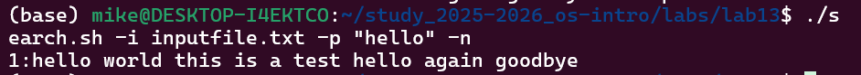
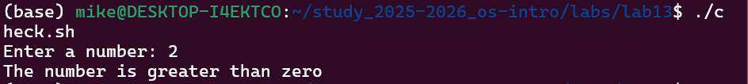
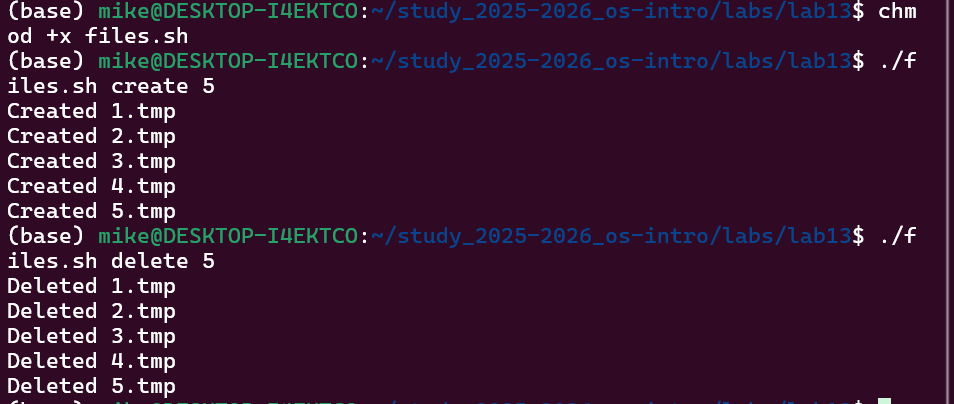

**Давид Майкл Фрэнсис**
**1032249023**


# Лабораторная работа № 13. Программирование в командном процессоре ОС UNIX. Ветвления и циклы

## 1. Цель работы
Изучить основы программирования в оболочке ОС UNIX. Научиться писать более
сложные командные файлы с использованием логических управляющих конструкций
и циклов.

---

## 2. Выполнение работы

### Задание 1. Командный файл с использованием getopts и grep

Был создан командный файл `search.sh`, который анализирует командную строку
с ключами `-i` (входной файл), `-o` (выходной файл), `-p` (шаблон поиска),
`-C` (различать регистр) и `-n` (выводить номера строк), после чего выполняет
поиск в указанном файле с помощью команды `grep`.

```bash
#!/bin/bash
inputfile=""
outputfile=""
pattern=""
case_flag=""
line_flag=""

while getopts "i:o:p:Cn" opt
do
    case $opt in
        i) inputfile=$OPTARG;;
        o) outputfile=$OPTARG;;
        p) pattern=$OPTARG;;
        C) case_flag="-i";;
        n) line_flag="-n";;
        *) echo "Unknown option: $opt";;
    esac
done

if [ -z "$inputfile" ] || [ -z "$pattern" ]
then
    echo "Error: input file and pattern are required"
    exit 1
fi

if [ -n "$outputfile" ]
then
    grep $case_flag $line_flag "$pattern" "$inputfile" > "$outputfile"
    echo "Results saved to $outputfile"
else
    grep $case_flag $line_flag "$pattern" "$inputfile"
fi
```



### Задание 2. Программа на языке Си и командный файл

Была написана программа на языке Си `check_number.c`, которая вводит число,
определяет его знак и завершается с соответствующим кодом завершения через
функцию `exit(n)`. Командный файл `check.sh` вызывает эту программу и с помощью
переменной `$?` анализирует код завершения и выводит сообщение о введённом числе.

**Программа на языке Си:**
```c
#include <stdio.h>
#include <stdlib.h>

int main() {
    int n;
    printf("Enter a number: ");
    scanf("%d", &n);
    if (n > 0) {
        exit(1);
    } else if (n < 0) {
        exit(2);
    } else {
        exit(0);
    }
}
```

**Командный файл:**
```bash
#!/bin/bash
./check_number
result=$?

case $result in
    0) echo "The number is equal to zero";;
    1) echo "The number is greater than zero";;
    2) echo "The number is less than zero";;
esac
```

**Компиляция и запуск:**
```bash
gcc check_number.c -o check_number
chmod +x check.sh
./check.sh
```


---

### Задание 3. Командный файл для создания и удаления файлов

Был создан командный файл `files.sh`, который принимает в качестве аргументов
действие (`create` или `delete`) и число `N`, после чего создаёт или удаляет
файлы, пронумерованные от 1 до N с расширением `.tmp`.

```bash
#!/bin/bash
action=$1
N=$2

if [ "$action" = "create" ]
then
    for i in $(seq 1 $N)
    do
        touch "$i.tmp"
        echo "Created $i.tmp"
    done
elif [ "$action" = "delete" ]
then
    for i in $(seq 1 $N)
    do
        if test -f "$i.tmp"
        then
            rm "$i.tmp"
            echo "Deleted $i.tmp"
        fi
    done
else
    echo "Usage: ./files.sh create N or ./files.sh delete N"
fi
```

**Запуск:**
```bash
chmod +x files.sh
# Создание файлов
./files.sh create 5
# Удаление файлов
./files.sh delete 5
```


---

### Задание 4. Командный файл для архивации с помощью tar и find

Был создан командный файл `archive.sh`, который архивирует все файлы в указанной
директории с помощью команды `tar`, а также отдельно архивирует только те файлы,
которые были изменены менее недели назад, используя команду `find`.

```bash
#!/bin/bash
dir=$1

if [ -z "$dir" ]
then
    echo "Error: please specify a directory"
    exit 1
fi

# Архивировать все файлы в директории
tar -czvf archive_all.tar.gz "$dir"
echo "All files archived to archive_all.tar.gz"

# Архивировать только файлы, изменённые менее недели назад
find "$dir" -mtime -7 -type f | tar -czvf archive_week.tar.gz -T -
echo "Files modified in last 7 days archived to archive_week.tar.gz"
```

**Запуск:**
```bash
chmod +x archive.sh
./archive.sh /home/user
```

---

## 3. Выводы
В ходе выполнения лабораторной работы были изучены более сложные конструкции
программирования в командной оболочке bash. Были написаны командные файлы
с использованием команды `getopts` для анализа аргументов командной строки,
условных операторов `if` и `case`, цикла `for`, а также команд `tar` и `find`
для архивации файлов. Получены практические навыки написания сложных командных
файлов с ветвлениями и циклами.

---

## 4. Ответы на контрольные вопросы

**1. Предназначение команды getopts:**
Команда `getopts` используется для синтаксического анализа параметров командной
строки. Она считывает ключи по одному и сохраняет их в переменную. Как правило
используется в цикле `while` совместно с оператором `case` для обработки каждого ключа.

**2. Отношение метасимволов к генерации имён файлов:**
Метасимволы `*`, `?` и `[c1-c2]` используются для генерации имён файлов по шаблону.
Например, `*.txt` соответствует всем файлам с расширением `.txt`, `?` соответствует
любому одному символу, а `[a-z]*` соответствует любому файлу, начинающемуся
со строчной буквы латинского алфавита.

**3. Операторы управления действиями:**
- `if/then/elif/else/fi` — условное ветвление
- `for` — цикл по списку значений
- `while` — цикл пока условие истинно
- `until` — цикл пока условие ложно
- `case` — выбор из нескольких вариантов

**4. Операторы для прерывания цикла:**
- `break` — полностью завершает выполнение цикла
- `continue` — пропускает текущую итерацию и переходит к следующей

**5. Назначение команд false и true:**
- `true` — всегда возвращает код завершения 0 (истина)
- `false` — всегда возвращает ненулевой код завершения (ложь)
Используются для создания бесконечных циклов или управления условиями,
например `while true` создаёт бесконечный цикл.

**6. Что означает строка `if test -f man$s/$i.$s`:**
Эта строка проверяет, существует ли обычный файл по пути `man$s/$i.$s`, где `$s`
и `$i` — переменные, подставляемые в путь. Команда `test -f` возвращает истину,
если указанный путь существует и является обычным файлом, а не каталогом.

**7. Различия между конструкциями while и until:**
- `while` — выполняет тело цикла пока условие **истинно** (код завершения 0)
- `until` — выполняет тело цикла пока условие **ложно** (ненулевой код завершения)
Они противоположны друг другу. `while true` выполняется бесконечно,
`until false` также выполняется бесконечно.
