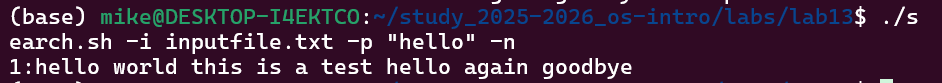
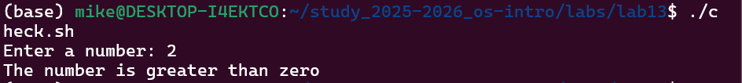
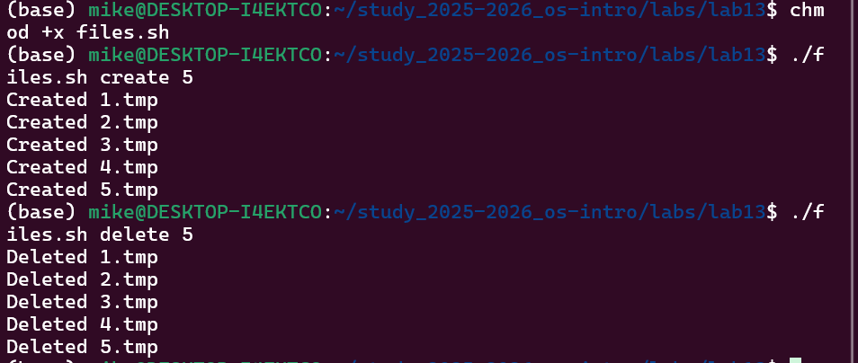

---
## Author
author:
  name: Давид Майкл Фрэнсис (1032249023)
  affiliation:
    - name: Российский университет дружбы народов
      country: Российская Федерация
      postal-code: 117198
      city: Москва
      address: ул. Миклухо-Маклая, д. 6

## Title
title: "Лабораторная работа №13"
subtitle: "Программирование в командном процессоре ОС UNIX. Ветвления и циклы"
license: "CC BY"
abstract: |
  В данном отчёте представлены результаты выполнения лабораторной работы по теме «Программирование в командном процессоре ОС UNIX. Ветвления и циклы».

  Описана разработка командных файлов bash с использованием `getopts`, условных операторов `if` и `case`, циклов `for`, а также взаимодействие командного файла с программой на языке Си через код завершения процесса.

  Сделаны выводы о достижении поставленной цели.
keywords: [bash, getopts, case, цикл for, код завершения]
---

# Введение

## Актуальность

По мере усложнения задач автоматизации простого последовательного выполнения команд в скрипте становится недостаточно — требуются управляющие конструкции ветвления и циклов, а также структурированный разбор параметров командной строки. Эти возможности bash являются продолжением базовых навыков написания скриптов и необходимы для разработки по-настоящему полезных инструментов командной строки.

## Цель работы

Изучить основы программирования в оболочке ОС UNIX. Научиться писать более сложные командные файлы с использованием логических управляющих конструкций и циклов.

## Задачи

- изучить команду `getopts` для разбора именованных параметров командной строки;
- написать скрипт анализа аргументов и поиска текста с помощью `grep`;
- написать программу на языке Си и командный файл, анализирующий код её завершения;
- написать скрипт создания и удаления файлов в цикле;
- написать скрипт архивации файлов, в том числе по критерию времени последнего изменения.

## Объект и предмет исследования

Объектом исследования является командная оболочка bash операционной системы семейства UNIX. Предметом исследования выступает процесс разработки командных файлов с использованием управляющих конструкций ветвления (`if`, `case`) и циклов (`for`), разбора параметров командной строки средствами `getopts`, а также анализа кодов завершения процессов.

## Методы исследования

Работа выполнялась практическим методом — путём написания и выполнения bash-скриптов, в том числе взаимодействующих с программой, написанной на языке Си.

## Схема выполнения работы

На рис. -@fig-flowchart представлена общая последовательность действий при выполнении работы.

::: {#fig-flowchart}

```{mermaid}
%%| fig-width: 100%
graph TD
    A@{ shape: circle, label: "Начало" } --> B[Выполнить действие]
    B --> C[Описать, что конкретно сделано]
    C --> D[Подтвердить скриншотом]
    D --> E[Занести в отчёт]
    E --> F[Поместить в git-репозиторий]
    F --> G[Сделать релиз git]
    G --> J@{ shape: dbl-circ, label: "Конец" }
```

Блок-схема выполнения лабораторной работы

:::

# Теоретическая часть

Команда `getopts` предназначена для структурированного разбора именованных ключей командной строки [@shotts_book_linux-command-line_en]. Она считывает ключи по одному в цикле `while`, а их значения — в переменную `OPTARG`; обработка каждого ключа обычно выполняется оператором `case`. Такой подход значительно надёжнее ручного разбора позиционных параметров (`$1`, `$2`, …), особенно когда скрипт принимает несколько необязательных ключей в произвольном порядке.

Оператор `case` выполняет выбор из нескольких вариантов на основе значения переменной или кода завершения и часто используется как более наглядная альтернатива цепочке `if`/`elif`. Любая запущенная программа — как встроенная команда shell, так и внешняя программа, например скомпилированная из кода на языке Си, — завершается с **кодом завершения** (exit status), доступным в переменной `$?` сразу после её выполнения. Код `0` по соглашению означает успешное завершение, любое ненулевое значение — тот или иной вид ошибки или особого состояния, определяемого самой программой через функцию `exit(n)`.

Цикл `for`, при переборе значений, полученных подстановкой команды (например, `for i in $(seq 1 $N)`), позволяет выполнить тело цикла фиксированное число раз — удобный приём для задач вида «создать N файлов». Команда `find` в сочетании с `tar` через ключ `-T -` позволяет передать список файлов, отобранных по произвольному критерию (например, `-mtime -7` — изменённых менее чем за 7 дней), непосредственно в архиватор.

# Материалы и методы

Для выполнения работы использовались операционная система семейства Linux, командная оболочка **bash**, компилятор **gcc**, а также утилиты `getopts`, `grep`, `tar`, `find` и `seq`.

# Выполнение лабораторной работы

## Задание 1. Командный файл с использованием getopts и grep

Был создан командный файл `search.sh`, который анализирует командную строку с ключами `-i` (входной файл), `-o` (выходной файл), `-p` (шаблон поиска), `-C` (не различать регистр) и `-n` (выводить номера строк), после чего выполняет поиск в указанном файле с помощью команды `grep` (рис. -@fig-001).

```bash
#!/bin/bash
inputfile=""
outputfile=""
pattern=""
case_flag=""
line_flag=""

while getopts "i:o:p:Cn" opt
do
    case $opt in
        i) inputfile=$OPTARG;;
        o) outputfile=$OPTARG;;
        p) pattern=$OPTARG;;
        C) case_flag="-i";;
        n) line_flag="-n";;
        *) echo "Unknown option: $opt";;
    esac
done

if [ -z "$inputfile" ] || [ -z "$pattern" ]
then
    echo "Error: input file and pattern are required"
    exit 1
fi

if [ -n "$outputfile" ]
then
    grep $case_flag $line_flag "$pattern" "$inputfile" > "$outputfile"
    echo "Results saved to $outputfile"
else
    grep $case_flag $line_flag "$pattern" "$inputfile"
fi
```

{#fig-001 width=70%}

## Задание 2. Программа на языке Си и командный файл

Была написана программа на языке Си `check_number.c`, которая считывает число, определяет его знак и завершается с соответствующим кодом через функцию `exit(n)`. Командный файл `check.sh` запускает эту программу и с помощью переменной `$?` анализирует код завершения, выводя сообщение о знаке введённого числа (рис. -@fig-002).

Программа на языке Си:

```c
#include <stdio.h>
#include <stdlib.h>

int main() {
    int n;
    printf("Enter a number: ");
    scanf("%d", &n);
    if (n > 0) {
        exit(1);
    } else if (n < 0) {
        exit(2);
    } else {
        exit(0);
    }
}
```

Командный файл:

```bash
#!/bin/bash
./check_number
result=$?

case $result in
    0) echo "The number is equal to zero";;
    1) echo "The number is greater than zero";;
    2) echo "The number is less than zero";;
esac
```

Компиляция и запуск:

```bash
gcc check_number.c -o check_number
chmod +x check.sh
./check.sh
```

{#fig-002 width=70%}

## Задание 3. Командный файл для создания и удаления файлов

Был создан командный файл `files.sh`, который принимает в качестве аргументов действие (`create` или `delete`) и число `N`, после чего создаёт или удаляет файлы, пронумерованные от 1 до `N`, с расширением `.tmp` (рис. -@fig-003).

```bash
#!/bin/bash
action=$1
N=$2

if [ "$action" = "create" ]
then
    for i in $(seq 1 $N)
    do
        touch "$i.tmp"
        echo "Created $i.tmp"
    done
elif [ "$action" = "delete" ]
then
    for i in $(seq 1 $N)
    do
        if test -f "$i.tmp"
        then
            rm "$i.tmp"
            echo "Deleted $i.tmp"
        fi
    done
else
    echo "Usage: ./files.sh create N or ./files.sh delete N"
fi
```

Запуск:

```bash
chmod +x files.sh
# Создание файлов
./files.sh create 5
# Удаление файлов
./files.sh delete 5
```

{#fig-003 width=70%}

## Задание 4. Командный файл для архивации с помощью tar и find

Был создан командный файл `archive.sh`, который архивирует все файлы в указанной директории с помощью команды `tar`, а также отдельно архивирует только те файлы, которые были изменены менее недели назад, используя команду `find` в связке с `tar -T -`.

```bash
#!/bin/bash
dir=$1

if [ -z "$dir" ]
then
    echo "Error: please specify a directory"
    exit 1
fi

# Архивировать все файлы в директории
tar -czvf archive_all.tar.gz "$dir"
echo "All files archived to archive_all.tar.gz"

# Архивировать только файлы, изменённые менее недели назад
find "$dir" -mtime -7 -type f | tar -czvf archive_week.tar.gz -T -
echo "Files modified in last 7 days archived to archive_week.tar.gz"
```

Запуск:

```bash
chmod +x archive.sh
./archive.sh /home/user
```

# Результаты

В результате выполнения работы были написаны четыре командных файла bash и одна программа на языке Си:

- `search.sh` — разбирает именованные ключи командной строки через `getopts` и выполняет поиск с помощью `grep`;
- `check_number.c` и `check.sh` — демонстрируют передачу результата между программой на Си и bash-скриптом через код завершения процесса;
- `files.sh` — создаёт и удаляет заданное число файлов в цикле `for`;
- `archive.sh` — архивирует все файлы каталога, а также отдельно файлы, изменённые за последнюю неделю.

Все скрипты были успешно выполнены с ожидаемым результатом.

# Обсуждение результатов

Задание 2 наглядно демонстрирует, что код завершения процесса (`$?`) — универсальный механизм взаимодействия между программами независимо от языка, на котором они написаны: программа на Си сообщает результат через `exit(n)`, а bash-скрипт интерпретирует это значение оператором `case`, не зная ничего о внутренней логике программы. Использование `getopts` в задании 1 по сравнению с обработкой позиционных параметров (как в более ранних лабораторных работах) показывает, что структурированный разбор ключей существенно упрощает добавление новых необязательных флагов без изменения порядка вызова скрипта.

# Заключение

В ходе выполнения лабораторной работы были изучены более сложные конструкции программирования в командной оболочке bash. Были написаны командные файлы с использованием команды `getopts` для анализа аргументов командной строки, условных операторов `if` и `case`, цикла `for`, а также команд `tar` и `find` для архивации файлов. Получены практические навыки написания сложных командных файлов с ветвлениями и циклами.

Поставленная цель работы достигнута.

# Ответы на контрольные вопросы {.unnumbered}

**1. Предназначение команды getopts**

Команда `getopts` используется для синтаксического анализа параметров командной строки. Она считывает ключи по одному и сохраняет их в переменную. Как правило, используется в цикле `while` совместно с оператором `case` для обработки каждого ключа.

**2. Отношение метасимволов к генерации имён файлов**

Метасимволы `*`, `?` и `[c1-c2]` используются для генерации имён файлов по шаблону. Например, `*.txt` соответствует всем файлам с расширением `.txt`, `?` соответствует любому одному символу, а `[a-z]*` соответствует любому файлу, начинающемуся со строчной буквы латинского алфавита.

**3. Операторы управления действиями**

- `if/then/elif/else/fi` — условное ветвление;
- `for` — цикл по списку значений;
- `while` — цикл, пока условие истинно;
- `until` — цикл, пока условие ложно;
- `case` — выбор из нескольких вариантов.

**4. Операторы для прерывания цикла**

- `break` — полностью завершает выполнение цикла;
- `continue` — пропускает текущую итерацию и переходит к следующей.

**5. Назначение команд false и true**

- `true` — всегда возвращает код завершения 0 (истина);
- `false` — всегда возвращает ненулевой код завершения (ложь).

Используются для создания бесконечных циклов или управления условиями, например `while true` создаёт бесконечный цикл.

**6. Что означает строка if test -f man$s/$i.$s**

Эта строка проверяет, существует ли обычный файл по пути `man$s/$i.$s`, где `$s` и `$i` — переменные, подставляемые в путь. Команда `test -f` возвращает истину, если указанный путь существует и является обычным файлом, а не каталогом.

**7. Различия между конструкциями while и until**

- `while` — выполняет тело цикла, пока условие **истинно** (код завершения 0);
- `until` — выполняет тело цикла, пока условие **ложно** (ненулевой код завершения).

Они противоположны друг другу: `while true` выполняется бесконечно, `until false` также выполняется бесконечно.

# Список литературы {.unnumbered}

::: {#refs}
:::
