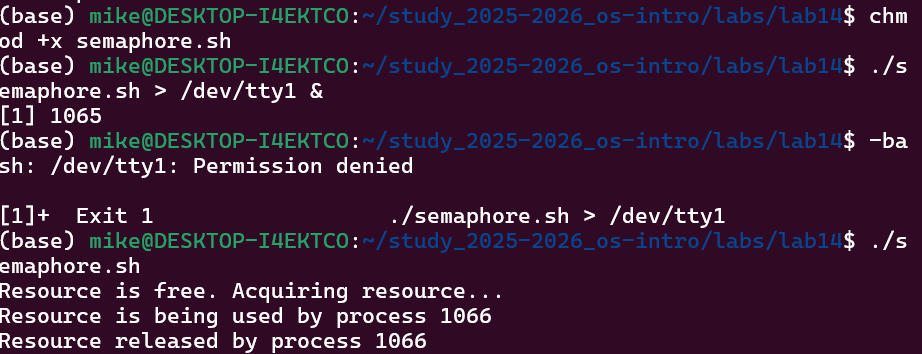
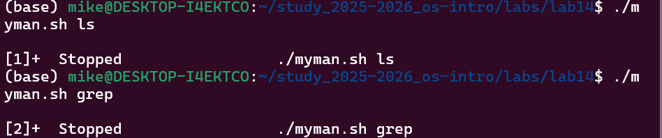
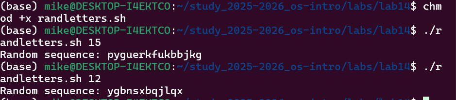

#Давид Майкл Фрэнсис

# Лабораторная работа № 14. Программирование в командном процессоре ОС UNIX. Расширенное программирование

## 1. Цель работы
Изучить основы программирования в оболочке ОС UNIX. Научиться писать более
сложные командные файлы с использованием логических управляющих конструкций
и циклов.

---

## 2. Выполнение работы

### Задание 1. Командный файл реализующий механизм семафоров

Был создан командный файл `semaphore.sh`, который реализует упрощённый механизм
семафоров. Файл ожидает освобождения ресурса в течение времени `t1`, выдавая
соответствующее сообщение, а после освобождения использует ресурс в течение
времени `t2`, также выдавая информацию об использовании ресурса текущим процессом.

```bash
#!/bin/bash
lockfile=/tmp/semaphore.lock
t1=10
t2=5

while true
do
    if [ ! -f "$lockfile" ]
    then
        echo "Resource is free. Acquiring resource..."
        touch "$lockfile"
        echo "Resource is being used by process $$"
        sleep $t2
        rm "$lockfile"
        echo "Resource released by process $$"
        break
    else
        echo "Resource is busy. Waiting..."
        sleep 1
    fi
done
```

**Запуск в фоновом режиме с перенаправлением вывода:**
```bash
chmod +x semaphore.sh
./semaphore.sh > /dev/tty1 &
./semaphore.sh
```


---

### Задание 2. Реализация команды man

Был создан командный файл `myman.sh`, который принимает в качестве аргумента
командной строки название команды и выдаёт справку об этой команде из каталога
`/usr/share/man/man1`, или сообщение об отсутствии справки, если соответствующий
файл не найден.

```bash
#!/bin/bash
if [ -z "$1" ]
then
    echo "Usage: ./myman.sh <command>"
    exit 1
fi

manfile=$(find /usr/share/man/man1 -name "$1*" | head -1)

if [ -z "$manfile" ]
then
    echo "No manual entry found for $1"
else
    less "$manfile"
fi
```

**Запуск:**
```bash
chmod +x myman.sh
./myman.sh ls
./myman.sh grep
```


---

### Задание 3. Генератор случайной последовательности букв

Был создан командный файл `randletters.sh`, который с помощью встроенной
переменной `$RANDOM` генерирует случайную последовательность букв латинского
алфавита. Длина последовательности передаётся в качестве аргумента командной
строки.

```bash
#!/bin/bash
length=${1:-10}
letters=""

for i in $(seq 1 $length)
do
    index=$((RANDOM % 26))
    letter=$(echo {a..z} | tr ' ' '\n' | sed -n "$((index+1))p")
    letters="$letters$letter"
done

echo "Random sequence: $letters"
```

**Запуск:**
```bash
chmod +x randletters.sh
./randletters.sh 15
```


---

## 3. Выводы
В ходе выполнения лабораторной работы были изучены более сложные конструкции
программирования в командной оболочке bash. Был реализован механизм семафоров
для синхронизации процессов, написан аналог команды `man` для просмотра справки,
а также командный файл для генерации случайных последовательностей букв с помощью
переменной `$RANDOM`. Получены практические навыки написания сложных командных
файлов с использованием управляющих конструкций и циклов.

---

## 4. Ответы на контрольные вопросы

**1. Синтаксическая ошибка в строке `while [$1 != "exit"]`:**
Ошибка заключается в отсутствии пробелов внутри квадратных скобок.
Правильный вариант:
```bash
while [ $1 != "exit" ]
```
После `[` и перед `]` обязательно должны быть пробелы.

**2. Как объединить несколько строк в одну:**
```bash
str1="Hello"
str2="World"
result="$str1 $str2"
echo $result
# Или просто
result=$str1$str2
echo $result
```

**3. Информация об утилите seq и альтернативные способы реализации:**
Утилита `seq` генерирует последовательность чисел. Например, `seq 1 10` генерирует
числа от 1 до 10. Альтернативные способы реализации в bash:
```bash
# С помощью цикла for в стиле Си
for ((i=1; i<=10; i++))
do echo $i
done

# С помощью цикла while
i=1
while [ $i -le 10 ]
do
    echo $i
    i=$((i+1))
done

# С помощью подстановки фигурных скобок
echo {1..10}
```

**4. Результат вычисления выражения `$((10/3))`:**
Результат равен `3`, так как bash выполняет целочисленное деление и отбрасывает
остаток от деления.

**5. Основные отличия командной оболочки zsh от bash:**
- **Автодополнение** — zsh имеет более мощное и настраиваемое автодополнение
- **Темы и плагины** — zsh поддерживает фреймворки такие как Oh-My-Zsh
- **Исправление ошибок** — zsh автоматически исправляет незначительные опечатки
- **Массивы** — в zsh массивы индексируются с 1, а в bash с 0
- **Совместимость** — bash по умолчанию доступен на большинстве систем Linux
- **Глобинг** — zsh имеет более мощные возможности сопоставления шаблонов

**6. Верен ли синтаксис конструкции `for ((a=1; a <= LIMIT; a++))`:**
Да, синтаксис верен. Это цикл for в стиле Си в bash. Переменная `a` увеличивается
от 1 до значения переменной `LIMIT`. Однако переменная `LIMIT` должна быть
определена до цикла:
```bash
LIMIT=10
for ((a=1; a <= LIMIT; a++))
do
    echo $a
done
```

**7. Сравнение bash с другими языками программирования:**

**Преимущества bash:**
- Прямое взаимодействие с операционной системой и файлами
- Не требует компиляции, скрипты выполняются сразу
- Мощный инструмент для автоматизации системных задач
- Доступен по умолчанию практически на всех системах Linux/Unix
- Удобен для объединения системных команд в конвейеры

**Недостатки bash:**
- Слабая поддержка сложных структур данных
- Значительно медленнее компилируемых языков таких как C
- Синтаксис может быть запутанным и склонным к ошибкам
- Не подходит для разработки крупных сложных приложений
- Ограниченная поддержка объектно-ориентированного программирования
- Сложнее отлаживать по сравнению с такими языками как Python
