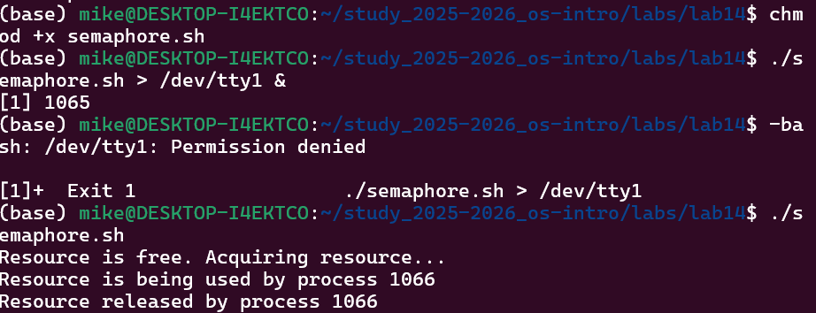
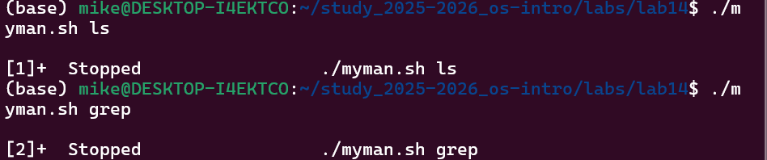
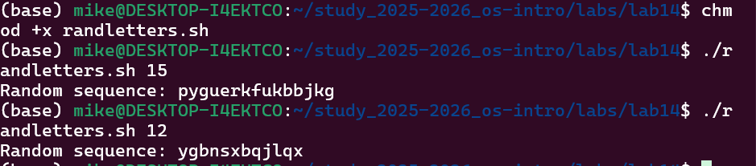

---
## Author
author:
  name: Давид Майкл Фрэнсис
  affiliation:
    - name: Российский университет дружбы народов
      country: Российская Федерация
      postal-code: 117198
      city: Москва
      address: ул. Миклухо-Маклая, д. 6

## Title
title: "Лабораторная работа №14"
subtitle: "Программирование в командном процессоре ОС UNIX. Расширенное программирование"
license: "CC BY"
abstract: |
  В данном отчёте представлены результаты выполнения лабораторной работы по теме «Программирование в командном процессоре ОС UNIX. Расширенное программирование».

  Описана разработка командных файлов bash: упрощённого механизма семафоров для синхронизации процессов, аналога команды `man` и генератора случайной последовательности букв на основе переменной `$RANDOM`.

  Сделаны выводы о достижении поставленной цели.
keywords: [bash, семафор, man, random, синхронизация процессов]
---

# Введение

## Актуальность

Помимо базовых управляющих конструкций, практические задачи администрирования и автоматизации в Linux нередко требуют более специфичных приёмов: синхронизации доступа нескольких процессов к общему ресурсу, программного взаимодействия со справочной системой man и генерации псевдослучайных данных. Эти приёмы расширяют базовый набор инструментов программирования в командной оболочке bash.

## Цель работы

Изучить основы программирования в оболочке ОС UNIX. Научиться писать более сложные командные файлы с использованием логических управляющих конструкций и циклов.

## Задачи

- реализовать упрощённый механизм семафоров для синхронизации доступа к общему ресурсу;
- написать аналог команды `man` для просмотра справки по командам;
- написать генератор случайной последовательности букв с использованием переменной `$RANDOM`.

## Объект и предмет исследования

Объектом исследования является командная оболочка bash операционной системы семейства UNIX. Предметом исследования выступает процесс разработки командных файлов, реализующих синхронизацию процессов через файл-блокировку, программное обращение к справочным страницам `man` и генерацию псевдослучайных последовательностей.

## Методы исследования

Работа выполнялась практическим методом — путём написания и выполнения bash-скриптов, включая работу с фоновыми процессами и перенаправлением вывода.

## Схема выполнения работы

На рис. -@fig-flowchart представлена общая последовательность действий при выполнении работы.

::: {#fig-flowchart}

```{mermaid}
%%| fig-width: 100%
graph TD
    A@{ shape: circle, label: "Начало" } --> B[Выполнить действие]
    B --> C[Описать, что конкретно сделано]
    C --> D[Подтвердить скриншотом]
    D --> E[Занести в отчёт]
    E --> F[Поместить в git-репозиторий]
    F --> G[Сделать релиз git]
    G --> J@{ shape: dbl-circ, label: "Конец" }
```

Блок-схема выполнения лабораторной работы

:::

# Теоретическая часть

**Семафор** в общем смысле — это механизм синхронизации, ограничивающий одновременный доступ нескольких процессов к общему ресурсу. В bash простейшая реализация семафора строится на основе **файла-блокировки** (lock file): процесс проверяет существование специального файла, и если файл отсутствует — создаёт его, тем самым «занимая» ресурс, а по завершении работы с ресурсом удаляет файл, освобождая его для других процессов [@shotts_book_linux-command-line_en].

Справочная система **man** хранит страницы руководства в виде файлов на диске, сгруппированных по разделам (man1 — пользовательские команды, man2 — системные вызовы и так далее). Поскольку это обычные файлы на файловой системе, к ним можно обращаться программно — например, находить нужный файл командой `find` по шаблону имени и выводить его содержимое командой `less`, не используя саму команду `man`.

Переменная **`$RANDOM`** — специальная переменная bash, при каждом обращении возвращающая псевдослучайное целое число в диапазоне от 0 до 32767. Применяя к результату операцию взятия остатка от деления (`%`) на нужный диапазон, можно получить случайное число в более узких границах — например, индекс буквы латинского алфавита от 0 до 25.

# Материалы и методы

Для выполнения работы использовались операционная система семейства Linux, командная оболочка **bash**, встроенная переменная `$RANDOM`, а также команды `find`, `less`, `sed` и `tr`.

# Выполнение лабораторной работы

## Задание 1. Командный файл, реализующий механизм семафоров

Был создан командный файл `semaphore.sh`, реализующий упрощённый механизм семафоров. Скрипт ожидает освобождения ресурса в течение времени `t1`, выдавая соответствующее сообщение, а после освобождения использует ресурс в течение времени `t2`, также выдавая информацию об использовании ресурса текущим процессом (рис. -@fig-001).

```bash
#!/bin/bash
lockfile=/tmp/semaphore.lock
t1=10
t2=5

while true
do
    if [ ! -f "$lockfile" ]
    then
        echo "Resource is free. Acquiring resource..."
        touch "$lockfile"
        echo "Resource is being used by process $$"
        sleep $t2
        rm "$lockfile"
        echo "Resource released by process $$"
        break
    else
        echo "Resource is busy. Waiting..."
        sleep 1
    fi
done
```

Запуск в фоновом режиме с перенаправлением вывода:

```bash
chmod +x semaphore.sh
./semaphore.sh > /dev/tty1 &
./semaphore.sh
```

{#fig-001 width=70%}

## Задание 2. Реализация команды man

Был создан командный файл `myman.sh`, который принимает в качестве аргумента командной строки название команды и выводит справку об этой команде из каталога `/usr/share/man/man1`, либо сообщение об отсутствии справки, если соответствующий файл не найден (рис. -@fig-002).

```bash
#!/bin/bash
if [ -z "$1" ]
then
    echo "Usage: ./myman.sh <command>"
    exit 1
fi

manfile=$(find /usr/share/man/man1 -name "$1*" | head -1)

if [ -z "$manfile" ]
then
    echo "No manual entry found for $1"
else
    less "$manfile"
fi
```

Запуск:

```bash
chmod +x myman.sh
./myman.sh ls
./myman.sh grep
```

{#fig-002 width=70%}

## Задание 3. Генератор случайной последовательности букв

Был создан командный файл `randletters.sh`, который с помощью встроенной переменной `$RANDOM` генерирует случайную последовательность букв латинского алфавита. Длина последовательности передаётся в качестве аргумента командной строки (рис. -@fig-003).

```bash
#!/bin/bash
length=${1:-10}
letters=""

for i in $(seq 1 $length)
do
    index=$((RANDOM % 26))
    letter=$(echo {a..z} | tr ' ' '\n' | sed -n "$((index+1))p")
    letters="$letters$letter"
done

echo "Random sequence: $letters"
```

Запуск:

```bash
chmod +x randletters.sh
./randletters.sh 15
```

{#fig-003 width=70%}

# Результаты

В результате выполнения работы были написаны три командных файла bash:

- `semaphore.sh` — реализует упрощённую синхронизацию доступа к общему ресурсу через файл-блокировку;
- `myman.sh` — находит и выводит страницу справки man по имени команды без использования самой команды `man`;
- `randletters.sh` — генерирует случайную последовательность букв заданной длины с помощью `$RANDOM`.

Все скрипты были успешно выполнены с ожидаемым результатом.

# Обсуждение результатов

Реализация семафора в задании 1 основана на последовательной проверке существования файла-блокировки (`if [ ! -f "$lockfile" ]`) и последующем его создании (`touch`). Между этими двумя операциями есть небольшой промежуток времени, в течение которого два процесса теоретически могут одновременно обнаружить отсутствие блокировки и попытаться занять ресурс — классическая проблема состояния гонки (race condition) для подобной наивной схемы блокировки. Для реального кода, где это критично, более надёжным решением является атомарное создание файла командой `mkdir` (которая либо успешно создаёт каталог, либо завершается ошибкой, если он уже существует) или использование специализированных утилит, например `flock`.

Скрипт `myman.sh` ищет справку только в разделе `man1` (пользовательские команды), поэтому не найдёт страницы из других разделов `man` — например, системные вызовы (раздел 2) или файлы конфигурации (раздел 5), что является осознанным упрощением для целей данной работы.

# Заключение

В ходе выполнения лабораторной работы были изучены более сложные конструкции программирования в командной оболочке bash. Был реализован механизм семафоров для синхронизации процессов, написан аналог команды `man` для просмотра справки, а также командный файл для генерации случайных последовательностей букв с помощью переменной `$RANDOM`. Получены практические навыки написания сложных командных файлов с использованием управляющих конструкций и циклов.

Поставленная цель работы достигнута.

# Ответы на контрольные вопросы {.unnumbered}

**1. Синтаксическая ошибка в строке while [$1 != "exit"]**

Ошибка заключается в отсутствии пробелов внутри квадратных скобок. Правильный вариант:

```bash
while [ $1 != "exit" ]
```

После `[` и перед `]` обязательно должны быть пробелы.

**2. Как объединить несколько строк в одну**

```bash
str1="Hello"
str2="World"
result="$str1 $str2"
echo $result
# Или просто
result=$str1$str2
echo $result
```

**3. Информация об утилите seq и альтернативные способы реализации**

Утилита `seq` генерирует последовательность чисел. Например, `seq 1 10` генерирует числа от 1 до 10. Альтернативные способы реализации в bash:

```bash
# С помощью цикла for в стиле Си
for ((i=1; i<=10; i++))
do echo $i
done

# С помощью цикла while
i=1
while [ $i -le 10 ]
do
    echo $i
    i=$((i+1))
done

# С помощью подстановки фигурных скобок
echo {1..10}
```

**4. Результат вычисления выражения $((10/3))**

Результат равен `3`, так как bash выполняет целочисленное деление и отбрасывает остаток от деления.

**5. Основные отличия командной оболочки zsh от bash**

- **Автодополнение** — zsh имеет более мощное и настраиваемое автодополнение;
- **Темы и плагины** — zsh поддерживает фреймворки, такие как Oh-My-Zsh;
- **Исправление ошибок** — zsh автоматически исправляет незначительные опечатки;
- **Массивы** — в zsh массивы индексируются с 1, а в bash — с 0;
- **Совместимость** — bash по умолчанию доступен на большинстве систем Linux;
- **Глобинг** — zsh имеет более мощные возможности сопоставления шаблонов.

**6. Верен ли синтаксис конструкции for ((a=1; a <= LIMIT; a++))**

Да, синтаксис верен. Это цикл `for` в стиле Си в bash. Переменная `a` увеличивается от 1 до значения переменной `LIMIT`. Однако переменная `LIMIT` должна быть определена до цикла:

```bash
LIMIT=10
for ((a=1; a <= LIMIT; a++))
do
    echo $a
done
```

**7. Сравнение bash с другими языками программирования**

Преимущества bash:

- прямое взаимодействие с операционной системой и файлами;
- не требует компиляции, скрипты выполняются сразу;
- мощный инструмент для автоматизации системных задач;
- доступен по умолчанию практически на всех системах Linux/Unix;
- удобен для объединения системных команд в конвейеры.

Недостатки bash:

- слабая поддержка сложных структур данных;
- значительно медленнее компилируемых языков, таких как C;
- синтаксис может быть запутанным и склонным к ошибкам;
- не подходит для разработки крупных сложных приложений;
- ограниченная поддержка объектно-ориентированного программирования;
- сложнее отлаживать по сравнению с такими языками, как Python.

# Список литературы {.unnumbered}

::: {#refs}
:::
