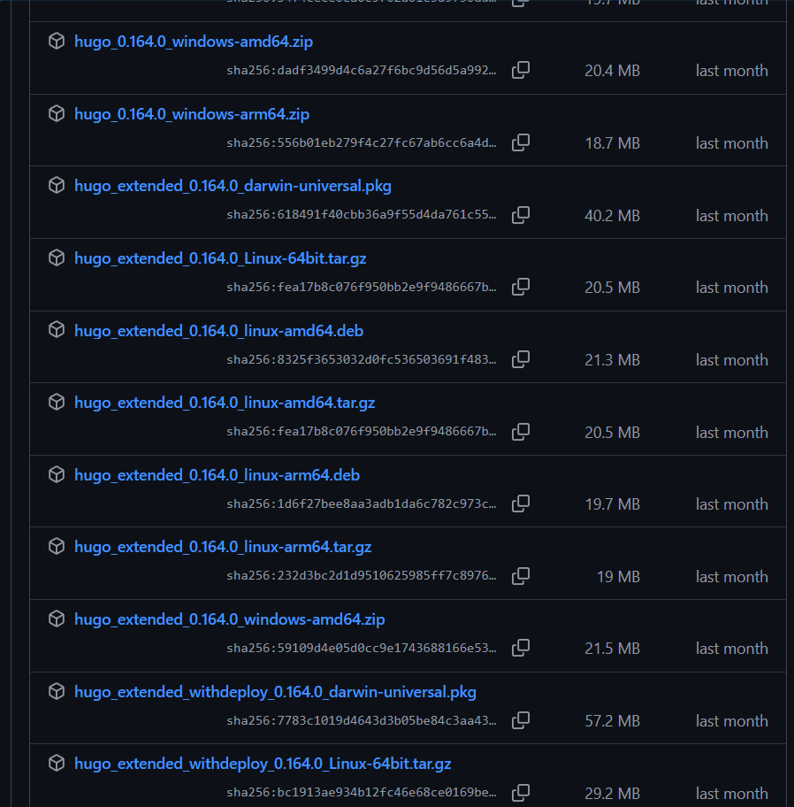
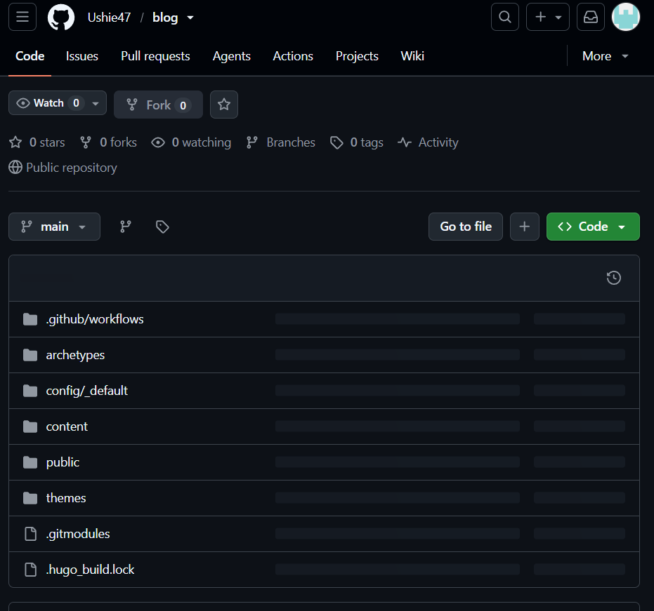
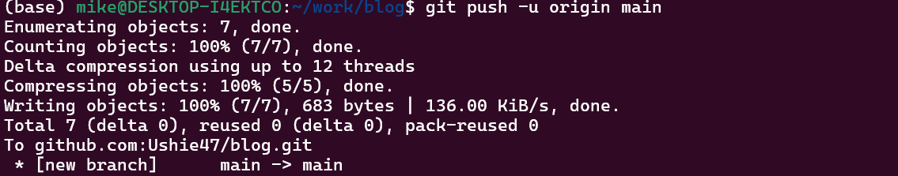
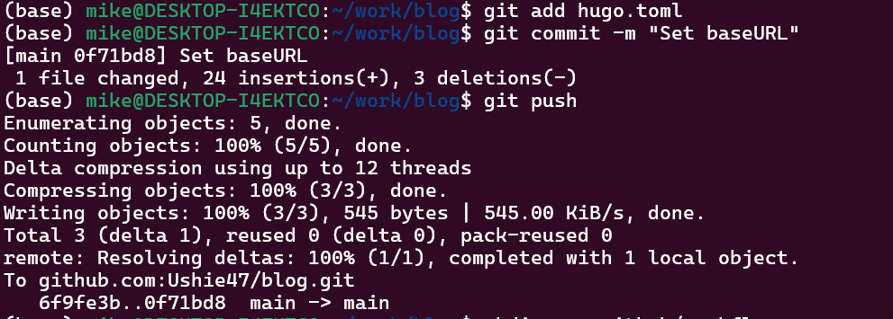
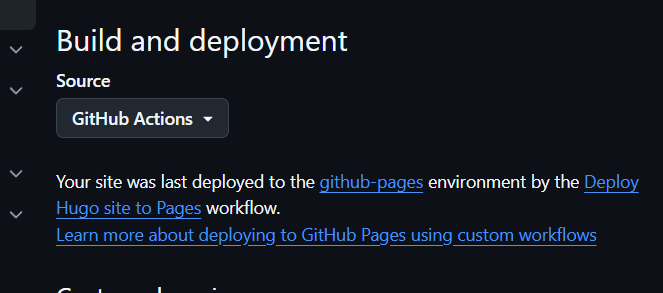
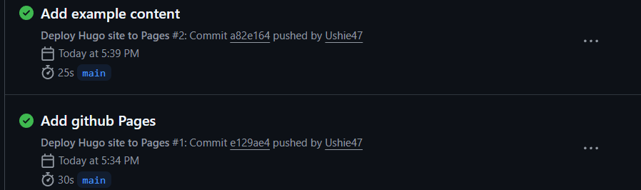

---
author:
  name: Давид Майкл Фрэнсис
  affiliation:
    - name: Российский университет дружбы народов
      country: Российская Федерация
      postal-code: 117198
      city: Москва
      address: ул. Миклухо-Маклая, д. 6
title: Индивидуальный проект №1
subtitle: Этап 1. Развёртывание личного сайта на GitHub Pages
license: CC BY
date: today
date-format: "YYYY-MM-DD"
---

# Информация

## Докладчик

* Давид Майкл Фрэнсис
* Студент направления «Математика и компьютерные науки»
* Российский университет дружбы народов
* <https://ushie47.github.io/blog>

# Вводная часть

## Цель работы

Целью работы является развёртывание личного сайта с помощью генератора статических сайтов Hugo и размещение его на GitHub Pages.

## Задание

1. Установить необходимое программное обеспечение.
2. Скачать шаблон темы оформления сайта.
3. Разместить сайт на хостинге git.
4. Задать параметр для URL сайта.
5. Разместить шаблон сайта на GitHub Pages.

# Выполнение проекта

## Страница релизов Hugo

Я перехожу на страницу релизов Hugo на GitHub, чтобы скачать расширенную версию (extended).

## Проверка загруженного файла

Я проверяю, что установочный файл был успешно загружен в систему.

## Проверка версии Hugo

После установки я проверяю версию Hugo, чтобы убедиться, что используется расширенная сборка.

## Создание проекта и инициализация Git

Я создаю новый проект Hugo и инициализирую в его папке Git-репозиторий.

## Подключение темы оформления

Я подключаю тему оформления hugo-coder как Git-подмодуль проекта.

## Репозиторий на GitHub

Репозиторий проекта успешно создан и отображается на GitHub.

## Отправка проекта на GitHub

Я связываю локальный репозиторий с удалённым и отправляю в него проект.

## Настройка параметра baseURL

Я настраиваю параметр `baseURL` в конфигурационном файле и отправляю изменения на GitHub.

## Настройки GitHub Pages

Я включаю развёртывание сайта через GitHub Actions в настройках репозитория.

## Файл рабочего процесса

Я создаю файл рабочего процесса, который автоматически собирает и публикует сайт при каждом push.

## Успешное выполнение workflow

Рабочий процесс GitHub Actions успешно завершается, и сайт разворачивается.

## Опубликованный сайт

Сайт успешно опубликован и доступен по адресу <https://ushie47.github.io/blog/>.

# Результаты

## Выводы

:::{.nonincremental}

- Установлен Hugo
- Создан проект и подключена тема оформления как Git-подмодуль
- Проект размещён в репозитории на GitHub
- Настроено автоматическое развёртывание сайта на GitHub Pages с помощью GitHub Actions

:::
