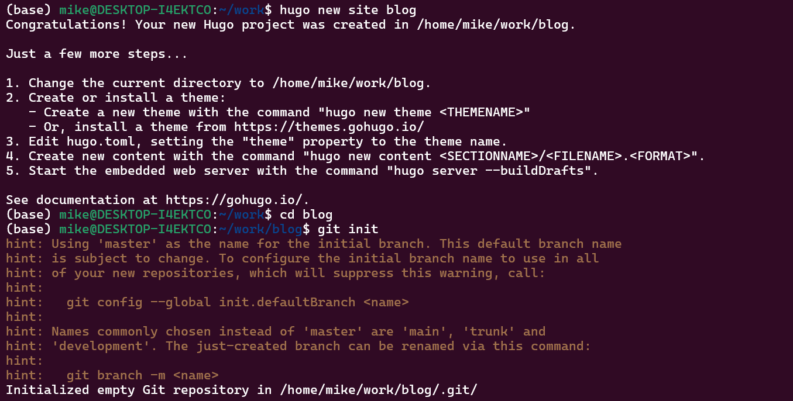
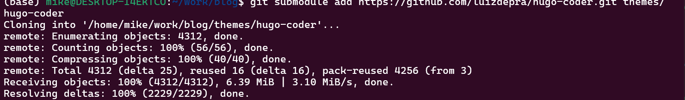
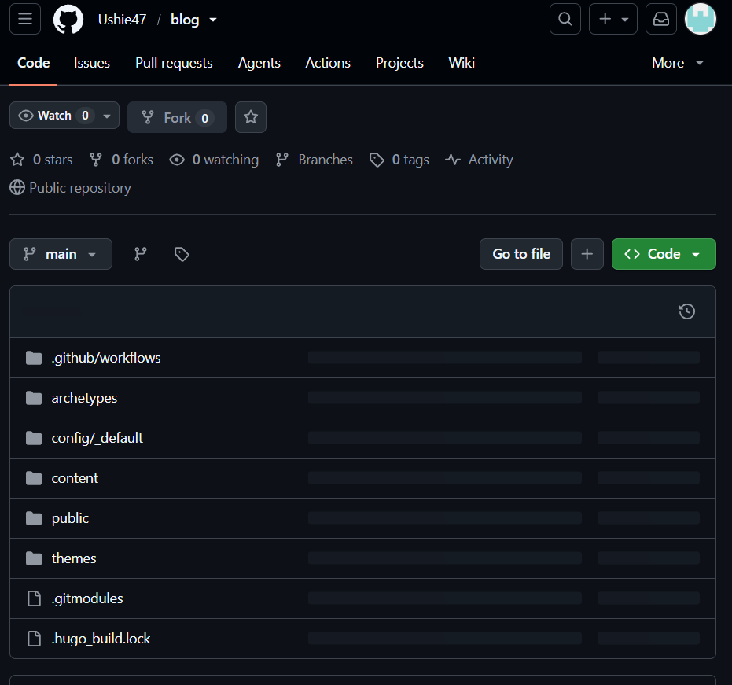
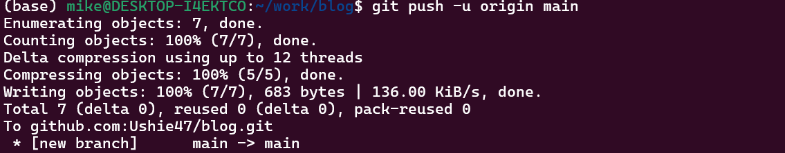
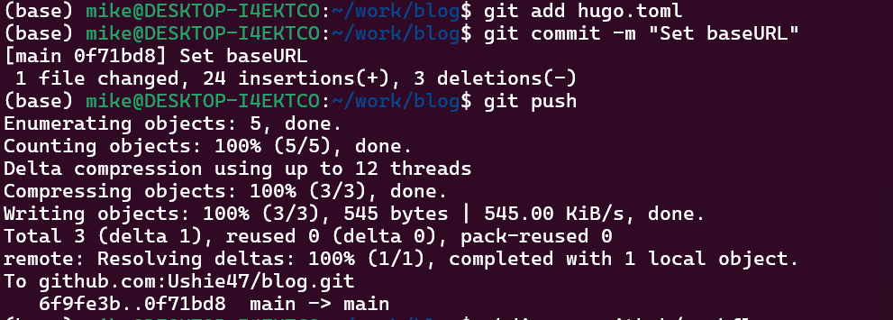
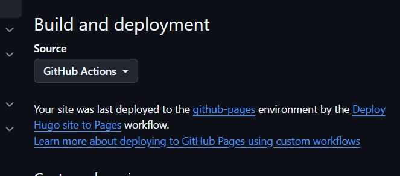
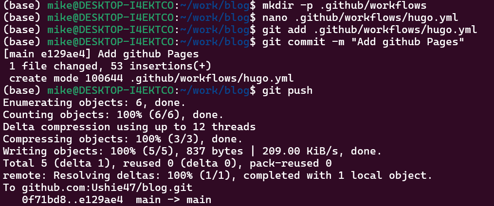
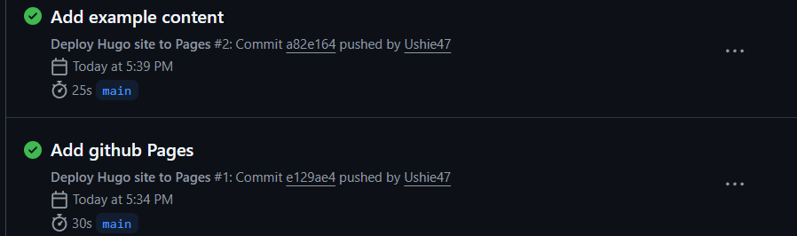

# Stages of Project Implementation

**Individual Project №1**

| | |
|---|---|
| **Name** | David Michael Francis |
| **Discipline** | Operating Systems |
| **University** | RUDN University, Moscow, Russia |
| **Language** | English |

## Purpose of the work

Learn how to host a site on a GitHub page and complete the first stage of a personal individual project.

## Task

1. Install the necessary software
2. Download Website Theme Template
3. Host it on git hosting
4. Set the parameter for site URLs
5. Place the site template on GitHub pages

---

## 1. Install the necessary software

The first step was installing Hugo, the static site generator used to build the website. I downloaded the extended edition (which supports Sass/SCSS) from the official Hugo releases page on GitHub.


The file was downloaded to my Downloads folder inside WSL Ubuntu.


I installed it using `apt`:

```bash
sudo apt install ./hugo_extended_0.164.0_linux-amd64.deb
```

Once installed, I confirmed the version and that the extended build was active:

```bash
hugo version
```


I also confirmed Git was installed and configured my identity for commits:

```bash
git --version
git config --global user.name "Your Name"
git config --global user.email "your-email@example.com"
```

---

## 2. Download Website Theme Template

Next, I created a new Hugo project and initialised it as a Git repository.

```bash
hugo new site blog
cd blog
git init
```



I then chose a theme from the Hugo themes directory and added it as a Git submodule of the project:

```bash
git submodule add https://github.com/luizdepra/hugo-coder.git themes/hugo-coder
```



Adding the theme as a submodule keeps it version-controlled separately from the main project, which is the standard way Hugo themes are managed.

---

## 3. Host it on git hosting

Before pushing the project online, I created a personal access setup for authentication and previewed the site locally to confirm it built correctly:

```bash
hugo server
```

Once confirmed locally, I created a new empty repository on GitHub to host the project.



I linked my local project to the new GitHub repository and pushed the code:

```bash
git add .
git commit -m "Initial Hugo site"
git remote add origin git@github.com:Ushie47/blog.git
git branch -M main
git push -u origin main
```



---

## 4. Set the parameter for site URLs

For the site to render correctly once deployed, the `baseURL` parameter in the Hugo configuration file needed to match the exact URL where GitHub Pages would serve the site.

```bash
nano hugo.toml
```

```toml
baseURL = "https://ushie47.github.io/blog/"
```

I committed and pushed this change:

```bash
git add hugo.toml
git commit -m "Set baseURL and site config"
git push
```



---

## 5. Place the site template on GitHub pages

To deploy the site automatically, I enabled GitHub Pages with the "GitHub Actions" build source, under repository **Settings → Pages**.



I then created a deployment workflow file to build and publish the site on every push to the main branch:

```bash
mkdir -p .github/workflows
nano .github/workflows/hugo.yml
```

```bash
git add .github/workflows/hugo.yml
git commit -m "Add GitHub Pages deploy workflow"
git push
```



I monitored the deployment under the repository's **Actions** tab.



Once the workflow completed, the site went live.


## Conclusion

Through this stage, I learned how to install Hugo, structure a static site project, manage a theme as a Git submodule, configure a project for deployment, and automatically publish a website using GitHub Actions and GitHub Pages. This provided a working foundation for the personal website that will be expanded in later stages of the project.
