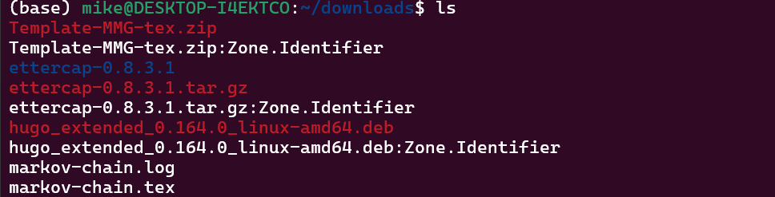
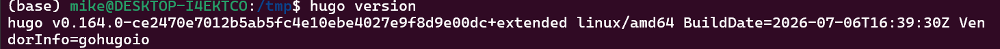
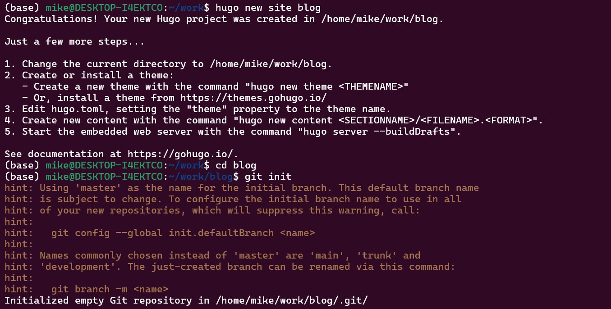
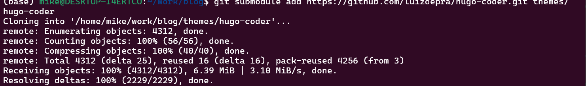
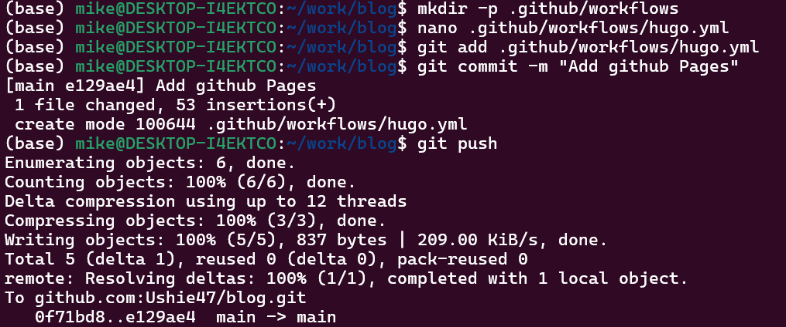
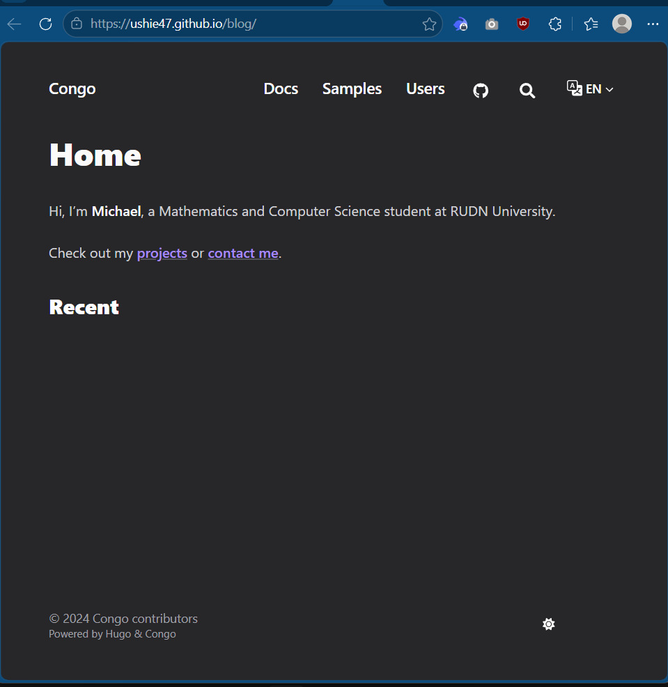

---
## Author
author:
  name: Давид Майкл Фрэнсис
  affiliation:
    - name: Российский университет дружбы народов
      country: Российская Федерация
      postal-code: 117198
      city: Москва
      address: ул. Миклухо-Маклая, д. 6

## Title
title: "Индивидуальный проект №1"
subtitle: "Этап 1. Развёртывание личного сайта на GitHub Pages"
license: "CC BY"
abstract: |
  В данном отчёте представлены результаты выполнения первого этапа индивидуального проекта по размещению личного сайта на GitHub Pages.

  Описаны установка генератора статических сайтов Hugo, подключение темы оформления как Git-подмодуля, размещение проекта в репозитории на GitHub, настройка параметра `baseURL` и автоматическое развёртывание сайта с помощью GitHub Actions.

  Сделаны выводы о достижении поставленной цели.
keywords: [hugo, github pages, github actions, git submodule, статический сайт]
---

# Введение

## Актуальность

Генераторы статических сайтов в сочетании с автоматизированным развёртыванием через CI/CD-конвейеры представляют собой широко распространённый современный подход к созданию и размещению личных сайтов и портфолио. Такой подход сочетает версионирование содержимого сайта средствами Git, быструю сборку статических страниц без необходимости в сервере баз данных и бесплатный хостинг через GitHub Pages, что делает его практичным инструментом для демонстрации учебных и личных проектов.

## Цель работы

Научиться размещать сайт на платформе GitHub Pages и выполнить первый этап личного индивидуального проекта.

## Задачи

- установить генератор статических сайтов Hugo;
- скачать и подключить шаблон темы оформления сайта;
- разместить проект в репозитории на GitHub;
- задать параметр `baseURL` для корректной работы сайта;
- настроить автоматическое развёртывание сайта на GitHub Pages.

## Объект и предмет исследования

Объектом исследования является процесс создания и развёртывания статического сайта с помощью Hugo. Предметом исследования выступают конкретные шаги установки Hugo, подключения темы оформления как Git-подмодуля, настройки параметра `baseURL` и автоматизации публикации сайта средствами GitHub Actions.

## Методы исследования

Работа выполнялась практическим методом — путём установки и настройки программного обеспечения в среде WSL Ubuntu с использованием утилит командной строки (`hugo`, `git`, `gh`) и веб-интерфейса GitHub.

## Схема выполнения работы

На рис. -@fig-flowchart представлена общая последовательность действий при выполнении работы.

::: {#fig-flowchart}

```{mermaid}
%%| fig-width: 100%
graph TD
    A@{ shape: circle, label: "Начало" } --> B[Выполнить действие]
    B --> C[Описать, что конкретно сделано]
    C --> D[Подтвердить скриншотом]
    D --> E[Занести в отчёт]
    E --> F[Поместить в git-репозиторий]
    F --> G[Сделать релиз git]
    G --> J@{ shape: dbl-circ, label: "Конец" }
```

Блок-схема выполнения лабораторной работы

:::

# Теоретическая часть

**Hugo** — генератор статических сайтов, который преобразует содержимое, написанное в формате Markdown, в готовые HTML-страницы без необходимости в сервере баз данных или интерпретаторе на стороне сервера [@hugo_web_docs_en]. Благодаря этому сайты, построенные на Hugo, отличаются высокой скоростью загрузки и могут размещаться на простом статическом хостинге, таком как GitHub Pages.

Оформление сайта в Hugo задаётся **темой** — отдельным набором шаблонов и стилей. Чтобы тема при этом оставалась отдельно версионируемой от содержимого самого сайта, её принято подключать как **Git-подмодуль** — вложенный репозиторий, привязанный к конкретному коммиту темы внутри основного репозитория проекта [@chacon_book_pro-git_en]. Такой подход позволяет обновлять тему независимо от содержимого сайта, не теряя историю изменений ни одного из репозиториев.

**GitHub Actions** — платформа непрерывной интеграции и развёртывания (CI/CD), позволяющая автоматически выполнять заданные действия (сборку, тестирование, публикацию) при наступлении определённых событий в репозитории, например при каждом push в основную ветку [@github_web_actions-docs_en]. В сочетании с **GitHub Pages** — бесплатным хостингом статических сайтов непосредственно из репозитория GitHub — это позволяет настроить полностью автоматический процесс публикации: при каждом обновлении содержимого сайт пересобирается и публикуется без каких-либо ручных действий.

# Материалы и методы

Для выполнения работы использовались:

- операционная система WSL Ubuntu;
- генератор статических сайтов **Hugo** (расширенная версия, extended);
- система контроля версий **Git**;
- платформа **GitHub** и сервис **GitHub Pages**;
- платформа непрерывного развёртывания **GitHub Actions**.

# Выполнение лабораторной работы

## Установка необходимого программного обеспечения

Первым шагом был установлен генератор статических сайтов Hugo. Была скачана расширенная версия (с поддержкой Sass/SCSS) с официальной страницы релизов Hugo на GitHub (рис. -@fig-001).

{#fig-001 width=70%}

Файл был загружен в папку Downloads внутри WSL Ubuntu (рис. -@fig-002).

{#fig-002 width=70%}

Hugo был установлен с помощью `apt`:

```bash
sudo apt install ./hugo_extended_0.164.0_linux-amd64.deb
```

После установки была проверена версия и активность расширенной сборки (рис. -@fig-003):

```bash
hugo version
```

{#fig-003 width=70%}

Также было проверено наличие Git и настроены пользовательские данные для коммитов:

```bash
git --version
git config --global user.name "Your Name"
git config --global user.email "your-email@example.com"
```

## Загрузка шаблона темы оформления

Далее был создан новый проект Hugo, инициализированный как Git-репозиторий:

```bash
hugo new site blog
cd blog
git init
```

{#fig-004 width=70%}

Из каталога тем Hugo была выбрана тема оформления и подключена к проекту в качестве Git-подмодуля:

```bash
git submodule add https://github.com/luizdepra/hugo-coder.git themes/hugo-coder
```

{#fig-005 width=70%}

Подключение темы как подмодуля позволяет версионировать её отдельно от основного проекта, что является стандартным способом управления темами в Hugo.

## Размещение на git-хостинге

Перед публикацией проекта в сети был выполнен локальный предпросмотр сайта для проверки корректности сборки:

```bash
hugo server
```

После проверки на GitHub был создан новый пустой репозиторий для размещения проекта (рис. -@fig-006).

{#fig-006 width=70%}

Локальный проект был связан с созданным репозиторием на GitHub, после чего код был отправлен в него:

```bash
git add .
git commit -m "Initial Hugo site"
git remote add origin git@github.com:Ushie47/blog.git
git branch -M main
git push -u origin main
```

{#fig-007 width=70%}

## Настройка параметра для URL сайта

Чтобы сайт корректно отображался после развёртывания, параметр `baseURL` в конфигурационном файле Hugo должен был точно соответствовать адресу, по которому GitHub Pages будет обслуживать сайт:

```bash
nano hugo.toml
```

```toml
baseURL = "https://ushie47.github.io/blog/"
```

Изменение было зафиксировано и отправлено в репозиторий (рис. -@fig-008):

```bash
git add hugo.toml
git commit -m "Set baseURL and site config"
git push
```

{#fig-008 width=70%}

## Размещение шаблона сайта на GitHub Pages

Для автоматического развёртывания сайта в настройках репозитория **Settings → Pages** был выбран источник сборки **GitHub Actions** (рис. -@fig-009).

{#fig-009 width=70%}

Далее был создан файл рабочего процесса, который автоматически собирает и публикует сайт при каждом push в основную ветку:

```bash
mkdir -p .github/workflows
nano .github/workflows/hugo.yml
```

```bash
git add .github/workflows/hugo.yml
git commit -m "Add GitHub Pages deploy workflow"
git push
```

{#fig-010 width=70%}

Развёртывание отслеживалось во вкладке **Actions** репозитория (рис. -@fig-011).

{#fig-011 width=70%}

После завершения рабочего процесса сайт стал доступен по его адресу (рис. -@fig-012).

{#fig-012 width=70%}

# Результаты

В результате выполнения работы:

- установлен генератор статических сайтов Hugo (расширенная версия);
- создан проект Hugo с темой оформления, подключённой как Git-подмодуль;
- проект размещён в репозитории на GitHub;
- настроен параметр `baseURL`, соответствующий адресу развёртывания сайта;
- настроено автоматическое развёртывание сайта на GitHub Pages с помощью GitHub Actions.

# Обсуждение результатов

Подключение темы оформления как Git-подмодуля, а не прямое копирование её файлов в проект, позволяет при необходимости обновлять тему до новой версии отдельной командой, не затрагивая историю изменений собственного содержимого сайта. Аналогично, автоматизация публикации через GitHub Actions избавляет от необходимости вручную собирать сайт локально и загружать результат на хостинг при каждом изменении — после первоначальной настройки рабочего процесса публикация сайта сводится к обычному `git push`, что соответствует общепринятой практике непрерывного развёртывания (continuous deployment).

# Заключение

В ходе выполнения первого этапа проекта были изучены установка Hugo, структурирование проекта статического сайта, управление темой оформления как Git-подмодулем, настройка проекта для развёртывания и автоматическая публикация сайта с помощью GitHub Actions и GitHub Pages. Это заложило рабочую основу личного сайта, которая будет расширена на последующих этапах проекта.

Поставленная цель работы достигнута.

# Список литературы {.unnumbered}

::: {#refs}
:::
