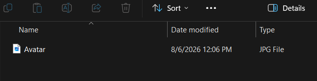
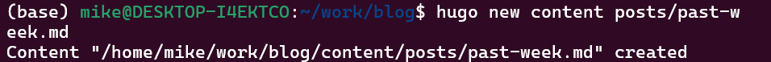
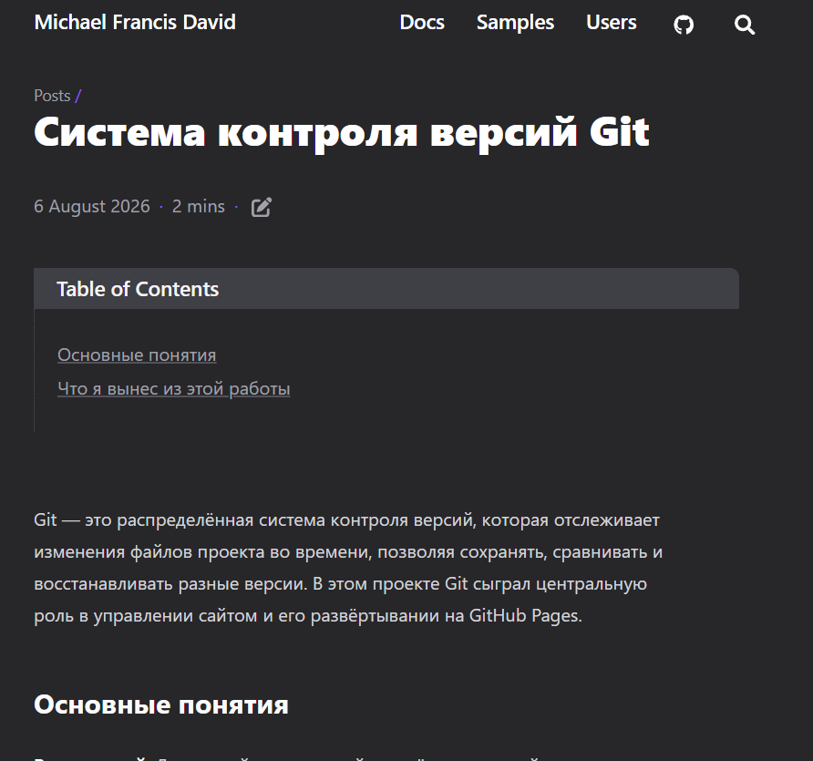

# Информация

## Докладчик

* Давид Майкл Фрэнсис
* Студент направления «Математика и компьютерные науки»
* Российский университет дружбы народов
* <https://ushie47.github.io/blog>

# Вводная часть

## Цель работы

Целью работы является наполнение личного сайта реальным содержимым: информацией о владельце сайта и записями блога.

## Задание

1. Добавить данные о себе на сайт (фото, биография, интересы, образование).
2. Сделать запись за прошедшую неделю.
3. Добавить запись на выбранную тему (Git).

# Выполнение проекта

## Включение профильного макета

Я открываю файл параметров темы, чтобы включить профильный макет главной страницы.

## Добавление фотографии профиля

Я добавляю фотографию профиля в папку assets проекта.

## Настройка данных автора

Я заполняю данные автора — имя, заголовок и биографию — в файле языковой конфигурации.

## Локальный предпросмотр профиля

После пересборки на локальном сервере отображается карточка профиля с фотографией и биографией.

## Создание записи блога

Я создаю новую запись блога для итогов прошедшей недели.

## Опубликованная запись «Итоги недели»

Запись с итогами первой недели успешно опубликована на сайте.

## Опубликованная запись «Git»

Запись на тему системы контроля версий Git также опубликована на сайте.

## Итоговый вид главной страницы

Главная страница сайта теперь отображает карточку профиля и последние записи блога.

# Результаты

## Выводы

- Наполнен личный сайт реальным содержимым (фотография профиля, биография через профильный макет темы Congo).
- Добавлены две записи блога — с итогами прошедшей недели и на тему системы контроля версий Git.
