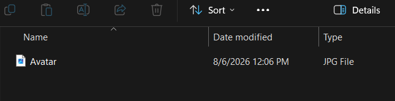
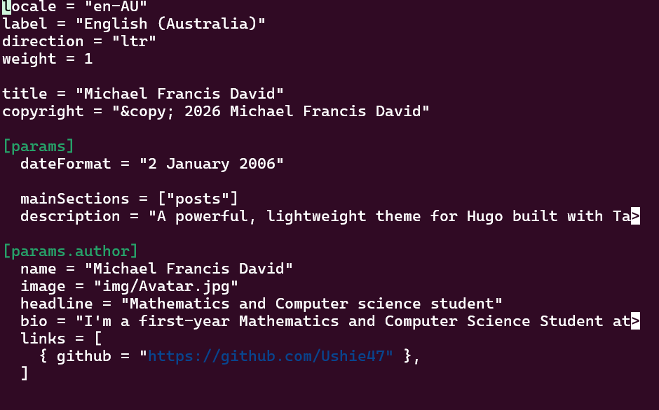
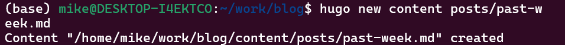
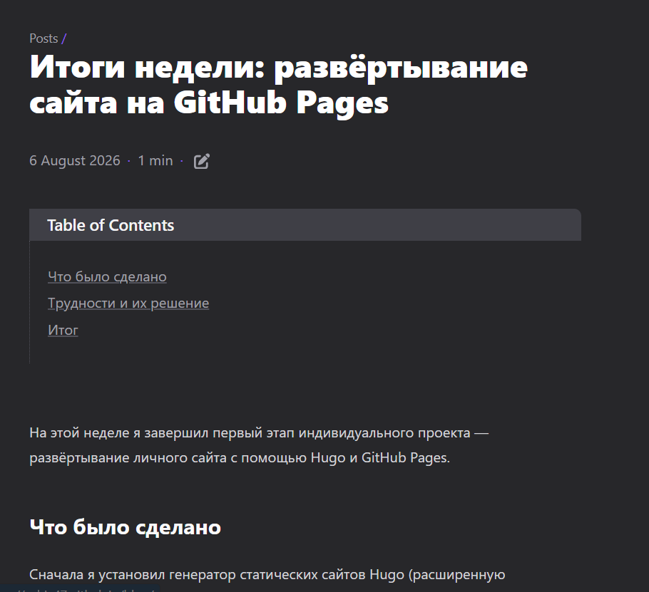
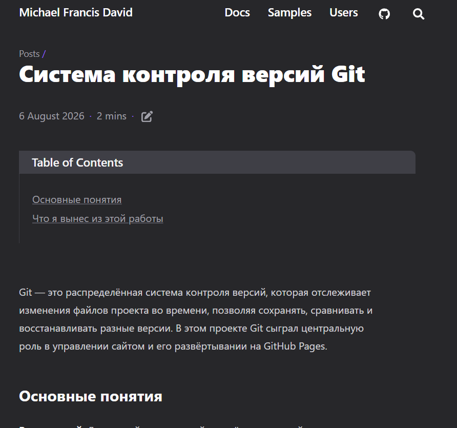

# Этапы реализации проекта

**Индивидуальный проект №1 — Этап 2**

| | |
|---|---|
| **Имя** | David Michael Francis |
| **Дисциплина** | Операционные системы |
| **Университет** | РУДН, Москва, Россия |
| **Язык** | Русский |

## Цель работы

Наполнить личный сайт, созданный на первом этапе, реальным содержимым: 
информацией о владельце сайта и записями блога, демонстрирующими работу 
механизма публикации сайта.

## Задание

1. Добавить данные о себе на сайт
   - Разместить фотографию владельца сайта
   - Разместить краткое описание владельца сайта (биография)
   - Добавить информацию об интересах
   - Добавить информацию об образовании
2. Сделать запись за прошедшую неделю
3. Добавить запись на выбранную тему (система контроля версий — Git)

---

## 1. Добавление данных о себе на сайт

Тема оформления была изменена с `hugo-coder` на **Congo**, которая 
предлагает специальный «профильный» макет главной страницы, 
предназначенный для отображения личной информации, фотографии и 
биографии.

### Включение профильного макета

Макет главной страницы был изменён со стандартного `custom` на 
`profile` в файле параметров темы.

```bash
nano config/_default/params.toml
```

```toml
[homepage]
  layout = "profile"
```


### Добавление фотографии

Фотография профиля была помещена в папку assets сайта, чтобы тема могла 
на неё ссылаться.

```bash
mkdir -p assets/img
cp /path/to/photo.jpg assets/img/Avatar.jpg
```



### Добавление биографии, интересов и образования

Имя автора, заголовок, биография и ссылки настраиваются централизованно 
в файле языковой конфигурации, а не в файле содержимого. Именно эти 
данные отображаются на главной странице профильным макетом Congo.

```bash
nano config/_default/languages.en.toml
```

```toml
[params.author]
  name = "Michael Francis David"
  image = "img/Avatar.jpg"
  headline = "Mathematics and Computer Science student"
  bio = "I'm a first-year Mathematics and Computer Science student at RUDN University, focusing on cybersecurity. My interests include operating systems, networking, and security research."
  links = [
    { github = "https://github.com/Ushie47" },
  ]
```



В процессе редактирования этого файла возникла ошибка сборки:

```
ERROR failed to load config: failed to unmarshal config for path
".../languages.en.toml": unmarshal failed: toml: basic strings cannot have new lines
```

Причиной оказалась пропущенная закрывающая кавычка в строке `bio` — 
обычная строка TOML должна оставаться на одной строке, если только не 
используется тройная кавычка. Точная строка была найдена с помощью 
`sed -n`, после чего недостающая кавычка `"` была добавлена, и ошибка 
была устранена.

### Локальная проверка

```bash
hugo server
```


---

## 2. Запись за прошедшую неделю

В разделе `posts` был создан новый файл содержимого, посвящённый итогам 
работы, выполненной на первом этапе.

```bash
hugo new content posts/past-week.md
```



Заголовок и текст записи описывают шаги установки, настройки темы, 
размещения на хостинге и развёртывания, выполненные на предыдущей 
неделе, написанные на русском языке в соответствии с языком обучения.

```toml
---
title: "Итоги недели: развёртывание сайта на GitHub Pages"
date: 2026-08-06
draft: false
---
```



---

## 3. Запись на выбранную тему — система контроля версий (Git)

Была создана вторая запись, посвящённая Git — системе контроля версий, 
использовавшейся на протяжении всего проекта, так как эта тема оказалась 
наиболее близкой к практическому опыту среди двух предложенных вариантов 
(Git или CI/CD).

```bash
hugo new content posts/git-version-control.md
```

В записи рассматриваются основные понятия Git, применявшиеся на практике 
в ходе проекта: репозитории, коммиты, ветки, удалённые репозитории, 
подмодули и аутентификация по SSH, — а также разбираются реальные ошибки, 
возникавшие и устранявшиеся при работе с Git в WSL.



---

## Возникшие трудности

После публикации профиля и записей возникли две проблемы, которые были 
устранены следующим образом:

- **Главная страница всё ещё отображалась в стандартном макете** — 
  параметр `layout` в блоке `[homepage]` не был изменён на `"profile"`; 
  исправление значения и повторное развёртывание устранили проблему.
- **Записи не отображались в разделе «Recent» на главной странице** — 
  параметр `mainSections` в файле `languages.en.toml` всё ещё указывал 
  на раздел с примерами содержимого темы (`"samples"`), а не на реальную 
  папку записей сайта. Изменение значения на `mainSections = ["posts"]` 
  и повторное развёртывание решили проблему.


---

## Выводы

На этом этапе я наполнил личный сайт реальным содержимым: фотографией 
профиля, биографией и справочной информацией, отображаемыми с помощью 
профильного макета главной страницы темы Congo, а также двумя записями 
блога — одной с итогами работы за прошедшую неделю и одной, посвящённой 
системе контроля версий Git. Я также получил опыт диагностики ошибок 
конфигурации в файлах TOML и исправления параметров темы, определяющих, 
какое содержимое отображается и каким образом. Сайт теперь представляет 
собой не только личный профиль, но и полноценный, хотя и небольшой, 
работающий блог, опираясь на конвейер развёртывания, созданный на первом 
этапе.
