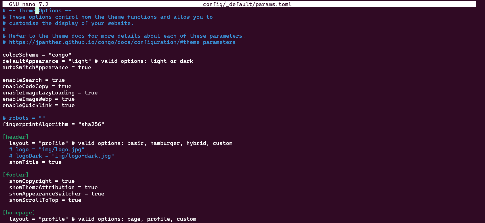
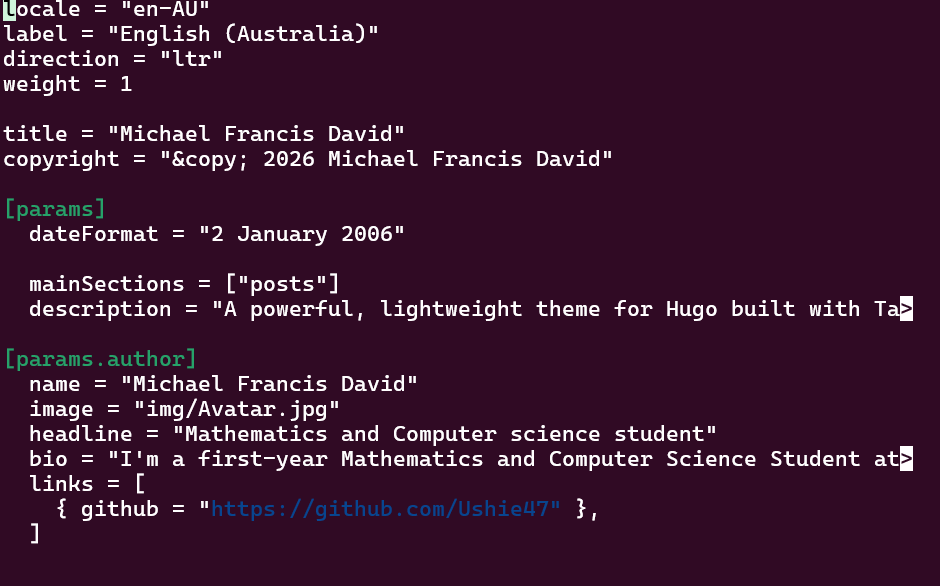
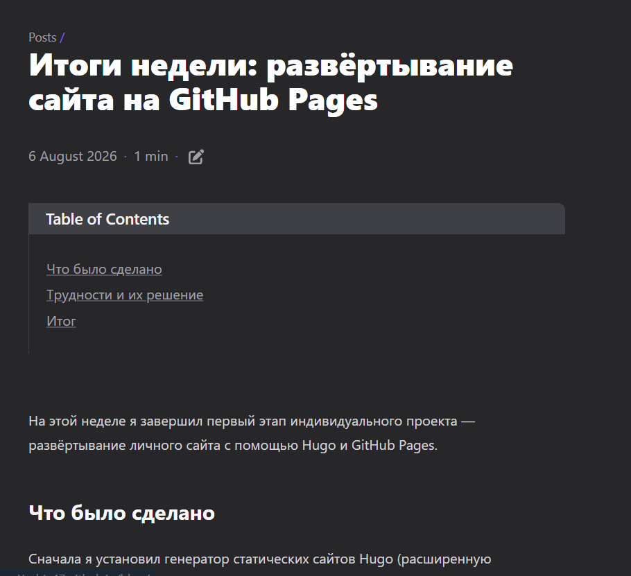

---
## Author
author:
  name: Давид Майкл Фрэнсис
  affiliation:
    - name: Российский университет дружбы народов
      country: Российская Федерация
      postal-code: 117198
      city: Москва
      address: ул. Миклухо-Маклая, д. 6

## Title
title: "Индивидуальный проект №1"
subtitle: "Этап 2. Наполнение сайта содержимым"
license: "CC BY"
abstract: |
  В данном отчёте представлены результаты выполнения второго этапа индивидуального проекта — наполнения личного сайта, созданного на первом этапе, реальным содержимым.

  Описаны переход на профильный макет главной страницы темы Congo, размещение фотографии, биографии и справочной информации о владельце сайта, а также публикация двух записей блога.

  Сделаны выводы о достижении поставленной цели.
keywords: [hugo, congo, toml, профиль, блог]
---

# Введение

## Актуальность

Личный сайт, содержащий только техническую инфраструктуру без реального содержимого, не выполняет своей основной функции — представления владельца сайта и демонстрации его работы. Наполнение сайта личной информацией и публикация содержимого через встроенные механизмы генератора статических сайтов — необходимый шаг, превращающий технический прототип в полноценный работающий ресурс.

## Цель работы

Наполнить личный сайт, созданный на первом этапе, реальным содержимым: информацией о владельце сайта и записями блога, демонстрирующими работу механизма публикации сайта.

## Задачи

- сменить тему оформления сайта на тему с профильным макетом главной страницы;
- разместить на сайте фотографию, биографию, информацию об интересах и образовании владельца сайта;
- сделать запись блога, посвящённую итогам прошедшей недели;
- добавить запись блога на выбранную тему (система контроля версий Git).

## Объект и предмет исследования

Объектом исследования является личный сайт, построенный на генераторе статических сайтов Hugo. Предметом исследования выступает процесс наполнения сайта личной информацией через профильный макет темы оформления Congo и публикации записей блога, а также диагностика связанных с этим ошибок конфигурации.

## Методы исследования

Работа выполнялась практическим методом — путём редактирования конфигурационных файлов Hugo в формате TOML и публикации содержимого сайта.

## Схема выполнения работы

На рис. -@fig-flowchart представлена общая последовательность действий при выполнении работы.

::: {#fig-flowchart}

```{mermaid}
%%| fig-width: 100%
graph TD
    A@{ shape: circle, label: "Начало" } --> B[Выполнить действие]
    B --> C[Описать, что конкретно сделано]
    C --> D[Подтвердить скриншотом]
    D --> E[Занести в отчёт]
    E --> F[Поместить в git-репозиторий]
    F --> G[Сделать релиз git]
    G --> J@{ shape: dbl-circ, label: "Конец" }
```

Блок-схема выполнения лабораторной работы

:::

# Теоретическая часть

Поведение и внешний вид темы оформления Hugo управляется её собственными параметрами, обычно задаваемыми в файле `params.toml` [@hugo_web_docs_en]. В частности, макет главной страницы (`[homepage] layout`) определяет, какой шаблон используется для её отображения — например, простой текстовый (`custom`) или профильный (`profile`), предназначенный для представления владельца сайта с фотографией и биографией.

Персональные данные автора — имя, заголовок, биография, ссылки — в Hugo принято задавать централизованно в языковом конфигурационном файле (`languages.<код_языка>.toml`), а не в отдельном файле содержимого. Такой подход позволяет теме единообразно подставлять эти данные в разные элементы сайта (профильную карточку, подпись автора у записей блога и так далее) из одного источника.

Конфигурационные файлы Hugo используют формат **TOML** [@toml_web_spec_en], в котором обычная («базовая») строка в кавычках `"..."` обязана оставаться на одной строке; перенос строки внутри такой строки без использования тройных кавычек `"""..."""` является синтаксической ошибкой и приводит к отказу в разборе всего файла конфигурации.

# Материалы и методы

Для выполнения работы использовались генератор статических сайтов **Hugo** с темой оформления **Congo**, текстовый редактор `nano`, команда `hugo server` для локального предпросмотра, а также система контроля версий **Git**.

# Выполнение лабораторной работы

## Добавление данных о себе на сайт

Тема оформления была изменена с `hugo-coder` на **Congo**, которая предлагает специальный «профильный» макет главной страницы, предназначенный для отображения личной информации, фотографии и биографии.

### Включение профильного макета

Макет главной страницы был изменён со стандартного `custom` на `profile` в файле параметров темы:

```bash
nano config/_default/params.toml
```

```toml
[homepage]
  layout = "profile"
```

{#fig-001 width=70%}

### Добавление фотографии

Фотография профиля была помещена в папку `assets` сайта, чтобы тема могла на неё ссылаться:

```bash
mkdir -p assets/img
cp /path/to/photo.jpg assets/img/Avatar.jpg
```

{#fig-002 width=70%}

### Добавление биографии, интересов и образования

Имя автора, заголовок, биография и ссылки настраиваются централизованно в файле языковой конфигурации, а не в файле содержимого. Именно эти данные отображаются на главной странице профильным макетом Congo:

```bash
nano config/_default/languages.en.toml
```

```toml
[params.author]
  name = "Michael Francis David"
  image = "img/Avatar.jpg"
  headline = "Mathematics and Computer Science student"
  bio = "I'm a first-year Mathematics and Computer Science student at RUDN University, focusing on cybersecurity. My interests include operating systems, networking, and security research."
  links = [
    { github = "https://github.com/Ushie47" },
  ]
```

{#fig-003 width=70%}

В процессе редактирования этого файла возникла ошибка сборки:

```
ERROR failed to load config: failed to unmarshal config for path
".../languages.en.toml": unmarshal failed: toml: basic strings cannot have new lines
```

Причиной оказалась пропущенная закрывающая кавычка в строке `bio` — обычная строка TOML должна оставаться на одной строке, если только не используется тройная кавычка. Точная строка была найдена с помощью `sed -n`, после чего недостающая кавычка `"` была добавлена, и ошибка была устранена.

### Локальная проверка

```bash
hugo server
```

{#fig-004 width=70%}

## Запись за прошедшую неделю

В разделе `posts` был создан новый файл содержимого, посвящённый итогам работы, выполненной на первом этапе:

```bash
hugo new content posts/past-week.md
```

{#fig-005 width=70%}

Заголовок и текст записи описывают шаги установки, настройки темы, размещения на хостинге и развёртывания, выполненные на предыдущей неделе, написанные на русском языке в соответствии с языком обучения:

```toml
---
title: "Итоги недели: развёртывание сайта на GitHub Pages"
date: 2026-08-06
draft: false
---
```

{#fig-006 width=70%}

## Запись на выбранную тему — система контроля версий (Git)

Была создана вторая запись, посвящённая Git — системе контроля версий, использовавшейся на протяжении всего проекта, так как эта тема оказалась наиболее близкой к практическому опыту среди двух предложенных вариантов (Git или CI/CD):

```bash
hugo new content posts/git-version-control.md
```

В записи рассматриваются основные понятия Git, применявшиеся на практике в ходе проекта: репозитории, коммиты, ветки, удалённые репозитории, подмодули и аутентификация по SSH, — а также разбираются реальные ошибки, возникавшие и устранявшиеся при работе с Git в WSL.

{#fig-007 width=70%}

## Возникшие трудности

После публикации профиля и записей возникли две проблемы, которые были устранены следующим образом:

- **Главная страница всё ещё отображалась в стандартном макете** — параметр `layout` в блоке `[homepage]` не был изменён на `"profile"`; исправление значения и повторное развёртывание устранили проблему.
- **Записи не отображались в разделе «Recent» на главной странице** — параметр `mainSections` в файле `languages.en.toml` всё ещё указывал на раздел с примерами содержимого темы (`"samples"`), а не на реальную папку записей сайта. Изменение значения на `mainSections = ["posts"]` и повторное развёртывание решили проблему.

{#fig-008 width=70%}

# Результаты

В результате выполнения работы:

- тема оформления сайта изменена на Congo с профильным макетом главной страницы;
- на сайте размещены фотография, биография и справочная информация о владельце сайта;
- опубликована запись блога с итогами прошедшей недели;
- опубликована запись блога на тему системы контроля версий Git;
- устранены ошибка синтаксиса TOML и две ошибки конфигурации, препятствовавшие корректному отображению сайта.

# Обсуждение результатов

Хранение данных автора централизованно в языковом конфигурационном файле, а не в отдельном файле содержимого, оказалось удобным решением: это единственное место, которое нужно отредактировать, чтобы обновить профильную информацию в любом месте сайта, где она используется. Вместе с тем именно эта централизация стала источником ошибки — единственная пропущенная кавычка в одном файле привела к полному отказу сборки сайта, что показывает важность аккуратного редактирования конфигурационных файлов в строгих форматах, таких как TOML. Обе проблемы с отображением (макет главной страницы и список записей в разделе «Recent») имели общую природу: параметры, оставшиеся от примера содержимого темы, не были явно переопределены — это распространённый источник ошибок при настройке готовых тем оформления.

# Заключение

На этом этапе я наполнил личный сайт реальным содержимым: фотографией профиля, биографией и справочной информацией, отображаемыми с помощью профильного макета главной страницы темы Congo, а также двумя записями блога — одной с итогами работы за прошедшую неделю и одной, посвящённой системе контроля версий Git. Я также получил опыт диагностики ошибок конфигурации в файлах TOML и исправления параметров темы, определяющих, какое содержимое отображается и каким образом. Сайт теперь представляет собой не только личный профиль, но и полноценный, хотя и небольшой, работающий блог, опираясь на конвейер развёртывания, созданный на первом этапе.

Поставленная цель работы достигнута.

# Список литературы {.unnumbered}

::: {#refs}
:::
