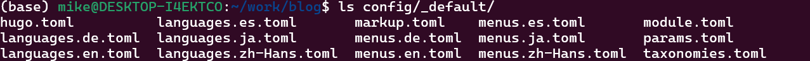
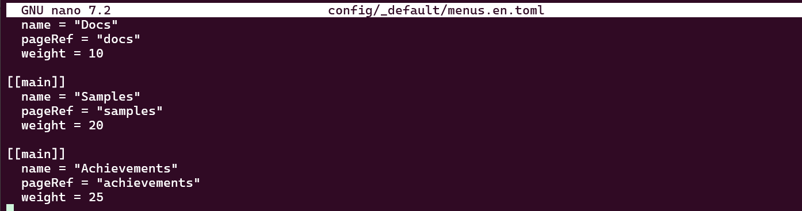
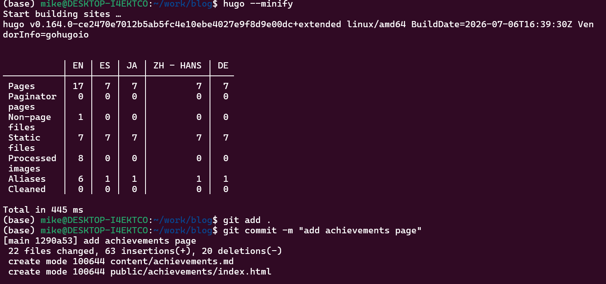
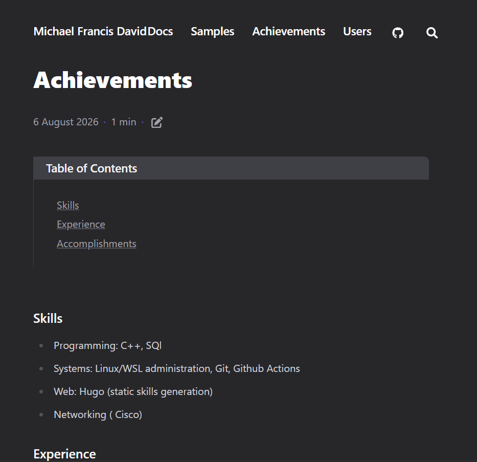
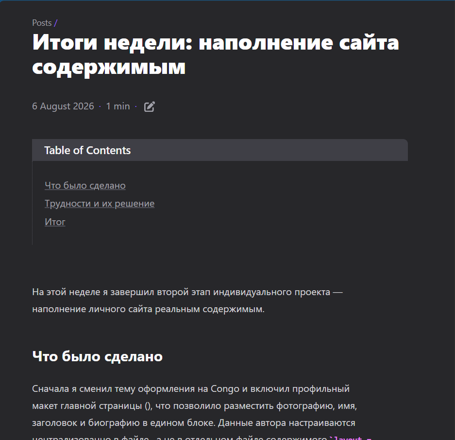

# Информация

## Докладчик

* Давид Майкл Фрэнсис
* Студент направления «Математика и компьютерные науки»
* Российский университет дружбы народов
* <https://ushie47.github.io/blog>

# Вводная часть

## Цель работы

Целью работы является добавление на сайт информации о достижениях владельца сайта и продолжение публикации записей блога.

## Задание

1. Добавить достижения на сайт (навыки, опыт, личные достижения).
2. Сделать запись за прошедшую неделю.
3. Добавить запись на выбранную тему (Языки разметки. LaTeX).

# Выполнение проекта

## Создание страницы достижений

Я создаю новую страницу содержимого для раздела «Достижения».

## Содержимое файла achievements.md

Страница заполняется тремя разделами: навыки, опыт и личные достижения.

## Проверка файлов конфигурации меню

Чтобы добавить пункт меню, я проверяю список файлов конфигурации и нахожу, что меню хранится в файле menus.en.toml.

## Добавление пункта меню

Я добавляю пункт «Achievements» в файл меню сайта.

## Сборка и публикация изменений

Я пересобираю сайт и публикую изменения в репозитории.

## Опубликованная страница «Achievements»

Страница «Достижения» опубликована и доступна на сайте.

## Опубликованная запись «Итоги недели»

Запись с итогами прошедшей недели также опубликована на сайте.

## Опубликованная запись «LaTeX»

Запись на тему языков разметки и LaTeX опубликована на сайте.

# Результаты

## Выводы

- Сайт был дополнен разделом «Достижения», содержащим информацию о навыках, опыте и личных достижениях.
- Добавлены две новые записи блога — с итогами прошедшей недели и на тему языков разметки и LaTeX.
