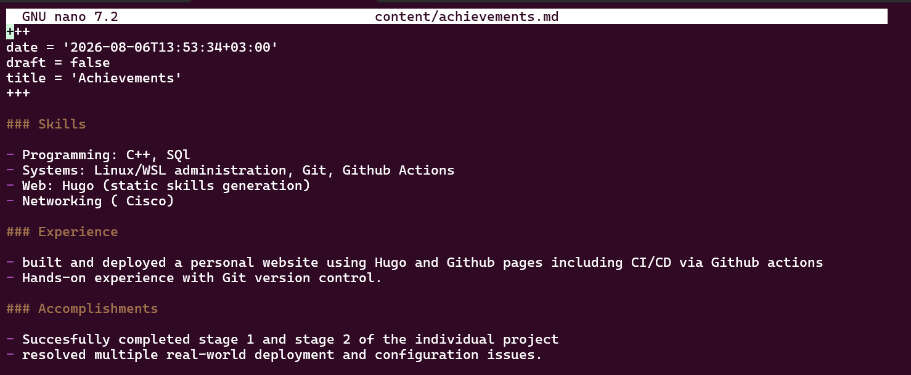
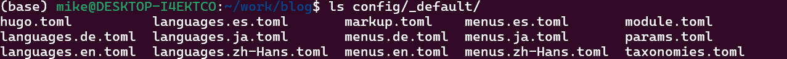
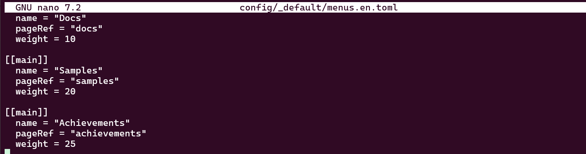
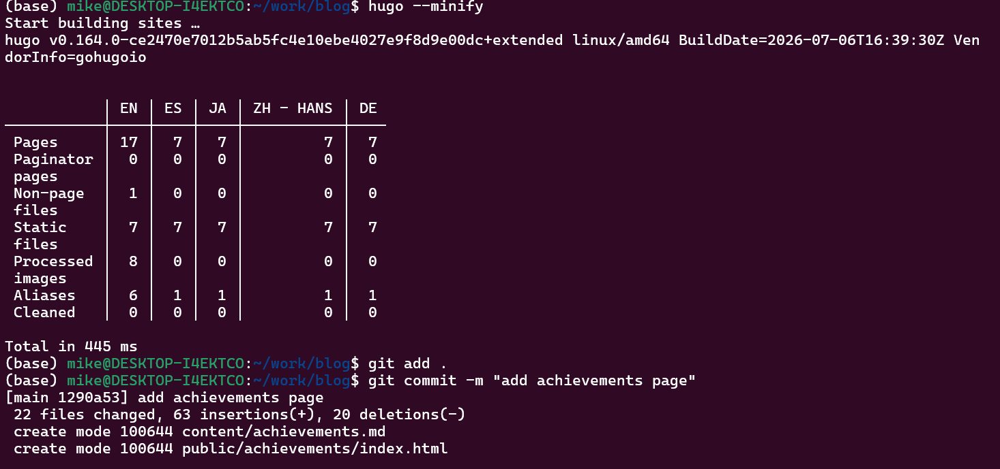
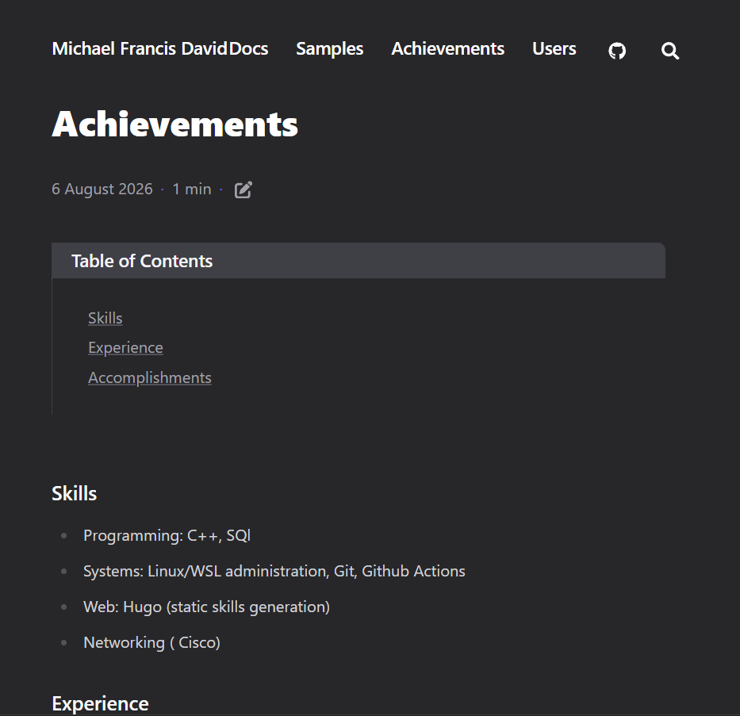
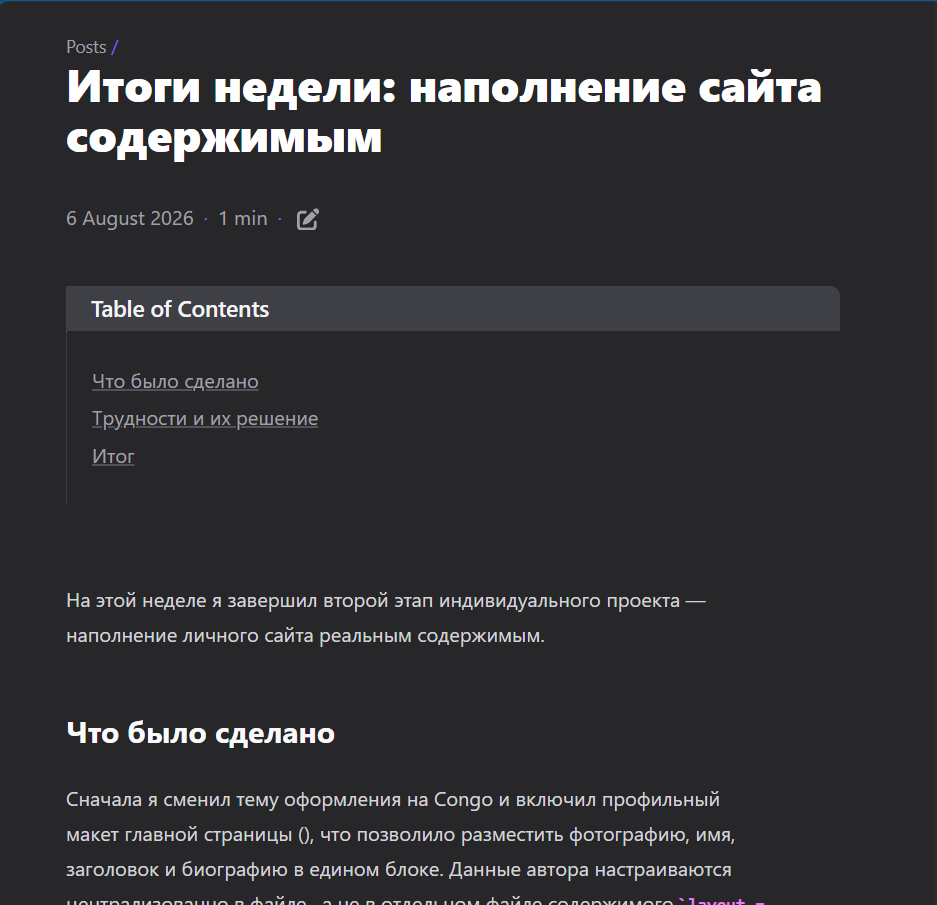
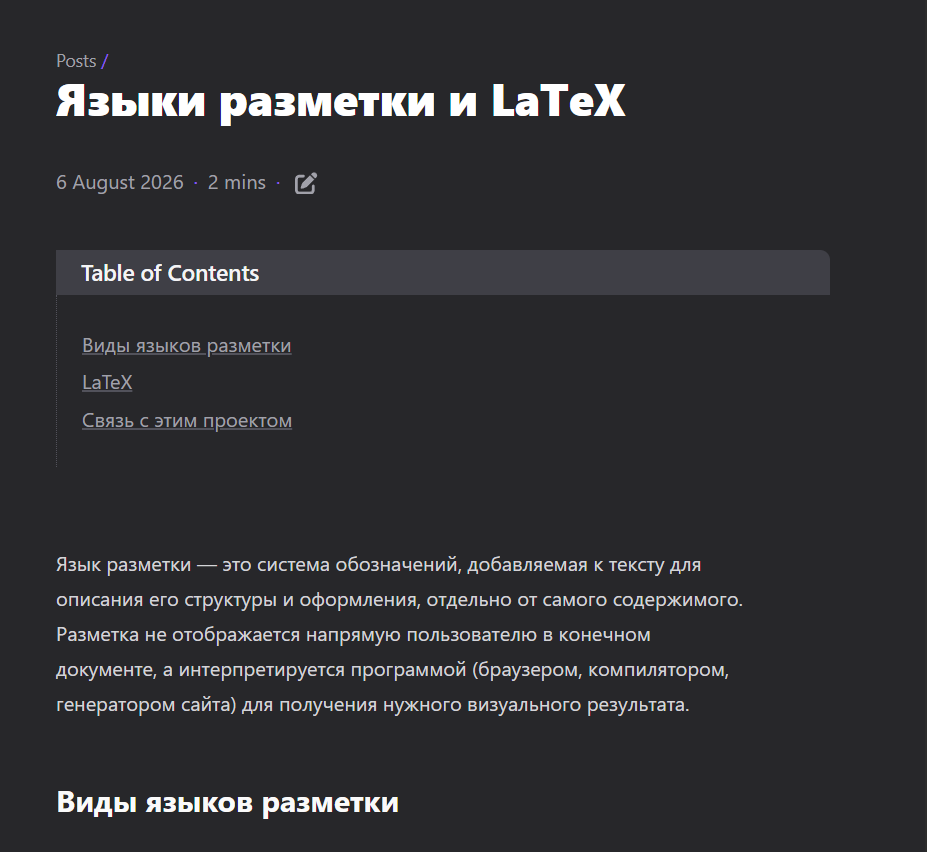

# Этапы реализации проекта

**Индивидуальный проект №1 — Этап 3**

| | |
|---|---|
| **Имя** | David Michael Francis |
| **Дисциплина** | Операционные системы |
| **Университет** | РУДН, Москва, Россия |
| **Язык** | Русский |

## Цель работы

Дополнить личный сайт информацией о достижениях владельца сайта и 
продолжить публикацию записей блога.

## Задание

1. Добавить достижения на сайт
   - Список достижений:
     - Добавить информацию о навыках
     - Добавить информацию об опыте
     - Добавить информацию о личных достижениях
2. Сделать запись за прошедшую неделю
3. Добавить запись на выбранную тему (Языки разметки. LaTeX)

---

## 1. Добавление достижений на сайт

Поскольку используемая тема оформления Congo не содержит отдельного 
встроенного раздела «достижения», для этой информации была создана 
новая страница содержимого.

```bash
hugo new content achievements.md
```


### Наполнение страницы

Страница была заполнена тремя разделами — навыки, опыт и достижения.

```bash
nano content/achievements.md
```

```markdown
---
title: "Achievements"
---

## Skills

- Programming: Python, C, Bash
- Systems: Linux/WSL administration, Git, GitHub Actions
- Web: Hugo (static site generation), basic HTML/CSS
- Currently studying: Operating Systems (RUDN University)

## Experience

- Built and deployed a personal website using Hugo and GitHub Pages,
  including CI/CD via GitHub Actions
- Hands-on experience with Git version control, including submodules,
  SSH authentication, and remote repository management

## Accomplishments

- Successfully completed Stage 1 and Stage 2 of the individual OS project
- Resolved multiple real-world deployment and configuration issues
```



### Добавление страницы в меню

Чтобы страница была доступна для перехода с любой страницы сайта, она 
была добавлена в главное меню.

При первой попытке команда `nano config/_default/menus.toml` открыла 
пустой файл — оказалось, что в теме Congo файлы меню разделены по 
языкам, и нужный файл называется `menus.en.toml`, а не `menus.toml`.

```bash
ls config/_default/
```



Правильный файл был открыт и дополнен новой записью меню:

```bash
nano config/_default/menus.en.toml
```

```toml
[[main]]
  name = "Achievements"
  pageRef = "achievements"
  weight = 25
```



### Публикация изменений

```bash
hugo --minify
git add .
git commit -m "Add achievements page to menu"
git push
```





---

## 2. Запись за прошедшую неделю

Была создана запись, посвящённая итогам работы, выполненной на втором 
этапе — настройке профиля, добавлению биографии и публикации первых 
двух записей блога.

```bash
hugo new content posts/week-2-summary.md
```



---

## 3. Запись на выбранную тему — языки разметки. LaTeX

Была создана запись на тему языков разметки с более подробным 
рассмотрением LaTeX — системы вёрстки, широко применяемой для научных 
и технических документов, в частности для оформления формул.

```bash
hugo new content posts/markup-languages-latex.md
```

В записи рассматриваются виды языков разметки (языки представления, 
легковесные языки разметки, языки описания форматирования), приводится 
пример простого документа на LaTeX и проводится связь с Markdown — 
языком разметки, используемым для содержимого самого сайта.



---

## Выводы

На этом этапе сайт был дополнен разделом «Достижения», содержащим 
информацию о навыках, опыте и личных достижениях, а также двумя новыми 
записями блога. В процессе работы была обнаружена и устранена проблема 
с расположением файла меню — вместо ожидаемого `menus.toml` в теме 
Congo используется файл, разделённый по языкам (`menus.en.toml`), что 
дало дополнительный практический опыт в понимании структуры 
конфигурационных файлов Hugo. Сайт продолжает развиваться как единый 
источник личной информации, портфолио и блога.
