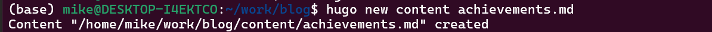
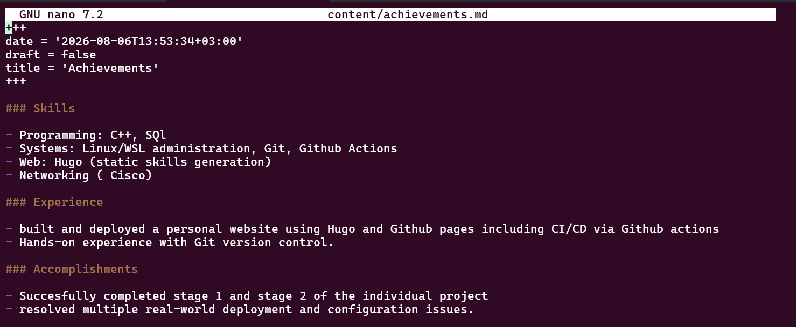
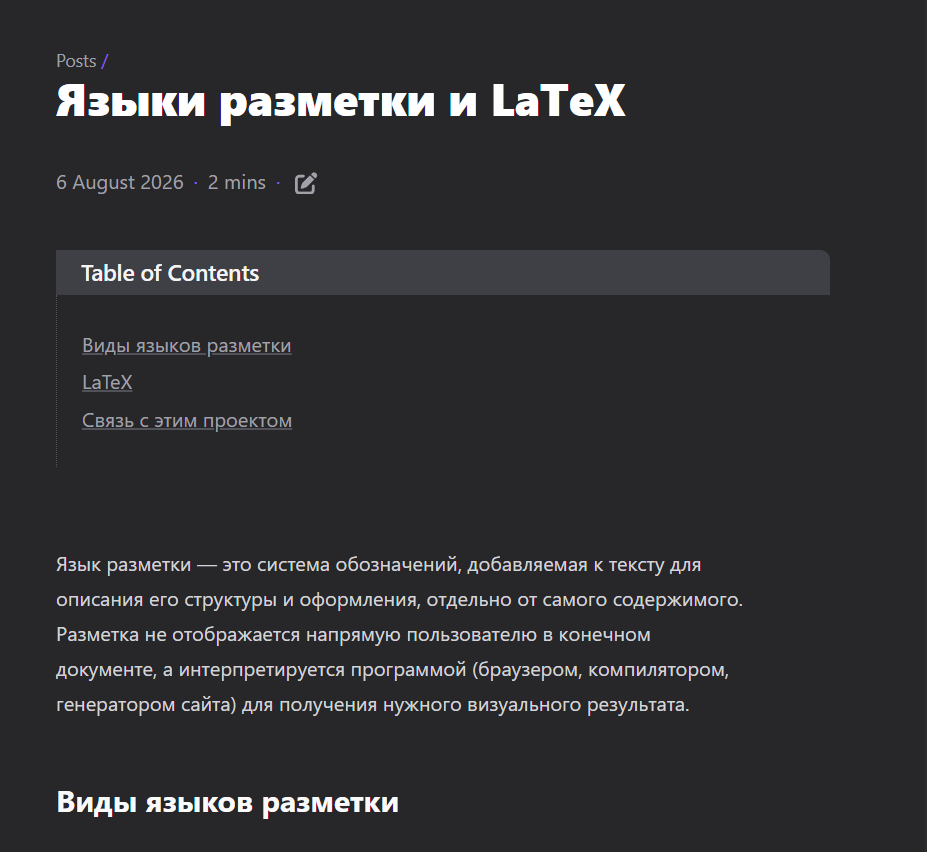

---
## Author
author:
  name: Давид Майкл Фрэнсис
  affiliation:
    - name: Российский университет дружбы народов
      country: Российская Федерация
      postal-code: 117198
      city: Москва
      address: ул. Миклухо-Маклая, д. 6

## Title
title: "Индивидуальный проект №1"
subtitle: "Этап 3. Раздел достижений и новые записи блога"
license: "CC BY"
abstract: |
  В данном отчёте представлены результаты выполнения третьего этапа индивидуального проекта — добавления на сайт раздела с достижениями владельца сайта и продолжения публикации записей блога.

  Описаны создание отдельной страницы содержимого вне стандартной структуры темы, настройка главного меню сайта и публикация двух новых записей блога, одна из которых посвящена языкам разметки и LaTeX.

  Сделаны выводы о достижении поставленной цели.
keywords: [hugo, congo, меню, latex, языки разметки]
---

# Введение

## Актуальность

По мере наполнения личного сайта реальным содержимым возникает необходимость выходить за пределы готовых разделов, предусмотренных темой оформления «из коробки». Умение создать и корректно подключить к навигации собственную страницу содержимого — распространённая практическая задача при работе с генераторами статических сайтов.

## Цель работы

Дополнить личный сайт информацией о достижениях владельца сайта и продолжить публикацию записей блога.

## Задачи

- создать на сайте раздел «Достижения» с информацией о навыках, опыте и личных достижениях;
- добавить созданную страницу в главное меню сайта;
- сделать запись блога, посвящённую итогам прошедшей недели;
- добавить запись блога на выбранную тему (языки разметки, LaTeX).

## Объект и предмет исследования

Объектом исследования является личный сайт, построенный на генераторе статических сайтов Hugo. Предметом исследования выступает процесс создания отдельной страницы содержимого вне стандартной структуры темы оформления, настройки главного меню сайта и публикации записей блога.

## Методы исследования

Работа выполнялась практическим методом — путём создания файлов содержимого и редактирования конфигурации меню Hugo.

## Схема выполнения работы

На рис. -@fig-flowchart представлена общая последовательность действий при выполнении работы.

::: {#fig-flowchart}

```{mermaid}
%%| fig-width: 100%
graph TD
    A@{ shape: circle, label: "Начало" } --> B[Выполнить действие]
    B --> C[Описать, что конкретно сделано]
    C --> D[Подтвердить скриншотом]
    D --> E[Занести в отчёт]
    E --> F[Поместить в git-репозиторий]
    F --> G[Сделать релиз git]
    G --> J@{ shape: dbl-circ, label: "Конец" }
```

Блок-схема выполнения лабораторной работы

:::

# Теоретическая часть

Генератор статических сайтов Hugo позволяет создавать отдельные страницы содержимого, не привязанные ни к одному из предопределённых разделов темы оформления [@hugo_web_docs_en]. Такая страница создаётся как обычный файл Markdown в корне каталога `content` и, в отличие от записей в разделах наподобие `posts`, не попадает автоматически ни в какие списки — доступ к ней необходимо обеспечить отдельно, обычно через пункт главного меню сайта.

Главное меню в теме Congo, как и языковая конфигурация, разделено по файлам для каждого языка сайта (`menus.<код_языка>.toml`), а не задаётся одним общим файлом `menus.toml`. Такая структура изначально рассчитана на многоязычные сайты, где пункты меню на разных языках могут отличаться по названию и даже набору.

**LaTeX** — система компьютерной вёрстки, созданная Лесли Лампортом на основе языка TeX, широко применяемая для подготовки научных и технических документов, в первую очередь благодаря высококачественному отображению математических формул [@lamport_book_latex_en]. В отличие от легковесных языков разметки, таких как Markdown, LaTeX предоставляет значительно более широкие возможности управления вёрсткой документа ценой более сложного синтаксиса.

# Материалы и методы

Для выполнения работы использовались генератор статических сайтов **Hugo** с темой оформления **Congo**, текстовый редактор `nano`, а также система контроля версий **Git**.

# Выполнение лабораторной работы

## Добавление достижений на сайт

Поскольку используемая тема оформления Congo не содержит отдельного встроенного раздела «достижения», для этой информации была создана новая страница содержимого:

```bash
hugo new content achievements.md
```

{#fig-001 width=70%}

### Наполнение страницы

Страница была заполнена тремя разделами — навыки, опыт и достижения:

```bash
nano content/achievements.md
```

```markdown
---
title: "Achievements"
---

## Skills

- Programming: Python, C, Bash
- Systems: Linux/WSL administration, Git, GitHub Actions
- Web: Hugo (static site generation), basic HTML/CSS
- Currently studying: Operating Systems (RUDN University)

## Experience

- Built and deployed a personal website using Hugo and GitHub Pages,
  including CI/CD via GitHub Actions
- Hands-on experience with Git version control, including submodules,
  SSH authentication, and remote repository management

## Accomplishments

- Successfully completed Stage 1 and Stage 2 of the individual OS project
- Resolved multiple real-world deployment and configuration issues
```

{#fig-002 width=70%}

### Добавление страницы в меню

Чтобы страница была доступна для перехода с любой страницы сайта, она была добавлена в главное меню. При первой попытке команда `nano config/_default/menus.toml` открыла пустой файл — оказалось, что в теме Congo файлы меню разделены по языкам, и нужный файл называется `menus.en.toml`, а не `menus.toml`:

```bash
ls config/_default/
```

{#fig-003 width=70%}

Правильный файл был открыт и дополнен новой записью меню:

```bash
nano config/_default/menus.en.toml
```

```toml
[[main]]
  name = "Achievements"
  pageRef = "achievements"
  weight = 25
```

{#fig-004 width=70%}

### Публикация изменений

```bash
hugo --minify
git add .
git commit -m "Add achievements page to menu"
git push
```

{#fig-005 width=70%}

{#fig-006 width=70%}

## Запись за прошедшую неделю

Была создана запись, посвящённая итогам работы, выполненной на втором этапе — настройке профиля, добавлению биографии и публикации первых двух записей блога:

```bash
hugo new content posts/week-2-summary.md
```

{#fig-007 width=70%}

## Запись на выбранную тему — языки разметки. LaTeX

Была создана запись на тему языков разметки с более подробным рассмотрением LaTeX — системы вёрстки, широко применяемой для научных и технических документов, в частности для оформления формул:

```bash
hugo new content posts/markup-languages-latex.md
```

В записи рассматриваются виды языков разметки (языки представления, легковесные языки разметки, языки описания форматирования), приводится пример простого документа на LaTeX и проводится связь с Markdown — языком разметки, используемым для содержимого самого сайта.

{#fig-008 width=70%}

# Результаты

В результате выполнения работы:

- создана и опубликована страница «Достижения» с информацией о навыках, опыте и личных достижениях;
- страница добавлена в главное меню сайта;
- опубликована запись блога с итогами работы за второй этап;
- опубликована запись блога на тему языков разметки и LaTeX;
- установлена корректная структура файлов меню темы Congo (`menus.en.toml` вместо ожидаемого `menus.toml`).

# Обсуждение результатов

Обнаруженная при настройке меню особенность — разделение файлов меню по языкам — не является ошибкой темы оформления, а отражает её изначальную рассчитанность на многоязычные сайты. Это наблюдение оказалось полезным заранее: такая же файловая структура (`config/_default/<тип>.<код_языка>.toml`) будет использоваться и при добавлении поддержки второго языка сайта на одном из последующих этапов проекта.

# Заключение

На этом этапе сайт был дополнен разделом «Достижения», содержащим информацию о навыках, опыте и личных достижениях, а также двумя новыми записями блога. В процессе работы была обнаружена и устранена проблема с расположением файла меню — вместо ожидаемого `menus.toml` в теме Congo используется файл, разделённый по языкам (`menus.en.toml`), что дало дополнительный практический опыт в понимании структуры конфигурационных файлов Hugo. Сайт продолжает развиваться как единый источник личной информации, портфолио и блога.

Поставленная цель работы достигнута.

# Список литературы {.unnumbered}

::: {#refs}
:::
