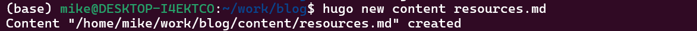
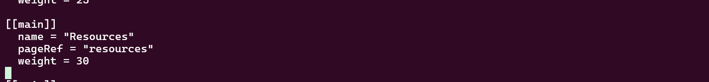
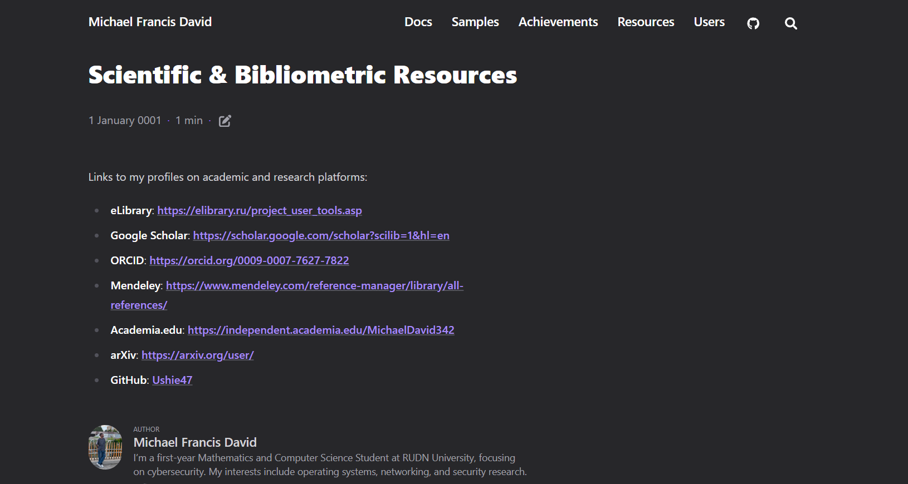

# Информация

## Докладчик

* Давид Майкл Фрэнсис
* Студент направления «Математика и компьютерные науки»
* Российский университет дружбы народов
* <https://ushie47.github.io/blog>

# Вводная часть

## Цель работы

Целью работы является добавление на сайт ссылок на научные и библиометрические ресурсы и продолжение публикации записей блога.

## Задание

1. Добавить ссылки на научные и библиометрические ресурсы на сайт.
2. Сделать запись за прошедшую неделю.
3. Добавить запись на выбранную тему (Работа с библиографией).

# Выполнение проекта

## Создание страницы ресурсов

Я создаю новую страницу содержимого для ссылок на научные ресурсы.

## Содержимое файла resources.md

Страница заполняется реальными ссылками на профили: eLibrary, Google Scholar, ORCID, Mendeley, Academia.edu, arXiv и GitHub.

## Добавление пункта меню

Я добавляю пункт «Resources» в файл меню сайта.

## Сборка и публикация изменений

Я пересобираю сайт и публикую изменения в репозитории.

## Опубликованная страница «Resources»

Страница «Resources» опубликована и доступна на сайте со всеми ссылками.

## Опубликованная запись «Итоги недели»

Запись с итогами прошедшей недели также опубликована на сайте.

## Опубликованная запись «Работа с библиографией»

Запись на тему работы с библиографией опубликована на сайте.

# Результаты

## Выводы

- Сайт был дополнен разделом «Resources» со ссылками на профили на научных и библиометрических платформах.
- Добавлены две новые записи блога — с итогами прошедшей недели и на тему работы с библиографией.
