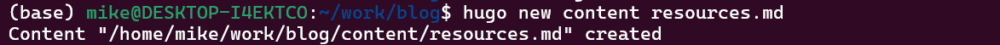
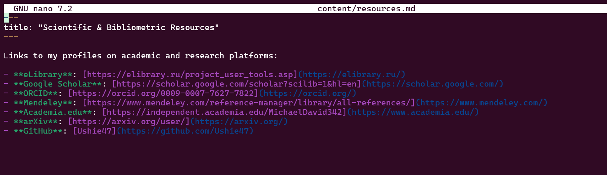
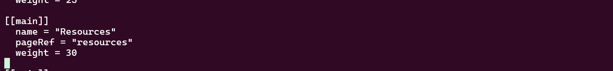
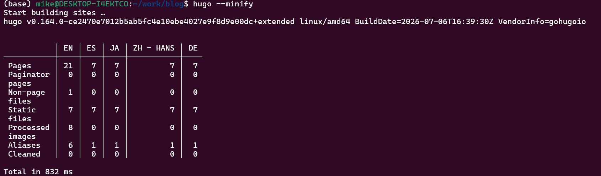
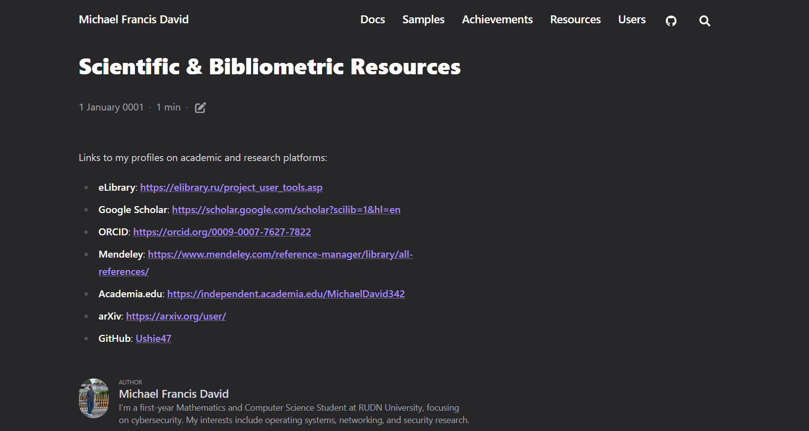
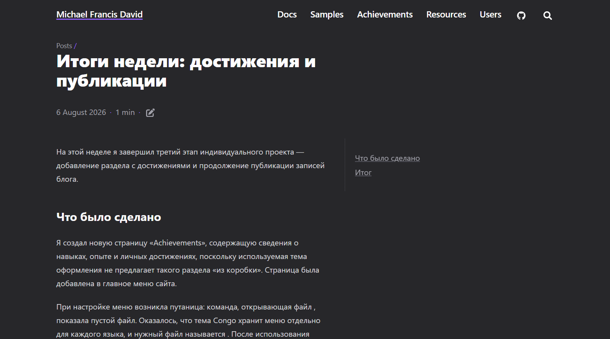
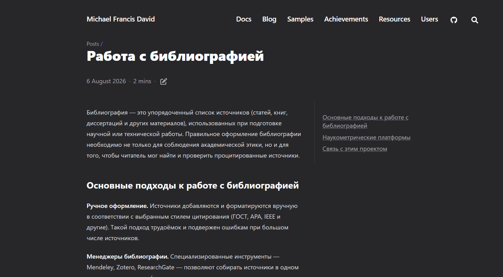

# Этапы реализации проекта

**Индивидуальный проект №1 — Этап 4**

| | |
|---|---|
| **Имя** | David Michael Francis |
| **Дисциплина** | Операционные системы |
| **Университет** | РУДН, Москва, Россия |
| **Язык** | Русский |

## Цель работы

Дополнить личный сайт ссылками на научные и библиометрические ресурсы 
и продолжить публикацию записей блога.

## Задание

1. Добавить ссылки на научные и библиометрические ресурсы на сайт
   - Зарегистрироваться на соответствующих ресурсах и разместить на 
     сайте ссылки на них: eLibrary, Google Scholar, ORCID, Mendeley, 
     ResearchGate, Academia.edu, arXiv, GitHub
2. Сделать запись за прошедшую неделю
3. Добавить запись на выбранную тему (Работа с библиографией)

---

## 1. Добавление ссылок на научные и библиометрические ресурсы

Для размещения ссылок на профессиональные профили была создана отдельная 
страница содержимого сайта.

```bash
hugo new content resources.md
```



### Наполнение страницы

Страница была заполнена ссылками на профили автора на научных и 
библиометрических платформах.

```bash
nano content/resources.md
```

```markdown
---
title: "Scientific & Bibliometric Resources"
---

Links to my profiles on academic and research platforms:

- **eLibrary**: [profile link](https://elibrary.ru/)
- **Google Scholar**: [profile link](https://scholar.google.com/)
- **ORCID**: [profile link](https://orcid.org/)
- **Mendeley**: [profile link](https://www.mendeley.com/)
- **ResearchGate**: [profile link](https://www.researchgate.net/)
- **Academia.edu**: [profile link](https://www.academia.edu/)
- **arXiv**: [profile link](https://arxiv.org/)
- **GitHub**: [Ushie47](https://github.com/Ushie47)
```



### Добавление страницы в меню

Страница была добавлена в главное меню сайта — в файл `menus.en.toml`, 
уже использовавшийся на предыдущем этапе для добавления пункта 
«Achievements».

```bash
nano config/_default/menus.en.toml
```

```toml
[[main]]
  name = "Resources"
  pageRef = "resources"
  weight = 30
```



### Публикация изменений

```bash
hugo --minify
git add .
git commit -m "Add scientific and bibliometric resources page"
git push
```





---

## 2. Запись за прошедшую неделю

Была создана запись, посвящённая итогам работы, выполненной на третьем 
этапе — добавлению раздела «Достижения» и решению проблемы с 
расположением файла меню (`menus.toml` → `menus.en.toml`).

```bash
hugo new content posts/week-3-summary.md
```



---

## 3. Запись на выбранную тему — работа с библиографией

Была создана запись, посвящённая работе с библиографией: основным 
элементам библиографической записи, распространённым стилям 
оформления (ГОСТ, APA, IEEE, BibTeX) и инструментам для сбора и 
организации источников (Google Scholar, Mendeley, Zotero, ORCID, 
ResearchGate).

```bash
hugo new content posts/working-with-bibliography.md
```

В записи также прослеживается связь с практической частью этапа — 
созданием на сайте раздела со ссылками на научные и библиометрические 
профили автора.



---

## Выводы

На этом этапе сайт был дополнен разделом «Resources» со ссылками на 
профили автора на научных и библиометрических платформах, а также 
двумя новыми записями блога. Работа над этим этапом закрепила навык 
добавления новых разделов сайта через создание страницы содержимого 
и последующее подключение её к меню — тот же подход, что применялся 
ранее для раздела «Achievements». Сайт продолжает расширяться, 
объединяя личный профиль, блог и профессиональные материалы в едином 
месте.
