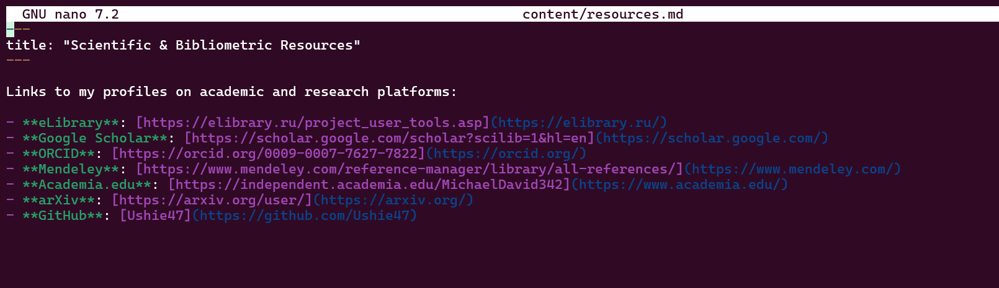
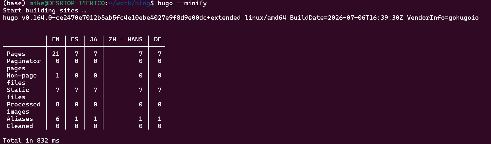
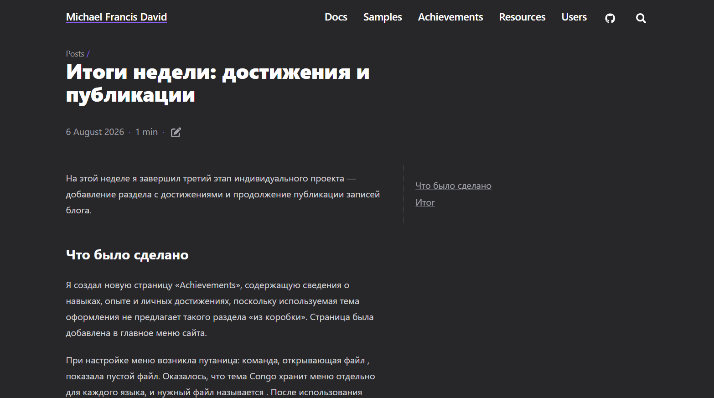
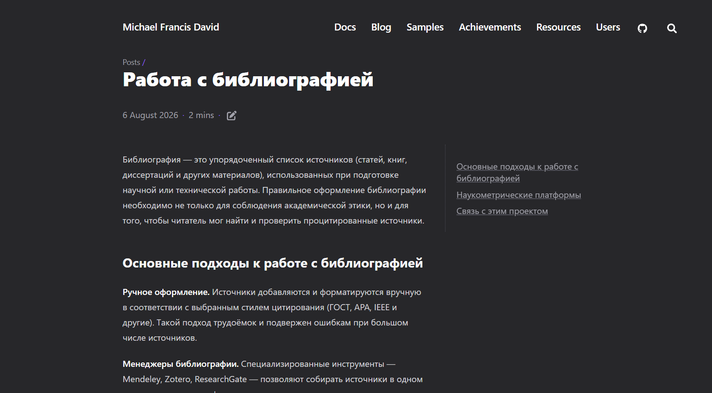

---
## Author
author:
  name: Давид Майкл Фрэнсис
  affiliation:
    - name: Российский университет дружбы народов
      country: Российская Федерация
      postal-code: 117198
      city: Москва
      address: ул. Миклухо-Маклая, д. 6

## Title
title: "Индивидуальный проект №1"
subtitle: "Этап 4. Ссылки на научные ресурсы и работа с библиографией"
license: "CC BY"
abstract: |
  В данном отчёте представлены результаты выполнения четвёртого этапа индивидуального проекта — добавления на сайт ссылок на научные и библиометрические ресурсы и продолжения публикации записей блога.

  Описаны создание страницы со ссылками на профили автора на научных платформах, подключение страницы к меню сайта и публикация двух новых записей блога, одна из которых посвящена работе с библиографией.

  Сделаны выводы о достижении поставленной цели.
keywords: [hugo, orcid, библиография, научные ресурсы, гост]
---

# Введение

## Актуальность

Наличие единого места со ссылками на профили в научных и библиометрических системах — распространённая практика для исследователей и студентов, облегчающая отслеживание публикаций и цитируемости, а также подтверждение авторства работ через постоянные идентификаторы, такие как ORCID. Размещение таких ссылок на личном сайте продолжает развитие сайта как профессионального портфолио, начатое на предыдущих этапах.

## Цель работы

Дополнить личный сайт ссылками на научные и библиометрические ресурсы и продолжить публикацию записей блога.

## Задачи

- зарегистрироваться на научных и библиометрических платформах (eLibrary, Google Scholar, ORCID, Mendeley, ResearchGate, Academia.edu, arXiv) и разместить ссылки на профили на сайте;
- добавить созданную страницу в главное меню сайта;
- сделать запись блога, посвящённую итогам прошедшей недели;
- добавить запись блога на выбранную тему (работа с библиографией).

## Объект и предмет исследования

Объектом исследования является личный сайт, построенный на генераторе статических сайтов Hugo. Предметом исследования выступает процесс создания страницы со ссылками на профессиональные научные профили, её подключения к главному меню сайта и публикации записей блога.

## Методы исследования

Работа выполнялась практическим методом — путём создания файлов содержимого, редактирования конфигурации меню Hugo и публикации изменений в git-репозиторий.

## Схема выполнения работы

На рис. -@fig-flowchart представлена общая последовательность действий при выполнении работы.

::: {#fig-flowchart}

```{mermaid}
%%| fig-width: 100%
graph TD
    A@{ shape: circle, label: "Начало" } --> B[Выполнить действие]
    B --> C[Описать, что конкретно сделано]
    C --> D[Подтвердить скриншотом]
    D --> E[Занести в отчёт]
    E --> F[Поместить в git-репозиторий]
    F --> G[Сделать релиз git]
    G --> J@{ shape: dbl-circ, label: "Конец" }
```

Блок-схема выполнения лабораторной работы

:::

# Теоретическая часть

**ORCID** (Open Researcher and Contributor ID) — некоммерческая система постоянных уникальных идентификаторов для исследователей, не меняющихся при смене места работы, учебного заведения или фамилии, в отличие от обычных ссылок на профили в отдельных системах [@orcid_web_about_en]. Наряду с ORCID платформы Google Scholar, eLibrary, Mendeley, ResearchGate и Academia.edu используются для публикации профиля исследователя, отслеживания цитируемости и обмена научными материалами.

Создание новой страницы содержимого в Hugo и её подключение к главному меню сайта в теме Congo выполняется тем же способом, что уже применялся на предыдущем этапе для раздела «Достижения» [@hugo_web_docs_en]: страница создаётся как файл Markdown в корне каталога `content`, после чего в соответствующий языковой файл меню (`menus.en.toml`) добавляется новая запись с указанием ссылки на страницу.

Оформление библиографических ссылок в научных и учебных работах регулируется стандартами цитирования. В российских учебных заведениях для этого применяется ГОСТ Р 7.0.5-2008 [@gost_standard_7-0-5-2008_ru], задающий общие требования и правила составления библиографической ссылки; наряду с ним в международной практике распространены стили APA, IEEE и формат BibTeX, используемый, в частности, для автоматической генерации списка литературы в системах вёрстки на основе LaTeX.

# Материалы и методы

Для выполнения работы использовались генератор статических сайтов **Hugo** с темой оформления **Congo**, текстовый редактор `nano`, а также система контроля версий **Git**.

# Выполнение лабораторной работы

## Добавление ссылок на научные и библиометрические ресурсы

Для размещения ссылок на профессиональные профили была создана отдельная страница содержимого сайта:

```bash
hugo new content resources.md
```

{#fig-001 width=70%}

### Наполнение страницы

Страница была заполнена ссылками на профили автора на научных и библиометрических платформах:

```bash
nano content/resources.md
```

```markdown
---
title: "Scientific & Bibliometric Resources"
---

Links to my profiles on academic and research platforms:

- **eLibrary**: [profile link](https://elibrary.ru/)
- **Google Scholar**: [profile link](https://scholar.google.com/)
- **ORCID**: [profile link](https://orcid.org/)
- **Mendeley**: [profile link](https://www.mendeley.com/)
- **ResearchGate**: [profile link](https://www.researchgate.net/)
- **Academia.edu**: [profile link](https://www.academia.edu/)
- **arXiv**: [profile link](https://arxiv.org/)
- **GitHub**: [Ushie47](https://github.com/Ushie47)
```

{#fig-002 width=70%}

### Добавление страницы в меню

Страница была добавлена в главное меню сайта — в файл `menus.en.toml`, уже использовавшийся на предыдущем этапе для добавления пункта «Achievements»:

```bash
nano config/_default/menus.en.toml
```

```toml
[[main]]
  name = "Resources"
  pageRef = "resources"
  weight = 30
```

{#fig-003 width=70%}

### Публикация изменений

```bash
hugo --minify
git add .
git commit -m "Add scientific and bibliometric resources page"
git push
```

{#fig-004 width=70%}

{#fig-005 width=70%}

## Запись за прошедшую неделю

Была создана запись, посвящённая итогам работы, выполненной на третьем этапе — добавлению раздела «Достижения» и решению проблемы с расположением файла меню (`menus.toml` → `menus.en.toml`):

```bash
hugo new content posts/week-3-summary.md
```

{#fig-006 width=70%}

## Запись на выбранную тему — работа с библиографией

Была создана запись, посвящённая работе с библиографией: основным элементам библиографической записи, распространённым стилям оформления (ГОСТ, APA, IEEE, BibTeX) и инструментам для сбора и организации источников (Google Scholar, Mendeley, Zotero, ORCID, ResearchGate):

```bash
hugo new content posts/working-with-bibliography.md
```

В записи также прослеживается связь с практической частью этапа — созданием на сайте раздела со ссылками на научные и библиометрические профили автора.

{#fig-007 width=70%}

# Результаты

В результате выполнения работы:

- создана и опубликована страница «Resources» со ссылками на профили на научных и библиометрических платформах;
- страница добавлена в главное меню сайта;
- опубликована запись блога с итогами работы за третий этап;
- опубликована запись блога на тему работы с библиографией.

# Обсуждение результатов

Создание страницы «Resources» выполнялось по тому же шаблону «страница содержимого + пункт меню», что и раздел «Достижения» на предыдущем этапе, — это подтверждает, что данный приём стал устоявшимся, воспроизводимым способом добавления новых разделов сайта, не предусмотренных темой оформления изначально. С содержательной точки зрения ссылки на ORCID и другие научные платформы дополняют раздел «Достижения»: если «Достижения» описывают практический опыт в прозе, то «Resources» предоставляет проверяемые внешние идентификаторы, подтверждающие профессиональную принадлежность автора.

# Заключение

На этом этапе сайт был дополнен разделом «Resources» со ссылками на профили автора на научных и библиометрических платформах, а также двумя новыми записями блога. Работа над этим этапом закрепила навык добавления новых разделов сайта через создание страницы содержимого и последующее подключение её к меню — тот же подход, что применялся ранее для раздела «Achievements». Сайт продолжает расширяться, объединяя личный профиль, блог и профессиональные материалы в едином месте.

Поставленная цель работы достигнута.

# Список литературы {.unnumbered}

::: {#refs}
:::
