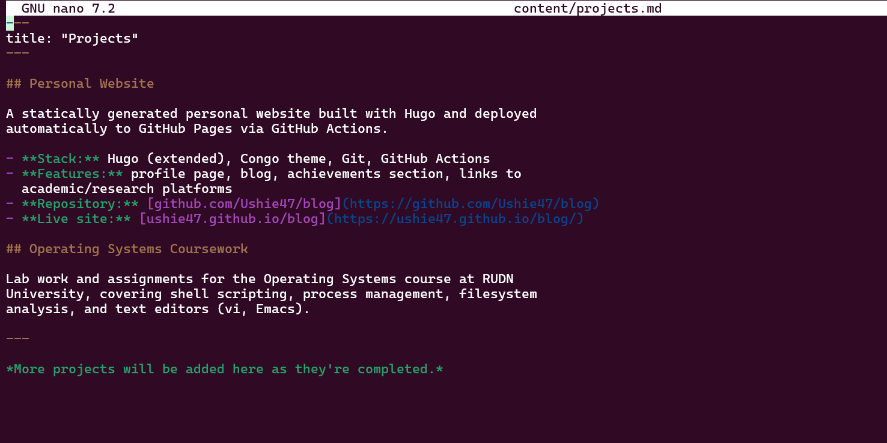
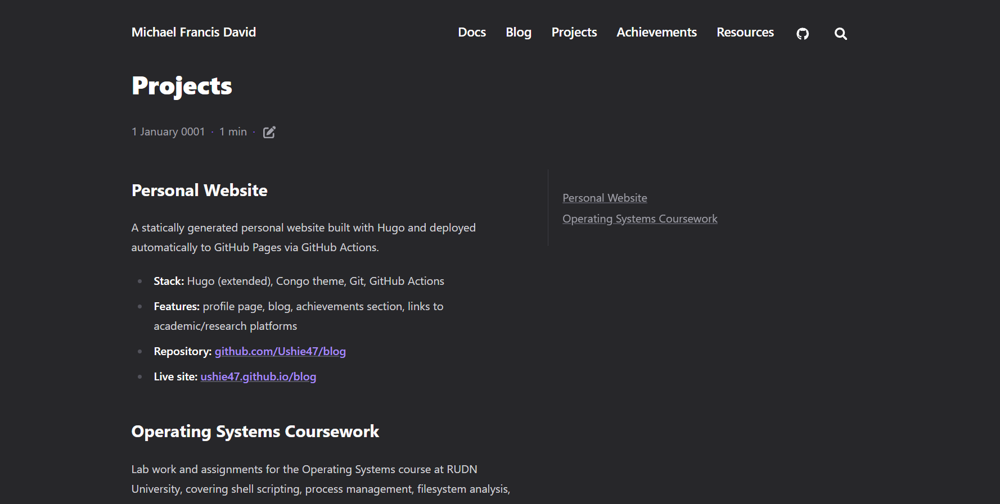
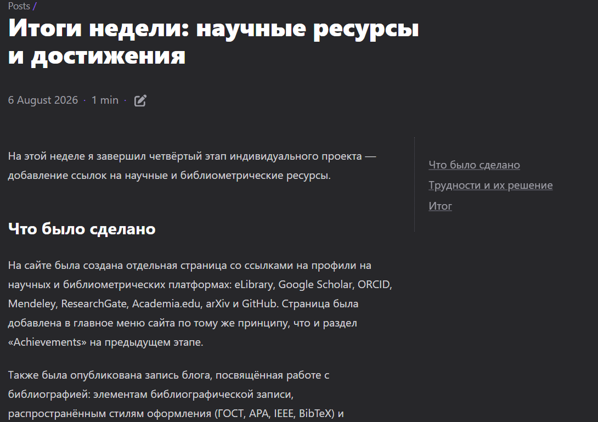
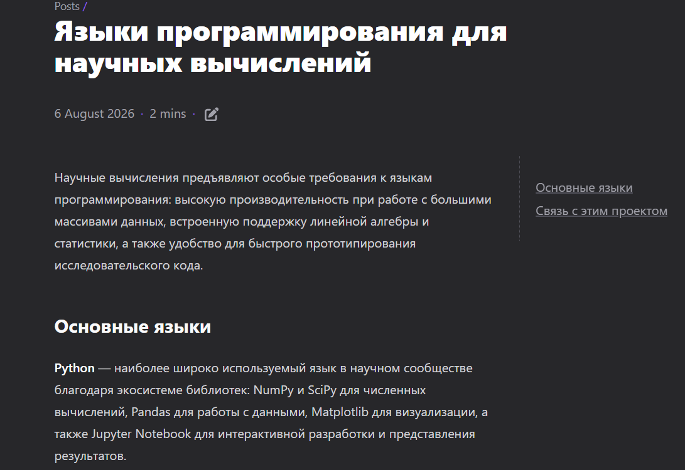
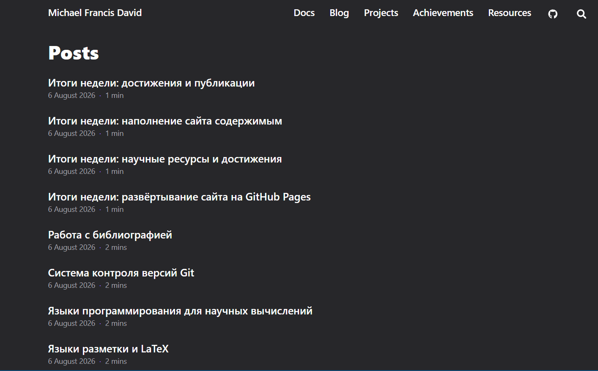

# Информация

## Докладчик

* Давид Майкл Фрэнсис
* Студент направления «Математика и компьютерные науки»
* Российский университет дружбы народов
* <https://ushie47.github.io/blog>

# Вводная часть

## Цель работы

Целью работы является добавление на сайт остальных элементов — заметок о личных проектах — и продолжение публикации записей блога.

## Задание

1. Добавить все остальные элементы на сайт (заметки о личных проектах).
2. Сделать запись за прошедшую неделю.
3. Добавить запись на выбранную тему (Научные языки программирования).

# Выполнение проекта

## Заполнение страницы проектов

Я заполняю страницу projects.md заметками о личных проектах.

## Добавление пункта меню

Я добавляю пункт «Projects» в файл меню сайта.

## Сборка и публикация изменений

Я пересобираю сайт и публикую изменения в репозитории.

## Опубликованная страница «Projects»

Страница «Projects» опубликована и доступна на сайте.

## Опубликованная запись «Итоги недели»

Запись с итогами прошедшей недели также опубликована на сайте.

## Опубликованная запись «Языки программирования»

Запись на тему научных языков программирования опубликована на сайте.

## Полный список записей блога

Все записи блога теперь доступны на отдельной странице, добавленной в меню сайта.

# Результаты

## Выводы

- Сайт был дополнен разделом с заметками о личных проектах.
- Добавлены две новые записи блога — с итогами прошедшей недели и на тему научных языков программирования.
- Был добавлен пункт меню, ведущий на полный список записей блога.
