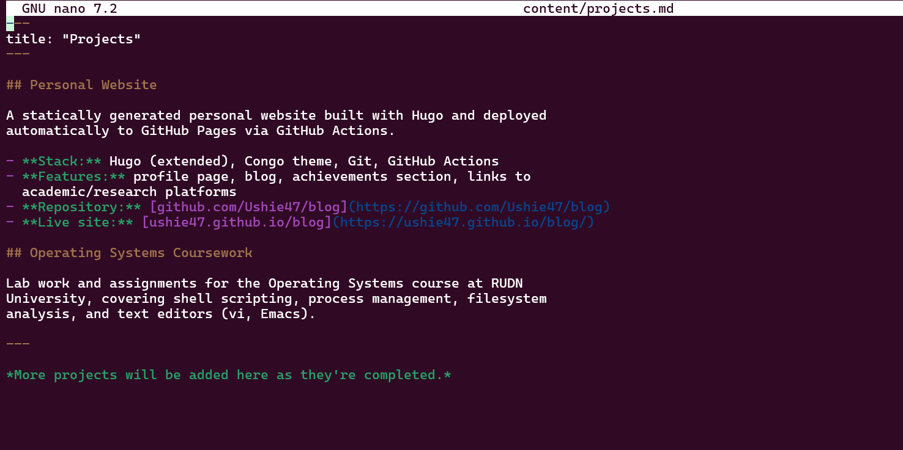
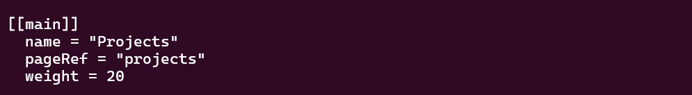
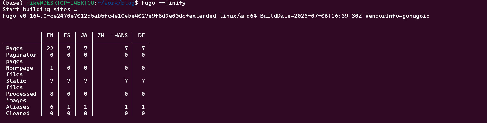
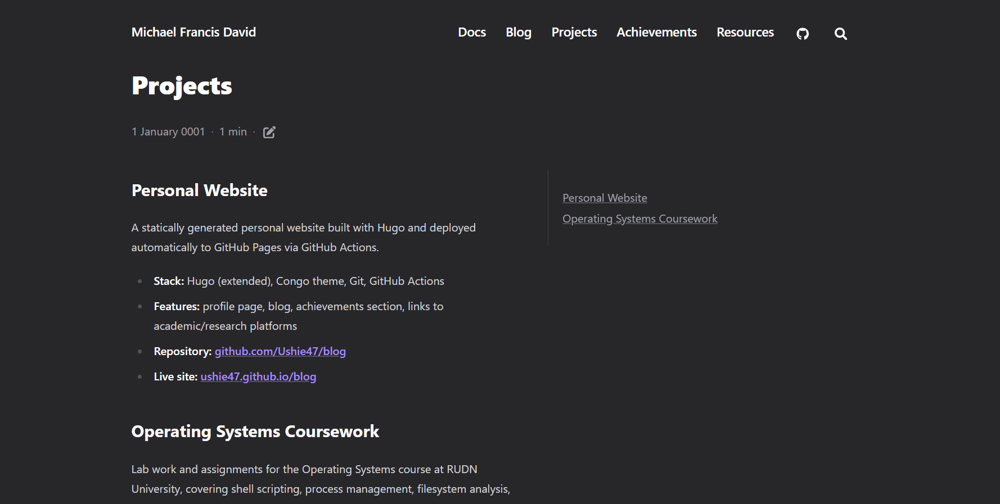
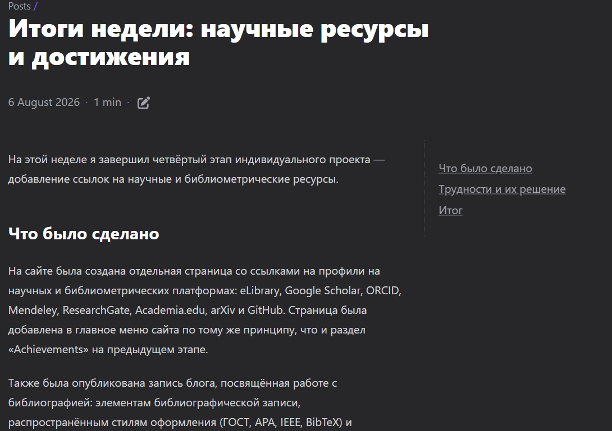
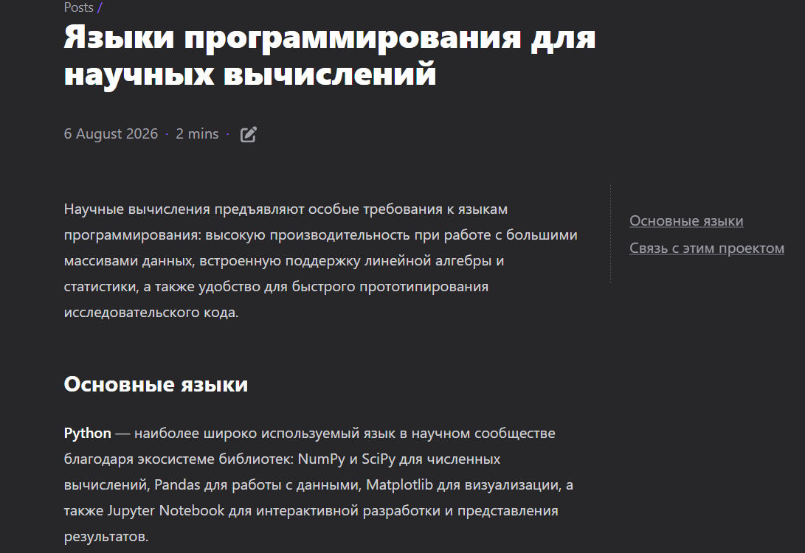
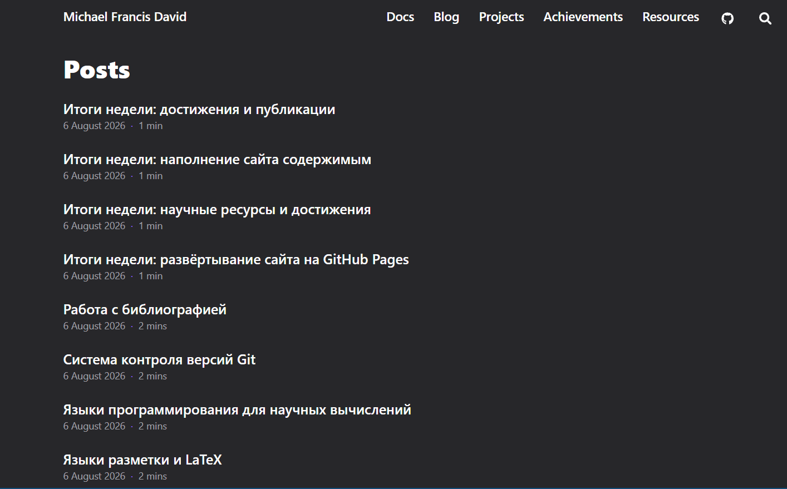

# Этапы реализации проекта

**Индивидуальный проект №1 — Этап 5**

| | |
|---|---|
| **Имя** | David Michael Francis |
| **Дисциплина** | Операционные системы |
| **Университет** | РУДН, Москва, Россия |
| **Язык** | Русский |

## Цель работы

Добавить на личный сайт остальные элементы: заметки о личных проектах 
и продолжить публикацию записей блога.

## Задание

1. Добавить все остальные элементы на сайт
   - Сделать заметки о личных проектах
2. Сделать запись за прошедшую неделю
3. Добавить запись на выбранную тему (Научные языки программирования)

---

## 1. Заметки о личных проектах

Для этого раздела была использована уже существующая страница 
`projects.md`, оставшаяся от примера содержимого темы Congo, — её 
содержимое было полностью заменено на реальные заметки о проектах.

```bash
nano content/projects.md
```

Страница описывает два проекта: сам этот сайт (стек технологий, 
возможности, ссылки на репозиторий и живую версию) и лабораторные 
работы по курсу «Операционные системы».

```markdown
---
title: "Projects"
---

## Personal Website

A statically generated personal website built with Hugo and deployed
automatically to GitHub Pages via GitHub Actions.

- **Stack:** Hugo (extended), Congo theme, Git, GitHub Actions
- **Features:** profile page, blog, achievements section, links to
  academic/research platforms
- **Repository:** github.com/Ushie47/blog
- **Live site:** ushie47.github.io/blog

## Operating Systems Coursework

Lab work and assignments for the Operating Systems course at RUDN
University, covering shell scripting, process management, filesystem
analysis, and text editors (vi, Emacs).
```



### Добавление страницы в меню

В отличие от предыдущих этапов, пункт меню для страницы «Projects» 
ещё не был настроен, поэтому он был добавлен в файл `menus.en.toml` 
тем же способом, что и разделы «Achievements» и «Resources» ранее.

```bash
nano config/_default/menus.en.toml
```

```toml
[[main]]
  name = "Projects"
  pageRef = "projects"
  weight = 20
```



### Публикация изменений

```bash
hugo --minify
git add .
git commit -m "Add personal projects notes"
git push
```





---

## 2. Запись за прошедшую неделю

Была создана запись, посвящённая итогам работы, выполненной на 
четвёртом этапе — добавлению страницы со ссылками на научные ресурсы 
и решению временного сбоя развёртывания на стороне GitHub.

```bash
hugo new content posts/week-4-summary.md
```



---

## 3. Запись на выбранную тему — научные языки программирования

Была создана запись, рассматривающая языки программирования, 
применяемые в научных вычислениях: Python (и его экосистему — NumPy, 
SciPy, Pandas, Matplotlib), MATLAB, R, Julia, Fortran, а также C и C++ 
как языки, на которых реализуются сами численные библиотеки.

```bash
hugo new content posts/scientific-programming-languages.md
```

В записи также проводится параллель с инструментами, использованными 
в самом проекте, — выбором подходящего языка или формата под 
конкретную задачу (Go для генератора сайта, Markdown для содержимого, 
YAML для автоматизации развёртывания).



---

## Дополнительно: доступ ко всем записям блога

В ходе этого этапа было замечено, что на главной странице в разделе 
«Recent» отображаются только 5 последних записей — это ограничение 
задаётся параметром `recentLimit` в файле конфигурации. Полный список 
записей при этом остаётся доступен по адресу `/posts/` благодаря 
автоматически создаваемой Hugo странице-списку для раздела содержимого. 
Для удобства навигации в меню сайта был добавлен отдельный пункт 
«Blog», ссылающийся на этот раздел.

```toml
[[main]]
  name = "Blog"
  pageRef = "posts"
  weight = 15
```



---

## Выводы

На этом этапе сайт был дополнен разделом с заметками о личных проектах, 
а также двумя новыми записями блога. Была решена задача навигации по 
всем записям блога через добавление отдельного пункта меню, ведущего 
на полный список публикаций. Сайт продолжает развиваться как единая 
площадка, объединяющая личный профиль, портфолио проектов, достижения, 
научные ресурсы и блог.
