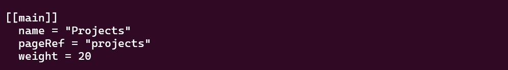
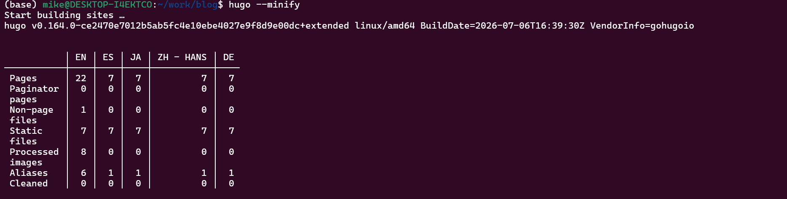

---
## Author
author:
  name: Давид  Майкл Фрэнсис
  affiliation:
    - name: Российский университет дружбы народов
      country: Российская Федерация
      postal-code: 117198
      city: Москва
      address: ул. Миклухо-Маклая, д. 6

## Title
title: "Индивидуальный проект №1"
subtitle: "Этап 5. Заметки о личных проектах и навигация по блогу"
license: "CC BY"
abstract: |
  В данном отчёте представлены результаты выполнения пятого этапа индивидуального проекта — добавления на сайт заметок о личных проектах и продолжения публикации записей блога.

  Описаны наполнение существующей страницы `projects.md` реальным содержимым, подключение страницы к меню сайта, публикация двух новых записей блога и настройка полноценной навигации по всем записям блога.

  Сделаны выводы о достижении поставленной цели.
keywords: [hugo, congo, портфолио, научные языки программирования]
---

# Введение

## Актуальность

Раздел с описанием личных проектов — стандартный элемент сайта-портфолио, позволяющий посетителю быстро оценить практический опыт автора без необходимости просматривать репозитории по отдельности. Кроме того, по мере роста числа записей блога возникает практическая задача навигации по полному их списку, а не только по нескольким последним записям, показываемым на главной странице.

## Цель работы

Добавить на личный сайт остальные элементы: заметки о личных проектах и продолжить публикацию записей блога.

## Задачи

- заменить содержимое существующей страницы `projects.md` реальными заметками о личных проектах;
- добавить страницу в главное меню сайта;
- сделать запись блога, посвящённую итогам прошедшей недели;
- добавить запись блога на выбранную тему (научные языки программирования);
- обеспечить доступ ко всем записям блога через отдельный пункт меню.

## Объект и предмет исследования

Объектом исследования является личный сайт, построенный на генераторе статических сайтов Hugo. Предметом исследования выступает процесс наполнения существующей страницы содержимого реальными данными, настройки навигации по блогу и публикации записей.

## Методы исследования

Работа выполнялась практическим методом — путём редактирования содержимого и конфигурации меню Hugo.

## Схема выполнения работы

На рис. -@fig-flowchart представлена общая последовательность действий при выполнении работы.

::: {#fig-flowchart}

```{mermaid}
%%| fig-width: 100%
graph TD
    A@{ shape: circle, label: "Начало" } --> B[Выполнить действие]
    B --> C[Описать, что конкретно сделано]
    C --> D[Подтвердить скриншотом]
    D --> E[Занести в отчёт]
    E --> F[Поместить в git-репозиторий]
    F --> G[Сделать релиз git]
    G --> J@{ shape: dbl-circ, label: "Конец" }
```

Блок-схема выполнения лабораторной работы

:::

# Теоретическая часть

Темы оформления Hugo, в том числе Congo, нередко поставляются с примером содержимого, включающим заготовки типовых страниц (о себе, проекты, контакты) [@hugo_web_docs_en]. Такие страницы удобно использовать как основу — заменяя содержимое примера собственными данными, — не создавая страницу с нуля и сохраняя предусмотренную темой вёрстку для соответствующего типа страницы.

Главная страница сайта на теме Congo показывает лишь ограниченное число последних записей блога, заданное параметром `recentLimit` в конфигурации. Это ограничение не распространяется на автоматически создаваемую Hugo страницу-список для всего раздела содержимого (например, `/posts/`), которая всегда включает все записи раздела независимо от настроек главной страницы. Эти два механизма — ограниченная витрина на главной странице и полный список на отдельной странице раздела — типичный шаблон организации навигации блога.

Научные вычисления предъявляют особые требования к языкам программирования: высокую производительность при работе с большими массивами данных и встроенную поддержку численных операций. Так, библиотека NumPy расширяет Python эффективными операциями над многомерными массивами, оставаясь при этом одним из самых используемых инструментов в научных вычислениях на Python [@harris_article_numpy_en].

# Материалы и методы

Для выполнения работы использовались генератор статических сайтов **Hugo** с темой оформления **Congo**, текстовый редактор `nano`, а также система контроля версий **Git**.

# Выполнение лабораторной работы

## Заметки о личных проектах

Для этого раздела была использована уже существующая страница `projects.md`, оставшаяся от примера содержимого темы Congo, — её содержимое было полностью заменено на реальные заметки о проектах:

```bash
nano content/projects.md
```

Страница описывает два проекта: сам этот сайт (стек технологий, возможности, ссылки на репозиторий и живую версию) и лабораторные работы по курсу «Операционные системы»:

```markdown
---
title: "Projects"
---

## Personal Website

A statically generated personal website built with Hugo and deployed
automatically to GitHub Pages via GitHub Actions.

- **Stack:** Hugo (extended), Congo theme, Git, GitHub Actions
- **Features:** profile page, blog, achievements section, links to
  academic/research platforms
- **Repository:** github.com/Ushie47/blog
- **Live site:** ushie47.github.io/blog

## Operating Systems Coursework

Lab work and assignments for the Operating Systems course at RUDN
University, covering shell scripting, process management, filesystem
analysis, and text editors (vi, Emacs).
```

{#fig-001 width=70%}

### Добавление страницы в меню

В отличие от предыдущих этапов, пункт меню для страницы «Projects» ещё не был настроен, поэтому он был добавлен в файл `menus.en.toml` тем же способом, что и разделы «Achievements» и «Resources» ранее:

```bash
nano config/_default/menus.en.toml
```

```toml
[[main]]
  name = "Projects"
  pageRef = "projects"
  weight = 20
```

{#fig-002 width=70%}

### Публикация изменений

```bash
hugo --minify
git add .
git commit -m "Add personal projects notes"
git push
```

{#fig-003 width=70%}

{#fig-004 width=70%}

## Запись за прошедшую неделю

Была создана запись, посвящённая итогам работы, выполненной на четвёртом этапе — добавлению страницы со ссылками на научные ресурсы и решению временного сбоя развёртывания на стороне GitHub:

```bash
hugo new content posts/week-4-summary.md
```

{#fig-005 width=70%}

## Запись на выбранную тему — научные языки программирования

Была создана запись, рассматривающая языки программирования, применяемые в научных вычислениях: Python (и его экосистему — NumPy, SciPy, Pandas, Matplotlib), MATLAB, R, Julia, Fortran, а также C и C++ как языки, на которых реализуются сами численные библиотеки:

```bash
hugo new content posts/scientific-programming-languages.md
```

В записи также проводится параллель с инструментами, использованными в самом проекте, — выбором подходящего языка или формата под конкретную задачу (Go для генератора сайта, Markdown для содержимого, YAML для автоматизации развёртывания).

{#fig-006 width=70%}

## Дополнительно: доступ ко всем записям блога

В ходе этого этапа было замечено, что на главной странице в разделе «Recent» отображаются только 5 последних записей — это ограничение задаётся параметром `recentLimit` в файле конфигурации. Полный список записей при этом остаётся доступен по адресу `/posts/` благодаря автоматически создаваемой Hugo странице-списку для раздела содержимого. Для удобства навигации в меню сайта был добавлен отдельный пункт «Blog», ссылающийся на этот раздел:

```toml
[[main]]
  name = "Blog"
  pageRef = "posts"
  weight = 15
```

{#fig-007 width=70%}

# Результаты

В результате выполнения работы:

- страница «Projects» наполнена реальными заметками о личных проектах и добавлена в главное меню сайта;
- опубликована запись блога с итогами работы за четвёртый этап;
- опубликована запись блога на тему научных языков программирования;
- добавлен пункт меню «Blog», обеспечивающий доступ к полному списку записей блога.

# Обсуждение результатов

Решение задачи навигации по блогу наглядно иллюстрирует различие между «витриной» и полным списком содержимого в Hugo: главная страница намеренно показывает лишь несколько последних записей для краткости, тогда как автоматически создаваемая страница раздела (`/posts/`) всегда содержит полный список без необходимости вручную его поддерживать. Этот шаблон — ограниченная выборка на видном месте плюс ссылка на полный список — типичен не только для блогов, но и для других разделов сайтов с растущим числом записей.

# Заключение

На этом этапе сайт был дополнен разделом с заметками о личных проектах, а также двумя новыми записями блога. Была решена задача навигации по всем записям блога через добавление отдельного пункта меню, ведущего на полный список публикаций. Сайт продолжает развиваться как единая площадка, объединяющая личный профиль, портфолио проектов, достижения, научные ресурсы и блог.

Поставленная цель работы достигнута.

# Список литературы {.unnumbered}

::: {#refs}
:::
