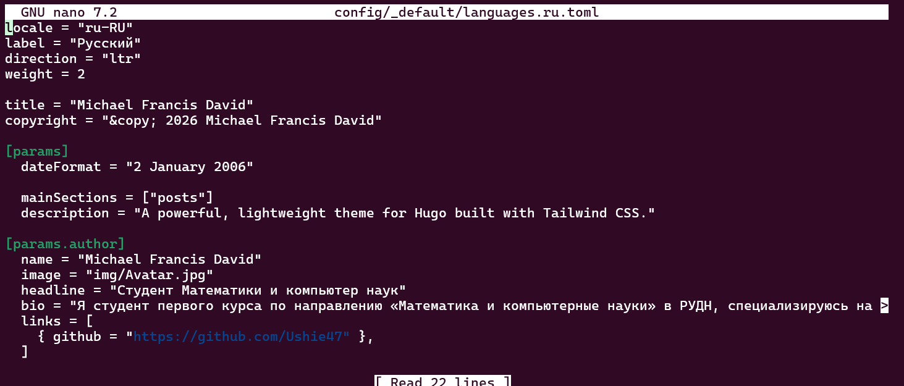
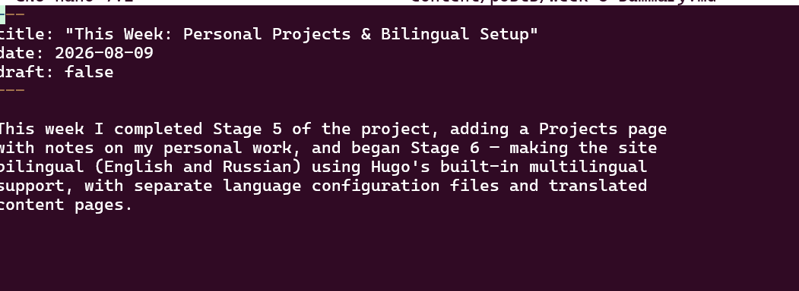
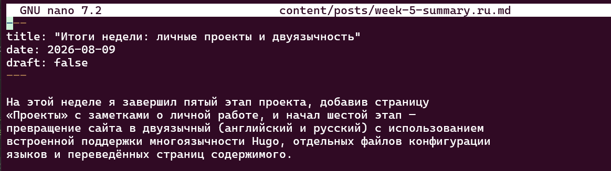

# Информация

## Докладчик

* Давид Майкл Фрэнсис
* Студент направления «Математика и компьютерные науки»
* Российский университет дружбы народов
* <https://ushie47.github.io/blog>

# Вводная часть

## Цель работы

Целью работы является добавление на сайт поддержки русского и английского языков, а также публикация новых постов на обоих языках.

## Задание

1. Сделать поддержку английского и русского языков.
2. Разместить элементы сайта на обоих языках.
3. Разместить контент на обоих языках.
4. Сделать пост по прошедшей неделе.
5. Добавить пост на тему по выбору (на двух языках).

# Выполнение проекта

## Файл языковой конфигурации

Я создаю файл языковой конфигурации для русского языка и перевожу данные автора.

## Параметры многоязычности

В основном конфигурационном файле явно задаются параметры многоязычности.

## Переключатель языков

После пересборки на сайте появляется переключатель языков с русским в списке.

## Перевод главного меню

Я перевожу пункты главного меню в отдельном файле для русского языка.

## Меню сайта на русском языке

Главное меню сайта теперь отображается на русском языке.

## Страница «Проекты»

Страница «Проекты» отображается на русском языке при переключении.

## Переименование файлов записей

Существующие записи блога переименовываются с суффиксом .ru.md, чтобы Hugo корректно относил их к русской версии сайта.

## Пост «This Week» на английском

Запись с итогами прошедшей недели публикуется на английском языке.

## Пост «Итоги недели» на русском

Та же запись публикуется на русском языке.

## Пост о CI/CD на английском

Запись на тему CI/CD с GitHub Actions публикуется на английском языке.

## Пост о CI/CD на русском

Та же запись публикуется на русском языке.

# Результаты

## Выводы

- Сайт стал полностью двуязычным: были настроены отдельные языковые конфигурации, переведены пункты меню и страницы содержимого.
- Опубликована новая запись на двух языках, посвящённая CI/CD с GitHub Actions.
