# Этапы реализации проекта

**Индивидуальный проект №1 — Этап 6**

| | |
|---|---|
| **Имя** | David Michael Francis |
| **Дисциплина** | Операционные системы |
| **Университет** | РУДН, Москва, Россия |
| **Язык** | Русский |

## Цель работы

Сделать сайт двуязычным, обеспечив поддержку английского и русского 
языков, перевод элементов сайта и содержимого, а также публикацию 
записей блога на обоих языках.

## Задание

1. Сделать поддержку английского и русского языков
2. Разместить элементы сайта на обоих языках
3. Разместить содержимое сайта на обоих языках
4. Сделать запись за прошедшую неделю
5. Добавить запись на выбранную тему (на двух языках)

---

## 1. Поддержка английского и русского языков

Тема оформления Congo изначально спроектирована с учётом 
многоязычности — конфигурация уже была разделена по языковым файлам 
(`languages.en.toml` и др.), что позволило добавить русский язык тем же 
способом.

```bash
cp config/_default/languages.en.toml config/_default/languages.ru.toml
```

Файл был отредактирован: обновлены код языка, название, вес и 
copyright, а также переведены поля профиля автора (`headline`, `bio`), 
поскольку они отображаются непосредственно на сайте.

```bash
nano config/_default/languages.ru.toml
```

```toml
languageCode = "ru-RU"
languageName = "Русский"
languageDirection = "ltr"
weight = 2
title = "Michael Francis David"
copyright = "&copy; 2026 Michael Francis David"

[params.author]
  name = "Michael Francis David"
  image = "img/Avatar.jpg"
  headline = "Студент математики и компьютерных наук"
  bio = "Я студент первого курса по направлению «Математика и компьютерные науки» в РУДН, специализируюсь на кибербезопасности."
  links = [
    { github = "https://github.com/Ushie47" },
  ]
```

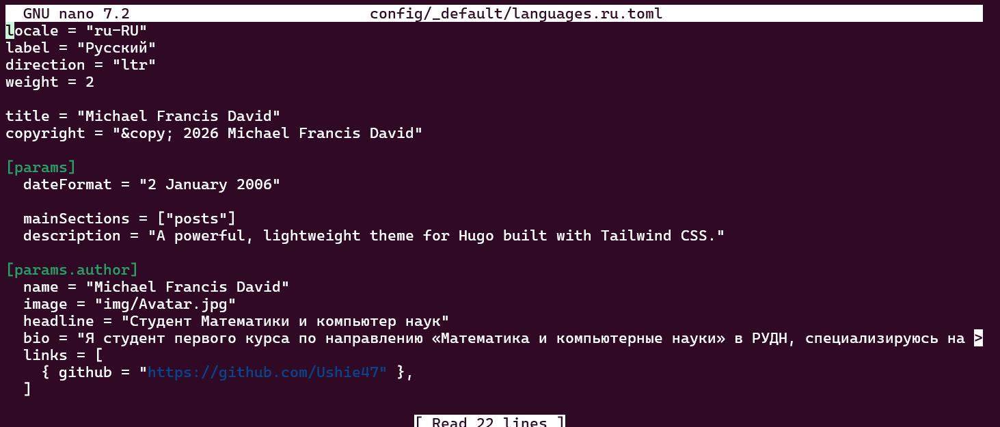

В основном конфигурационном файле были явно заданы параметры 
многоязычности:

```bash
nano config/_default/hugo.toml
```

```toml
defaultContentLanguage = "en"
defaultContentLanguageInSubdir = false
```

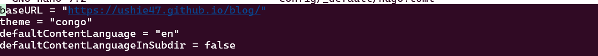

После пересборки и локального просмотра на сайте появился переключатель 
языков (EN/RU) в шапке сайта.

```bash
hugo server
```

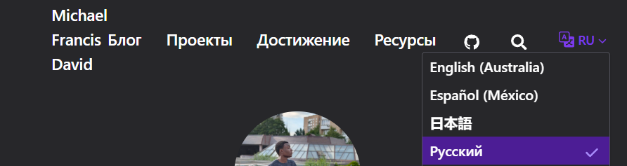

---

## 2. Перевод элементов сайта

Главное меню было продублировано и переведено на русский язык — 
Congo хранит меню отдельно для каждого языка, аналогично конфигурации.

```bash
cp config/_default/menus.en.toml config/_default/menus.ru.toml
nano config/_default/menus.ru.toml
```

```toml
[[main]]
  name = "Блог"
  pageRef = "posts"
  weight = 15

[[main]]
  name = "Проекты"
  pageRef = "projects"
  weight = 20

[[main]]
  name = "Достижения"
  pageRef = "achievements"
  weight = 25

[[main]]
  name = "Ресурсы"
  pageRef = "resources"
  weight = 30
```
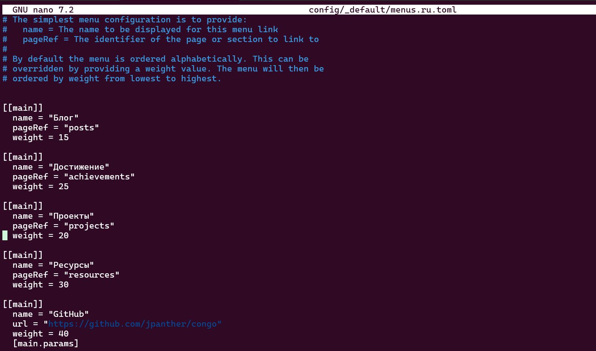

Также был добавлен файл с русским заголовком для страницы-списка 
записей блога:

```bash
mkdir -p content/posts
nano content/posts/_index.ru.md
```

```markdown
---
title: "Блог"
---
```

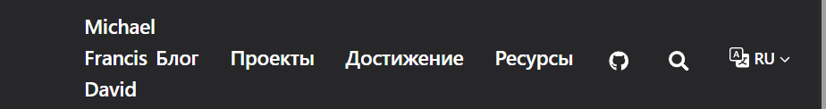

---

## 3. Перевод содержимого сайта

Для каждой основной страницы сайта была создана русская версия с 
суффиксом `.ru.md`, в соответствии с тем, как Hugo определяет язык 
страницы по имени файла.

```bash
nano content/_index.ru.md
nano content/projects.ru.md
nano content/achievements.ru.md
nano content/resources.ru.md
```

Каждая страница была переведена на русский язык при сохранении той же 
структуры и front matter, что и в английской версии.

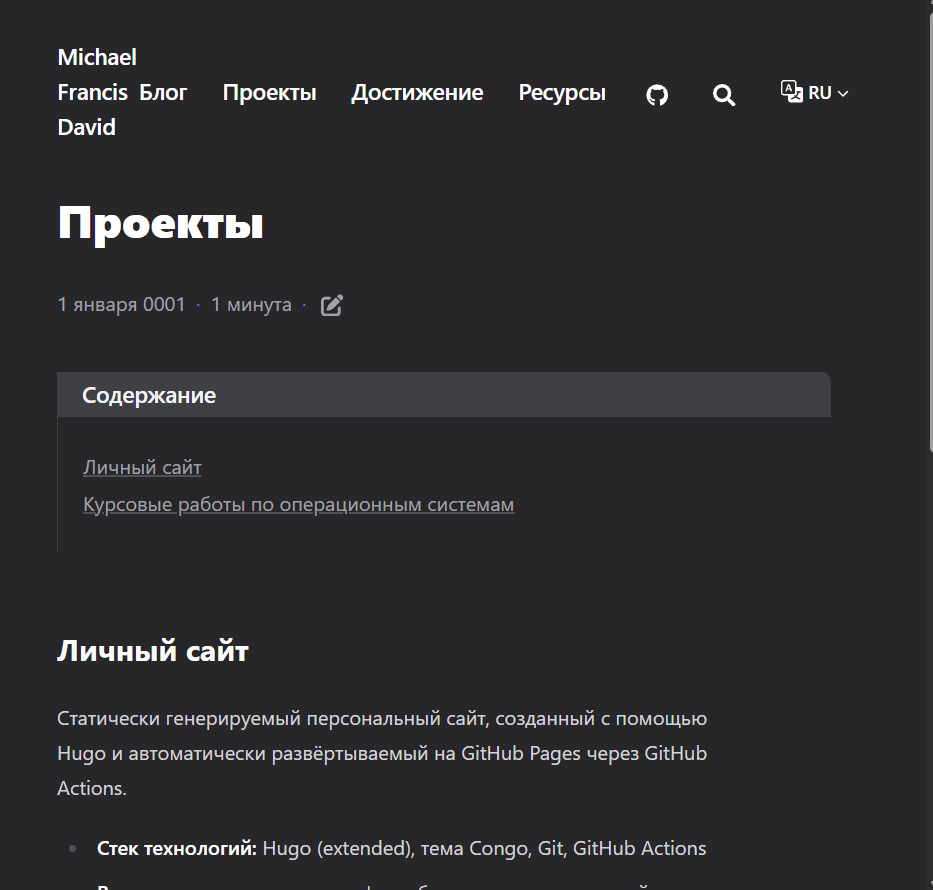

Кроме того, уже существовавшие записи блога, изначально написанные на 
русском языке, были явно помечены суффиксом `.ru.md`, чтобы Hugo 
корректно относил их к русской версии сайта, а не к английской по 
умолчанию.

```bash
cd content/posts
for f in week-1-summary week-2-summary week-3-summary week-4-summary \
         git-version-control markup-languages-latex \
         scientific-programming-languages working-with-bibliography \
         past-week; do
  [ -f "$f.md" ] && mv "$f.md" "$f.ru.md"
done
```

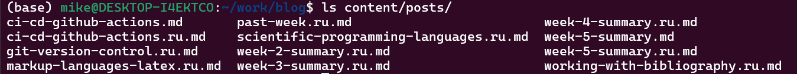

---

## 4. Запись за прошедшую неделю

Была подготовлена запись, посвящённая итогам пятого этапа — добавлению 
страницы «Проекты» и началу настройки двуязычности сайта. Запись была 
опубликована на обоих языках.

```bash
nano content/posts/week-5-summary.md
nano content/posts/week-5-summary.ru.md
```

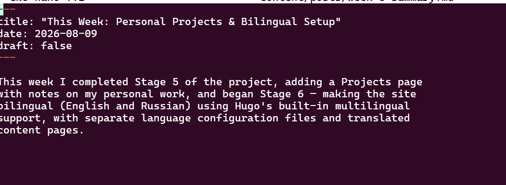

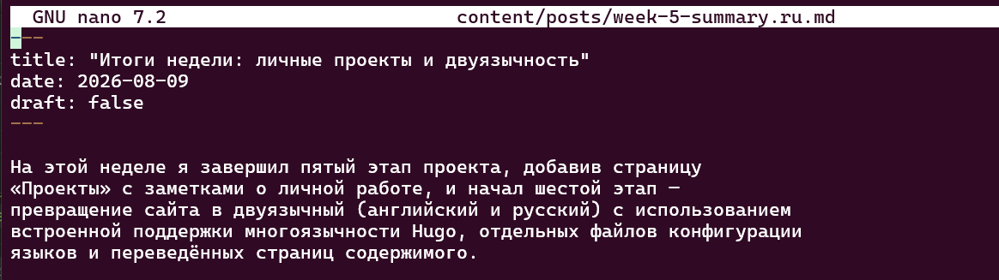

---

## 5. Запись на выбранную тему (на двух языках) — CI/CD с GitHub Actions

Была подготовлена запись о непрерывной интеграции и развёртывании 
(CI/CD) на примере конвейера GitHub Actions, используемого для 
автоматической сборки и публикации самого этого сайта. Запись 
описывает структуру рабочего процесса, его практическое значение и 
опыт, полученный при работе с автоматизацией на протяжении проекта.

```bash
nano content/posts/ci-cd-github-actions.md
nano content/posts/ci-cd-github-actions.ru.md
```

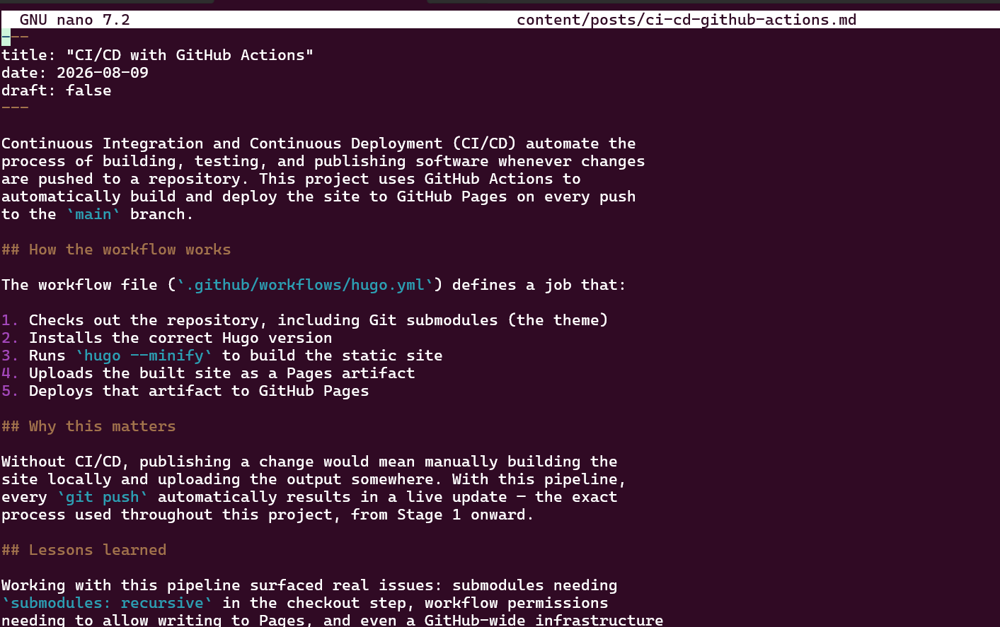

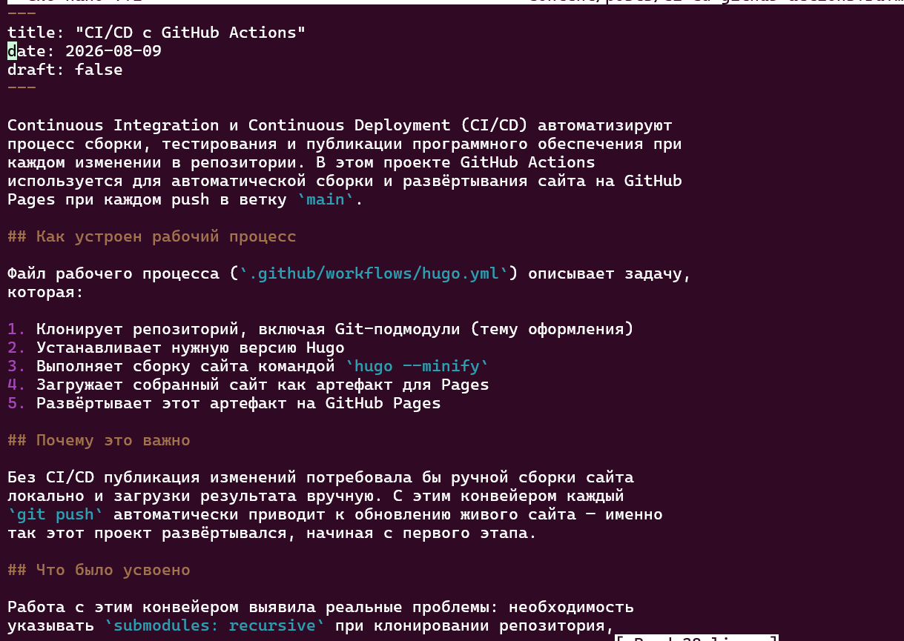

---

## Публикация изменений

```bash
git add .
git commit -m "Add bilingual support: language config, menus, translated pages and posts"
git push
```

---

## Выводы

На этом этапе сайт стал полностью двуязычным: были настроены отдельные 
языковые конфигурации, переведены пункты меню, основные страницы 
содержимого и записи блога, а также опубликована новая запись на двух 
языках, посвящённая CI/CD. Это завершает работу над функциональностью, 
структурой и содержимым личного сайта, объединяющего профиль, блог, 
портфолио проектов, достижения и научные ресурсы на английском и 
русском языках.
