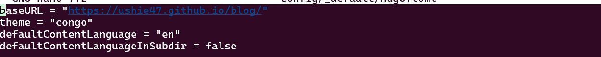
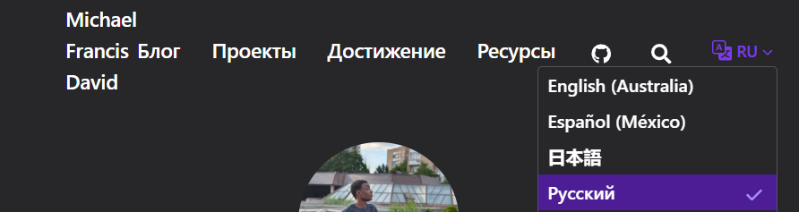
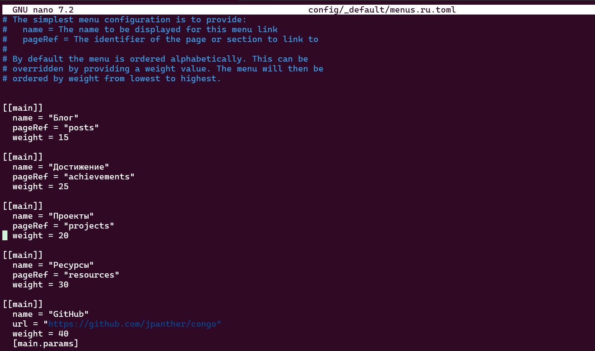
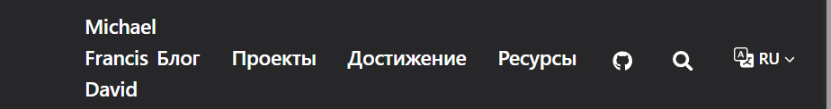
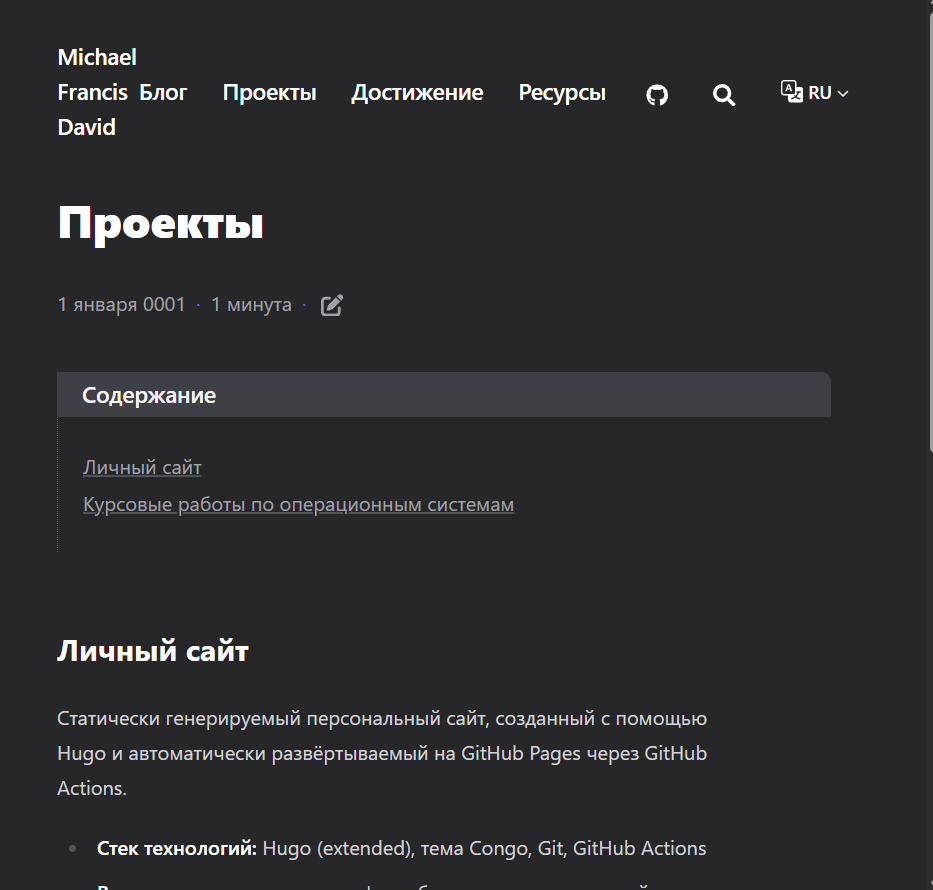
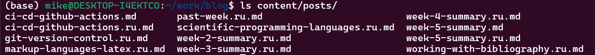
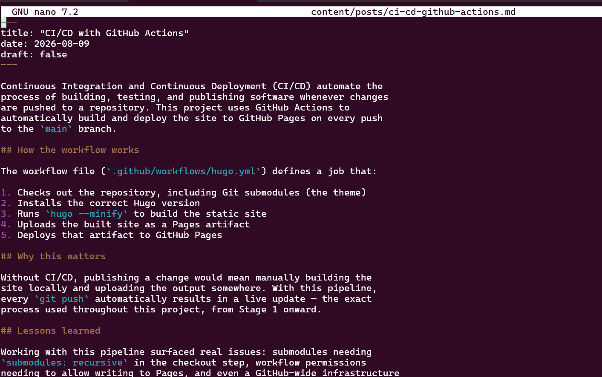
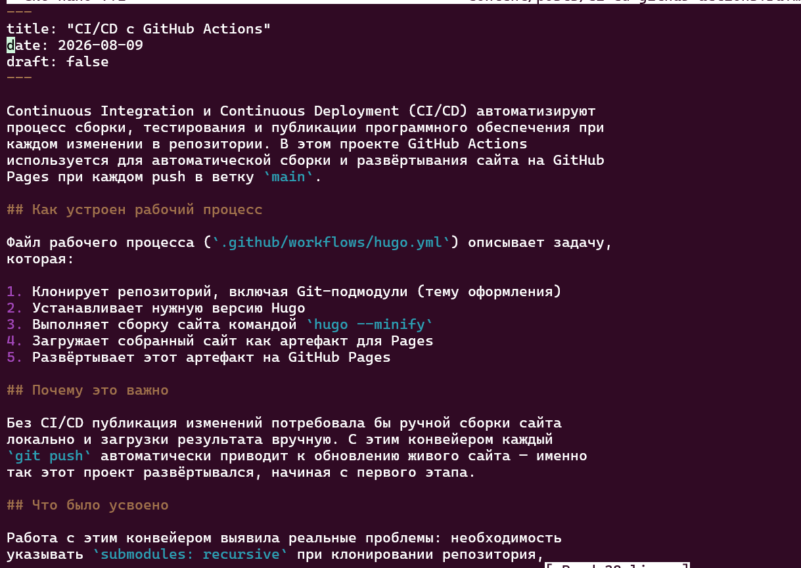

---
## Author
author:
  name: Давид Майкл Фрэнсис
  affiliation:
    - name: Российский университет дружбы народов
      country: Российская Федерация
      postal-code: 117198
      city: Москва
      address: ул. Миклухо-Маклая, д. 6

## Title
title: "Индивидуальный проект №1"
subtitle: "Этап 6. Двуязычность сайта (английский и русский)"
license: "CC BY"
abstract: |
  В данном отчёте представлены результаты выполнения шестого, заключительного этапа индивидуального проекта — обеспечения поддержки английского и русского языков на личном сайте.

  Описаны настройка многоязычной конфигурации, перевод элементов интерфейса (меню) и основного содержимого сайта, а также публикация записей блога на обоих языках, включая новую запись о CI/CD с GitHub Actions.

  Сделаны выводы о достижении поставленной цели.
keywords: [hugo, congo, многоязычность, локализация, ci/cd]
---

# Введение

## Актуальность

Личный сайт, предназначенный для демонстрации учебных и профессиональных материалов как русскоязычной, так и англоязычной аудитории, нуждается в поддержке обоих языков. Встроенная многоязычность Hugo позволяет реализовать это без смены генератора статических сайтов или темы оформления, используя предусмотренные темой механизмы разделения конфигурации, меню и содержимого по языкам.

## Цель работы

Сделать сайт двуязычным, обеспечив поддержку английского и русского языков, перевод элементов сайта и содержимого, а также публикацию записей блога на обоих языках.

## Задачи

1. сделать поддержку английского и русского языков;
2. разместить элементы сайта (меню) на обоих языках;
3. разместить содержимое сайта на обоих языках;
4. сделать запись блога за прошедшую неделю;
5. добавить запись блога на выбранную тему на двух языках.

## Объект и предмет исследования

Объектом исследования является личный сайт, построенный на генераторе статических сайтов Hugo. Предметом исследования выступает процесс настройки многоязычной конфигурации, перевода элементов интерфейса и содержимого сайта, а также публикации записей блога на двух языках.

## Методы исследования

Работа выполнялась практическим методом — путём настройки многоязычной конфигурации Hugo и перевода содержимого сайта.

## Схема выполнения работы

На рис. -@fig-flowchart представлена общая последовательность действий при выполнении работы.

::: {#fig-flowchart}

```{mermaid}
%%| fig-width: 100%
graph TD
    A@{ shape: circle, label: "Начало" } --> B[Выполнить действие]
    B --> C[Описать, что конкретно сделано]
    C --> D[Подтвердить скриншотом]
    D --> E[Занести в отчёт]
    E --> F[Поместить в git-репозиторий]
    F --> G[Сделать релиз git]
    G --> J@{ shape: dbl-circ, label: "Конец" }
```

Блок-схема выполнения лабораторной работы

:::

# Теоретическая часть

Многоязычность в Hugo построена на единообразном принципе разделения файлов по языкам, применяемом сразу на нескольких уровнях [@hugo_web_docs_en]. Конфигурация каждого языка задаётся в отдельном файле вида `languages.<код_языка>.toml`, аналогично меню, которое хранится в файлах `menus.<код_языка>.toml`. На уровне содержимого Hugo определяет язык конкретной страницы или записи по суффиксу имени файла: файл `about.md` относится к языку по умолчанию, тогда как `about.ru.md` — его русская версия.

Поведение сайта при нескольких настроенных языках дополнительно управляется двумя параметрами основного конфигурационного файла: `defaultContentLanguage` задаёт язык, используемый по умолчанию, если суффикс в имени файла отсутствует, а `defaultContentLanguageInSubdir` определяет, должен ли язык по умолчанию также получать собственный префикс пути (`/en/...`) или оставаться на корневом адресе сайта. Благодаря такой структуре добавление нового языка не требует переписывания шаблонов темы — используется та же тема, тот же набор страниц, но для каждого языка подставляются собственные тексты.

# Материалы и методы

Для выполнения работы использовались генератор статических сайтов **Hugo** с темой оформления **Congo**, текстовый редактор `nano`, командная оболочка bash (для пакетного переименования файлов), а также система контроля версий **Git**.

# Выполнение лабораторной работы

## Поддержка английского и русского языков

Тема оформления Congo изначально спроектирована с учётом многоязычности — конфигурация уже была разделена по языковым файлам (`languages.en.toml` и др.), что позволило добавить русский язык тем же способом:

```bash
cp config/_default/languages.en.toml config/_default/languages.ru.toml
```

Файл был отредактирован: обновлены код языка, название, вес и copyright, а также переведены поля профиля автора (`headline`, `bio`), поскольку они отображаются непосредственно на сайте:

```bash
nano config/_default/languages.ru.toml
```

```toml
languageCode = "ru-RU"
languageName = "Русский"
languageDirection = "ltr"
weight = 2
title = "Michael Francis David"
copyright = "&copy; 2026 Michael Francis David"

[params.author]
  name = "Michael Francis David"
  image = "img/Avatar.jpg"
  headline = "Студент математики и компьютерных наук"
  bio = "Я студент первого курса по направлению «Математика и компьютерные науки» в РУДН, специализируюсь на кибербезопасности."
  links = [
    { github = "https://github.com/Ushie47" },
  ]
```

{#fig-001 width=70%}

В основном конфигурационном файле были явно заданы параметры многоязычности:

```bash
nano config/_default/hugo.toml
```

```toml
defaultContentLanguage = "en"
defaultContentLanguageInSubdir = false
```

{#fig-002 width=70%}

После пересборки и локального просмотра на сайте появился переключатель языков (EN/RU) в шапке сайта:

```bash
hugo server
```

{#fig-003 width=70%}

## Перевод элементов сайта

Главное меню было продублировано и переведено на русский язык — Congo хранит меню отдельно для каждого языка, аналогично конфигурации:

```bash
cp config/_default/menus.en.toml config/_default/menus.ru.toml
nano config/_default/menus.ru.toml
```

```toml
[[main]]
  name = "Блог"
  pageRef = "posts"
  weight = 15

[[main]]
  name = "Проекты"
  pageRef = "projects"
  weight = 20

[[main]]
  name = "Достижения"
  pageRef = "achievements"
  weight = 25

[[main]]
  name = "Ресурсы"
  pageRef = "resources"
  weight = 30
```

{#fig-004 width=70%}

Также был добавлен файл с русским заголовком для страницы-списка записей блога:

```bash
mkdir -p content/posts
nano content/posts/_index.ru.md
```

```markdown
---
title: "Блог"
---
```

{#fig-005 width=70%}

## Перевод содержимого сайта

Для каждой основной страницы сайта была создана русская версия с суффиксом `.ru.md`, в соответствии с тем, как Hugo определяет язык страницы по имени файла:

```bash
nano content/_index.ru.md
nano content/projects.ru.md
nano content/achievements.ru.md
nano content/resources.ru.md
```

Каждая страница была переведена на русский язык при сохранении той же структуры и front matter, что и в английской версии.

{#fig-006 width=70%}

Кроме того, уже существовавшие записи блога, изначально написанные на русском языке, были явно помечены суффиксом `.ru.md`, чтобы Hugo корректно относил их к русской версии сайта, а не к английской по умолчанию:

```bash
cd content/posts
for f in week-1-summary week-2-summary week-3-summary week-4-summary \
         git-version-control markup-languages-latex \
         scientific-programming-languages working-with-bibliography \
         past-week; do
  [ -f "$f.md" ] && mv "$f.md" "$f.ru.md"
done
```

{#fig-007 width=70%}

## Запись за прошедшую неделю

Была подготовлена запись, посвящённая итогам пятого этапа — добавлению страницы «Проекты» и началу настройки двуязычности сайта. Запись была опубликована на обоих языках:

```bash
nano content/posts/week-5-summary.md
nano content/posts/week-5-summary.ru.md
```

{#fig-008 width=70%}

{#fig-009 width=70%}

## Запись на выбранную тему (на двух языках) — CI/CD с GitHub Actions

Была подготовлена запись о непрерывной интеграции и развёртывании (CI/CD) на примере конвейера GitHub Actions, используемого для автоматической сборки и публикации самого этого сайта. Запись описывает структуру рабочего процесса, его практическое значение и опыт, полученный при работе с автоматизацией на протяжении проекта:

```bash
nano content/posts/ci-cd-github-actions.md
nano content/posts/ci-cd-github-actions.ru.md
```

{#fig-010 width=70%}

{#fig-011 width=70%}

## Публикация изменений

```bash
git add .
git commit -m "Add bilingual support: language config, menus, translated pages and posts"
git push
```

# Результаты

В результате выполнения работы:

- настроена многоязычная конфигурация сайта (английский и русский языки);
- переведено главное меню сайта;
- переведены основные страницы содержимого (главная, проекты, достижения, ресурсы);
- существующие записи блога корректно помечены как русскоязычные (`.ru.md`);
- опубликована запись с итогами пятого этапа на обоих языках;
- опубликована новая запись о CI/CD с GitHub Actions на обоих языках.

# Обсуждение результатов

На протяжении этого этапа прослеживается единый принцип, последовательно применённый на всех уровнях проекта: суффикс языка в имени файла (`languages.ru.toml`, `menus.ru.toml`, `about.ru.md` и так далее) используется Hugo одинаковым образом независимо от того, идёт ли речь о конфигурации, меню или содержимом. Благодаря этому задача добавления второго языка сводится к последовательному повторению одного и того же приёма, а не к изучению отдельного механизма для каждого типа файлов. Явное переименование уже существовавших русскоязычных записей блога в `.ru.md` сделало прежде неявное допущение (что весь контент на сайте — на языке по умолчанию) явным и корректным с точки зрения конфигурации сайта.

# Заключение

На этом этапе сайт стал полностью двуязычным: были настроены отдельные языковые конфигурации, переведены пункты меню, основные страницы содержимого и записи блога, а также опубликована новая запись на двух языках, посвящённая CI/CD. Это завершает работу над функциональностью, структурой и содержимым личного сайта, объединяющего профиль, блог, портфолио проектов, достижения и научные ресурсы на английском и русском языках.

Поставленная цель работы достигнута.

# Список литературы {.unnumbered}

::: {#refs}
:::
